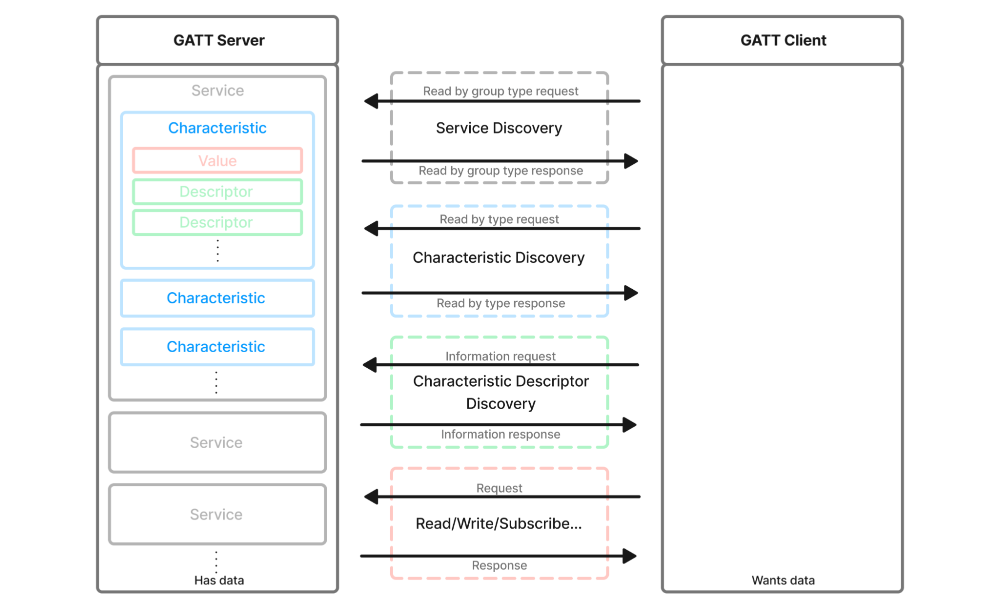

# MetaWear API Specification

MetaWear API 1.0.0 Specification.

This document is the complete reference for the MetaWear BLE serial protocol: the module and register maps, plus the byte-level wire details (command byte arrays, config bit fields, scale factors, and response parsing) needed to implement the protocol from scratch in any language. Wire-level details for each module appear in a **Wire-Level Reference** subsection at the end of that module's chapter.

## Bluetooth Low Energy

MetaSensors (MetaWears or MetaWear sensors) measure movement (accelerometer, gyroscope, magnetometer, sensor fusion), temperature, air pressure, and present this via the [**GATT**](https://bluetoothle.wiki/gatt) connection.

The **Generic Attributes (GATT)** is the name of the interface used to connect to Bluetooth LE (Low Energy) devices. The interface has one or more Bluetooth **Services**, identified by unique ids, that contain Bluetooth **Characteristics** also identified by ids.

A **GATT** **client** (such as your smartphone or laptop) scans for devices that are [advertising](https://bluetoothle.wiki/advertising) and connects to a **GATT** **server** (a chosen MetaWear device). Once connected, the **client** discovers the **Services** and **Characteristics** of the **server**. Then, it reads from, writes to, or sets up a connection to receive notifications from the **Characteristic**.


Here's a brief breakdown:

1. **Scanning for Devices**: The GATT client (e.g., a smartphone or laptop) scans for nearby BLE devices that are advertising their presence.  
2. **Connecting to a GATT Server**: Once a device (e.g., a MetaWear device) is found, the client can connect to it. The device acts as the GATT server.  
3. **Discovering Services and Characteristics**: After connecting, the GATT client queries the server to discover the available Services and Characteristics. Services are collections of related functionalities, and Characteristics are attributes that contain specific data.  
4. **Interacting with Characteristics**:  
   1. **Reading**: The client can read data from a Characteristic.  
   2. **Writing**: The client can write data to a Characteristic.  
   3. **Notifications**: The client can set up notifications to receive updates from a Characteristic automatically when its value changes.



The [BluetoothSIG](https://www.bluetooth.com/) provides [a set of standard **UUID**s](https://www.bluetooth.com/specifications/assigned-numbers/) for **Services** and **Characteristics** which the MetaSensors support:

| Service UUID | Characteristic UUID | Description           | MetaWear Result |
| :----------- | :------------------ | :-------------------- | :-------------- |
| `180A`       | `2A24`              | For Model Number      | 8 (MetaMotionS) |
| `180A`       | `2A19`              | For Battery Life      | 1.2             |
| `180A`       | `2A25`              | For Serial Number     | 055B9E          |
| `180A`       | `2A26`              | For Firmware Revision | 1.7.2           |
| `180A`       | `2A27`              | For Hardware Revision | 0.1             |
| `180A`       | `2A29`              | For Manufacturer Name | MbientLab Inc   |

For example, a heart rate sensor will typically use the Bluetooth adopted and standardized **Heart Rate Service** (UUID: `0x180D`) and **Heart Rate Measurement Characteristic** (UUID: `0x2A37`).

However, this is where the standards stop for the MetaWear spec.

MetaWears do not use the standard SIG **Services** and **Characteristics** because there are too many sensors on board and there are not enough **Services** and **Characteristics** available to support them all. Additionally, standardized **Characteristics** and **Services** for data such as “quaternions” do not exist.

Instead, the MetaWear advertises a unique **Service** and **Characteristics** that use a custom serial protocol to send commands and receive data.

MetaWear advertises the **Service** **UUID**: `326A9000-85CB-9195-D9DD-464CFBBAE75A`.

The MetaWear protocol uses the **Characteristic** **UUID**: `326A9001-85CB-9195-D9DD-464CFBBAE75A` to send commands to the board.

The MetaWear protocol uses the **Characteristic** **UUID**: `326A9006-85CB-9195-D9DD-464CFBBAE75A` to send responses. The responses may contain ACKs, device information, or sensor data. You must subscribe to this **Characteristic**.

| Name                            | 128-bit UUID                           | Mode          | Length |
| :------------------------------ | :------------------------------------- | :------------ | :----- |
| MetaWear **Service**            | `326A9000-85CB-9195-D9DD-464CFBBAE75A` |               |        |
| Command **Characteristic**      | `326A9001-85CB-9195-D9DD-464CFBBAE75A` | Read / Write  | 20     |
| Notification **Characteristic** | `326A9006-85CB-9195-D9DD-464CFBBAE75A` | Read / Notify | 20     |

## Modules

Sensors and peripherals on the MetaWear are referred to as **Modules**. 

The following **Modules** are available:

| Module Name        | Opcode | Description                                                  | State      |
| :----------------- | :----- | :----------------------------------------------------------- | :--------- |
| Switch             | `0x01` | Mechanical button                                            | Active     |
| LED                | `0x02` | Color LED                                                    | Active     |
| Accelerometer      | `0x03` | BMI160 or BMI270 acceleration sensor (3D accelerometer)      | Active     |
| Temperature        | `0x04` | Thermistor, external, and internal temperature sensor        | Active     |
| GPIO               | `0x05` | Analog and digital IOs                                       | Active     |
| Neo Pixel          | `0x06` |                                                              | Deprecated |
| iBeacon            | `0x07` |                                                              | Deprecated |
| Haptic             | `0x08` | Buzzer driver (for MMS+ or MMRL+)                            | Active     |
| Data Processor     | `0x09` | Internal math for sensor filter                              | Active     |
| Event              | `0x0A` | Events such as losing the Bluetooth connection               | Active     |
| Logging            | `0x0B` | Start, Stop, download or trigger sensor data logging         | Active     |
| Timer              | `0x0C` | Built-in timer (used for delays, counting or debug)          | Active     |
| Serial Passthrough | `0x0D` | I2C bus                                                      | Active     |
| ANCS               | `0x0E` |                                                              | Deprecated |
| Macro              | `0x0F` | Store commands in the memory                                 | Active     |
| GSR (Conductance)  | `0x10` |                                                              | Deprecated |
| Settings           | `0x11` | Bluetooth settings such as device name or TX power           | Active     |
| Barometer          | `0x12` | BMP280 pressure sensor                                       | Active     |
| Gyro               | `0x13` | BMI160 or BMI270 rotational (angular velocity) sensor        | Active     |
| Ambient Light      | `0x14` | LTR-329ALS ambient light sensor (MMS)                        | Active     |
| Magnetometer       | `0x15` | BMM150 magnetic field sensor                                 | Active     |
| Humidity           | `0x16` |                                                              | Deprecated |
| Color Detection    | `0x17` |                                                              | Deprecated |
| Proximity          | `0x18` |                                                              | Deprecated |
| Sensor Fusion      | `0x19` | Bosch algorithm for orientation (Quaternion or Euler angles) | Active     |
| Debug              | `0xFE` | Reset device or jump to bootloader                           | Active     |

## Serial Protocol

Commands to the MetaWear are sent via **Writes** to the **Command Characteristic**.

Responses from the MetaWear are received via **Notifications** from the **Notification Characteristic**.

### Data Encoding

All multi-byte values in the MetaWear serial protocol are encoded in **little-endian** byte order. This means the least significant byte comes first.

For example, the uint16\_t value `0x01F4` (500 in decimal) is sent as `[0xF4, 0x01]`.

The data types used in the protocol are:

| Type      | Size    | Description                                             |
| :-------- | :------ | :------------------------------------------------------ |
| uint8\_t  | 1 byte  | Unsigned 8-bit integer (0 to 255)                       |
| int8\_t   | 1 byte  | Signed 8-bit integer (-128 to 127)                      |
| uint16\_t | 2 bytes | Unsigned 16-bit integer, little-endian (0 to 65535)     |
| int16\_t  | 2 bytes | Signed 16-bit integer, little-endian (-32768 to 32767)  |
| uint32\_t | 4 bytes | Unsigned 32-bit integer, little-endian                  |
| int32\_t  | 4 bytes | Signed 32-bit integer, little-endian                    |
| float     | 4 bytes | IEEE 754 single-precision floating-point, little-endian |

Bit fields within a byte are packed from the least significant bit (LSB) first. For example, if a byte contains a 2-bit field `a` and a 3-bit field `b`, the layout is: bits 0-1 \= `a`, bits 2-4 \= `b`, bits 5-7 \= unused.

### Module Discovery

When a host connects to a MetaWear for the first time, it should discover which modules are available and their implementations by reading the **Module Info** register (`0x00`) from each module opcode.

The discovery process is:

1. Subscribe to the **Notification Characteristic** (`326A9006`)
2. For each opcode in the **SDK discovery set** — the `MODULE_DISCOVERY_CMDS` list under *Module discovery order* below — send a read command: \[`opcode, 0x80`\] (reading register `0x00`). Probe only this set, not every numeric value in the `0x01`–`0x19` range. The set is *not* simply "all active modules": it still includes the **deprecated** iBeacon (`0x07`) and Humidity (`0x16`) opcodes, which the SDK legacy-probes for backward compatibility, while the other deprecated opcodes — NeoPixel (`0x06`), ANCS (`0x0E`), GSR (`0x10`), Color (`0x17`), Proximity (`0x18`) — are omitted entirely.
3. The MetaWear responds with: \[`opcode, 0x80, impl_id, revision, ...`\]
4. **Every opcode responds.** A **present** module returns `[opcode, 0x80, impl_id, revision, ...]`; an **absent** module returns only the 2-byte header `[opcode, 0x80]` with no implementation or revision byte. Detect absence by the response carrying no implementation byte (length 2) — not by a missing reply, which would force a per-opcode timeout.

The **Implementation ID** identifies which hardware variant is present (e.g., BMI160 vs BMI270 for the accelerometer), and the **Revision** indicates the firmware revision for that module. Together they determine which registers are available and how data should be interpreted.


#### Board Initialization Sequence (Wire-Level)

1. Enable notifications on the notify characteristic.
2. Read each Device Info GATT characteristic in order (firmware, model, hardware, manufacturer, serial).
3. For each module in `MODULE_DISCOVERY_CMDS` list, send:
   ```
   [module_id, 0x80]   <- READ_REGISTER(0x00) = info register
   ```
   A **present** module responds with `[module_id, 0x80, implementation_byte, revision_byte, ...]`; an **absent** module responds with just `[module_id, 0x80]` (no implementation/revision byte — see step 4 of *Module Discovery* above).
4. After all modules respond, call `init_*_module()` for each present module.
5. Read logging time signal (module 0x0B, register 0x84) and set reference epoch.

Module discovery order:
```
SWITCH, LED, ACCELEROMETER, TEMPERATURE, GPIO, IBEACON, HAPTIC,
DATA_PROCESSOR, EVENT, LOGGING, TIMER, I2C, MACRO, SETTINGS,
BAROMETER, GYRO, AMBIENT_LIGHT, MAGNETOMETER, HUMIDITY,
SENSOR_FUSION, DEBUG
```
`IBEACON` (`0x07`) and `HUMIDITY` (`0x16`) appear in this set even though the [Modules](#modules) table marks them **Deprecated** — the SDK still probes them for backward compatibility, and a board that doesn't implement one simply returns the empty 2-byte Module Info.

Model numbers (from `module_number` string in Device Info "model number" characteristic):
```
"0" -> MetaWear R
"1" -> MetaWear RG  (or RPro if barometer + ambient light present)
"2" -> MetaWear C   (or CPro if magnetometer present, or MetaEnv if humidity present)
"3" -> MetaHealth
"4" -> MetaTracker
"5" -> MetaMotion R (or RL if no ambient light)
"6" -> MetaMotion C
"8" -> MetaMotion S
```

Hardware revisions (from `hardware_revision` string, characteristic `0x2A27`) shipped per model:
```
"5" -> r0.1, r0.2, r0.3, r0.4, r0.5      (MetaMotion R / RL)
"8" -> r0.1                              (MetaMotion S)
```
Some firmware reports the bare `0.X` form without the leading `r`; treat both forms as equivalent.

#### Example: MetaMotion RL Module Map

The table below shows the **Implementation ID** and **Revision** reported by each module on a **MetaMotion RL (MMRL)** board. Modules marked *Not present* still **respond** to the Module Info read, but with only the 2-byte header `[opcode, 0x80]` (no implementation/revision) — that empty response is how the host detects absence.

| Module             | Opcode | Implementation | Revision    |
| :----------------- | :----- | :------------- | :---------- |
| Switch             | `0x01` | 0              | 0           |
| LED                | `0x02` | 0              | 1           |
| Accelerometer      | `0x03` | 1              | 2           |
| Temperature        | `0x04` | 1              | 0           |
| GPIO               | `0x05` | 0              | 2           |
| iBeacon            | `0x07` | 0              | 0           |
| Haptic             | `0x08` | 0              | 0           |
| Data Processor     | `0x09` | 0              | 3           |
| Event              | `0x0A` | 0              | 0           |
| Logging            | `0x0B` | 0              | 3           |
| Timer              | `0x0C` | 0              | 0           |
| Serial Passthrough | `0x0D` | 0              | 1           |
| Macro              | `0x0F` | 0              | 2           |
| Settings           | `0x11` | 0              | 10          |
| Barometer          | `0x12` | —              | Not present |
| Gyro               | `0x13` | 0              | 1           |
| Ambient Light      | `0x14` | —              | Not present |
| Magnetometer       | `0x15` | 0              | 2           |
| Humidity           | `0x16` | —              | Not present |
| Sensor Fusion      | `0x19` | 0              | 3           |
| Debug              | `0xFE` | 0              | 6           |

#### Example: MetaMotion S Module Map

The table below shows the **Implementation ID** and **Revision** reported by each module on a **MetaMotion S (MMS)** board. Modules marked *Not present* still **respond** to the Module Info read, but with only the 2-byte header `[opcode, 0x80]` (no implementation/revision) — that empty response is how the host detects absence.

| Module             | Opcode | Implementation | Revision    |
| :----------------- | :----- | :------------- | :---------- |
| Switch             | `0x01` | 0              | 0           |
| LED                | `0x02` | 0              | 1           |
| Accelerometer      | `0x03` | 4              | 0           |
| Temperature        | `0x04` | 1              | 0           |
| GPIO               | `0x05` | 0              | 2           |
| iBeacon            | `0x07` | 0              | 0           |
| Haptic             | `0x08` | 0              | 0           |
| Data Processor     | `0x09` | 0              | 3           |
| Event              | `0x0A` | 0              | 0           |
| Logging            | `0x0B` | 0              | 3           |
| Timer              | `0x0C` | 0              | 0           |
| Serial Passthrough | `0x0D` | 0              | 1           |
| Macro              | `0x0F` | 0              | 2           |
| Settings           | `0x11` | 0              | 10          |
| Barometer          | `0x12` | 0              | 0           |
| Gyro               | `0x13` | 1              | 0           |
| Ambient Light      | `0x14` | 0              | 0           |
| Magnetometer       | `0x15` | 0              | 2           |
| Humidity           | `0x16` | —              | Not present |
| Sensor Fusion      | `0x19` | 0              | 3           |
| Debug              | `0xFE` | 0              | 6           |

### Packed Data

Several sensor modules (Accelerometer, Gyroscope, Magnetometer) provide a **Packed Data** register that sends three consecutive XYZ samples in a single 18-byte notification instead of one 6-byte sample at a time.

The packed format is:

| Bytes 0-5   | Bytes 6-11  | Bytes 12-17 |
| :---------- | :---------- | :---------- |
| Sample 1    | Sample 2    | Sample 3    |
| X, Y, Z     | X, Y, Z     | X, Y, Z     |

Each sample is three int16\_t values (X, Y, Z) in little-endian order. Using packed data reduces BLE overhead by transmitting 3x the data per notification, which is important at high sample rates (200Hz+) where individual notifications cannot keep up.

### Command Format

When sending commands or receiving data, the serial protocol format is as follows:

| Byte 0        | Byte 1          | Bytes 2 \- 19 |
| :------------ | :-------------- | :------------ |
| Module Opcode | Setting Address | Value         |

The **Opcode** refers to the table in the **Module** section above.  
The **Address** and **Value** depend on which **Module** is specifically addressed. 

If the command involves reading data once, the **Setting Address** should be bitwise OR’d with `0x80`.

| Byte 0        | Byte 1 (bits 0-5) | Byte 1 (bit 6)             | Byte 1 (bit 7)                              | Bytes 2 \- 19 |
| :------------ | :---------------- | :------------------------- | :------------------------------------------ | :------------ |
| Module Opcode | Setting Address   | Data-ID / silent-read flag | `1` = one-time read; `0` = write or notify  | Value         |

For example, when sending the following command bytes to the MetaWear **Command Characteristic** \[`0x03, 0x0f, 0x01, 0x00`\]:

* `0x03` is the **Module** **Opcode** for the accelerometer  
* `0x0f` is the **Address** for the orientation interrupt enable register, we want to write to it  
* `0x01 0x00` is the 2 byte **Value** that the user wants to write to that register which corresponds to turning it on

The MetaWear will turn on the accelerometer and immediately start sending orientation data to the smartphone or computer.

For example, when sending the following command bytes to the MetaWear **Command Characteristic** \[`0x04, 0x81, 0x00`\]:

* `0x04` is the **Module** **Opcode** for the temperature sensor  
* `0x01` is the **Address** for the temperature sensor data (`0x81` means we want to read it)  
* `0x00` is the 1 byte **Value**: the **channel index** to read — a 0-based position into the board's channel list. Channel `0x00` is the first channel, which on current boards is the nRF on-die ("internal") sensor. See the [Multichannel Temperature Module](#0x04-multichannel-temperature-module) for how channels map to sensor types.

The MetaWear will see the read temperature command and send back the temperature value. 

To understand the **Addresses** and **Values**, users must refer to the tables in the corresponding **Module** chapter:

| Setting Address                         | Mode                                                                                              | Wlen                                   | Rlen                                                 | Value                                                |
| :-------------------------------------- | :------------------------------------------------------------------------------------------------ | :------------------------------------- | :--------------------------------------------------- | :--------------------------------------------------- |
| The 1 byte **Address** for the register (Byte 1 of the command) | The modes supported:<br>R = Readable register<br>W = Writable register<br>N = Notifiable register | Length of **Value** bytes when writing | Length of **Value** bytes when reading and notifying | Byte or bit level detail of what the **Value** means |

Let’s revisit the data packet sent to the **Command Characteristic** in the last example `[0x04, 0x81, 0x00`\]:

* `0x04` is the **Module** **Opcode** for the temperature sensor  
* `0x81` is the **Address** for the temperature sensor data register `0x01` OR’d with `0x80` because we want to read it  
* `0x00` is the **channel index** — a 0-based position into the board's channel list (channel `0` is the first available channel). The *driver type* behind each channel (nRF on-die, external thermistor, BMP280, on-board thermistor) is a separate enum reported by **Module Info**; see the [Multichannel Temperature Module](#0x04-multichannel-temperature-module).

The temperature data received from the read above is \[`0x04, 0x81, 0x00, 0xC8, 0x00`\]:

* `0x04` is the **Module** **Opcode** for the temperature sensor  
* `0x81` is the **Address** for the temperature sensor data with a read  
* `0x00` is the channel index that was read  
* `0xC8 0x00` is the 2-byte temperature value: int16\_t little-endian in units of **0.125°C** (`0x00C8` = 200 → 200 × 0.125 = 25.0°C)

For example, you may receive the following data: \[`0x03, 0x11, 0x07`\] where:

* `0x03` is the **Module** **Opcode** for the accelerometer  
* `0x11` is the **Address** for the orientation data register  
* `0x07` is the 1 byte **Value** that represents the `FACE_UP_LANDSCAPE_RIGHT` orientation


### Subscribing to Register Notifications

Subscribing to the GATT **Notification Characteristic** (`326A9006`) only opens the transport — it does not, by itself, cause any register to emit data. Every notifiable register (Mode **N** in the module tables) is silent until it is individually switched on.

To turn a register's notifications on or off, **write a single byte to that same register**: `0x01` to enable, `0x00` to disable.

| Action                              | Command               |
| :---------------------------------- | :-------------------- |
| Subscribe to switch presses         | \[`0x01, 0x01, 0x01`\] |
| Unsubscribe from the switch         | \[`0x01, 0x01, 0x00`\] |
| Subscribe to accelerometer data     | \[`0x03, 0x04, 0x01`\] |
| Subscribe to quaternion output      | \[`0x19, 0x07, 0x01`\] |

Three details commonly trip up new implementations:

1. **Subscribing is not the same as starting the sensor.** Streaming sensor data typically requires all three of: the notify enable on the data register (e.g. \[`0x03, 0x04, 0x01`\]), the module's interrupt enable register (e.g. \[`0x03, 0x02, 0x01, 0x00`\]), and the module's power/start command (e.g. \[`0x03, 0x01, 0x01`\]). Data flows only when all three are active.
2. **Dynamically created resources use a dedicated Notify Enable register instead.** Timers, data processor filters, and macros multiplex many instances over a single notification register, so they expose a separate enable register that takes \[ID, enable\]: e.g. Timer Notify Enable \[`0x0C, 0x07, timer_id, 0x01`\] or Data Processor Notification Enable \[`0x09, 0x07, filter_id, 0x01`\].
3. **Subscriptions live on the board, not the connection.** Notify enables persist across BLE disconnects, so a reconnecting host may immediately receive notifications set up in a previous session. Disable unwanted subscriptions (or reset the device state) on connect.

### Wire-Level Packet Format

All commands are written to a single GATT characteristic. All responses (notifications)
arrive on a single notify characteristic.

```
Service UUID:        0x326a9000-85cb-9195-d9dd-464cfbbae75a
Command char UUID:   0x326a9001-85cb-9195-d9dd-464cfbbae75a   (write without response, or with response for MACRO commands)
Notify char UUID:    0x326a9006-85cb-9195-d9dd-464cfbbae75a   (subscribe for notifications)
```

Device Info service (standard BLE 0x180A):
```
Firmware revision:   0x2A26
Model number:        0x2A24
Hardware revision:   0x2A27
Manufacturer:        0x2A29
Serial number:       0x2A25
```

#### Packet Format

Every command and every notification follows the same two- or three-byte header:

```
Byte 0: module_id
Byte 1: register_id  (bits 0-5 = register address; bit 6 = 0x40 data-id/silent
                      flag; bit 7 = 0x80 READ request/response)
Byte 2: data_id      (only present for signals that have an ID, e.g. timer, logger entries)
Bytes 3+: payload
```

The register byte's **two high bits are flags**, which is why `CLEAR_READ` masks
with `0x3f` to recover the bare 6-bit address:

* **Bit 7 (`0x80`)** — read request/response. OR it into the address for a one-time read.
* **Bit 6 (`0x40`)** — set *together with* bit 7 on reads that carry a data-id byte in the response and/or route the read **silently** to on-board consumers instead of the host: I2C/SPI reads (`0xC1` / `0xC2`) and the silent sensor reads that feed **logger triggers** (see [Read-signal routing](#read-signal-routing-hardware-observed-firmware-172)). Note that *data processors* are fed by **loud** reads, not silent ones — only loggers consume the silent form.

Macros are the only commands written **with** response; everything else uses
write-without-response.

The READ modifier:
```
#define READ_REGISTER(x)   (0x80 | x)
#define CLEAR_READ(x)      (0x3f & x)
```

## 0x01 \- Switch Module

The **Module Opcode** is `0x01`.

The MMS and MMRL both have a switch on board that doesn’t have functionality out of the box. The functionality can be programmed so that it can be used in conjunction with the **Event Module** to start recording data, turn on the LED, etc.

The button has two states:

* Pressed / Down (`0x01`)  
* Unpressed / Up (`0x00`)

The button is already debounced and stays at value 1 when pressed.

| Setting      | Address | Mode | Wlen | Rlen | Value                                                                                 |
| :----------- | :------ | :--- | :--- | :--- | :------------------------------------------------------------------------------------ |
| Module Info  | `0x00`  | R    |      | 2    | Byte 0: Module Implementation ID: 0 (uint8\_t) Byte 1: Module Revision: 0+ (uint8\_t) |
| Switch State | `0x01`  | RN   | 1    | 1    | Byte 0: Switch State (Value \= `0x00` or `0x01`)                                      |

## 0x02 \- LED Module

The **Module Opcode** is `0x02`.

By default the RGB LED on the MetaSensors turn on when the device is charging. It is green when the device is fully charged and blinks blue when charging (when plugged in).

The LED is programmable and this default can be overwritten. The LED can be turned off using the **Stop** command, paused using the **Pause** command, and turned on using the **Play** command.

Before the LED can be turned on, the **Mode** should be set to determine how the LED will behave when turned on including color, time on/off, brightness, and so on:

* Mode `0x00`: Solid  
* Mode `0x01`: Blink  
* Mode `0x02`: Flash 

Depending on the **Mode**, you can create a pattern that determines how bright the blink mode is or how many times to flash the LED.

| Setting     | Address | Mode | Wlen | Rlen | Value                                                                                                                                                                                                                                                                                                                                                                                                                                                                                                                                                                                                                                                               |
| :---------- | :------ | :--- | :--- | :--- | :------------------------------------------------------------------------------------------------------------------------------------------------------------------------------------------------------------------------------------------------------------------------------------------------------------------------------------------------------------------------------------------------------------------------------------------------------------------------------------------------------------------------------------------------------------------------------------------------------------------------------------------------------------------ |
| Module Info | `0x00`  | R    |      | 3    | Byte 0: Module Implementation ID: 0 (uint8\_t) Byte 1: Module Revision: 1 (uint8\_t) Byte 2: Channel Count (uint8\_t)                                                                                                                                                                                                                                                                                                                                                                                                                                                                                                      |
| Play        | `0x01`  | RW   | 1    | 1    | Byte 0:  Value `0x00` \= Pause pattern Value `0x01` \= Play pattern Value `0x02` \= Autoplay                                                                                                                                                                                                                                                                                                                                                                                                                                                                                                                                                                        |
| Stop        | `0x02`  | RW   | 1    | 1    | Byte 0:  Value `0x00` \= Stop pattern Value `0x01` \= Stop and Reset Channels                                                                                                                                                                                                                                                                                                                                                                                                                                                                                                                                                                                       |
| Mode        | `0x03`  | RW   | 18   | 18   | For a Write: Byte 0: Channel: 0: G, 1: R, 2: B Byte 1: Mode Mode (0x00) "Solid" (no pattern) Mode (0x01) "Blink" pattern: Byte 2: On Intensity (0-31) Byte 3: Off Intensity (0-31) Byte 4-5: Time On (ms) Byte 6-7: Time Period (ms) Byte 8-9: Time Offset (ms) Byte 10: Repeat Count (0-254, 255: Forever) Mode (0x02) "Flash" patter: Byte 2: On Intensity (0-31) Byte 3: Off Intensity (0-31) Byte 4-5: Time Rise (ms) Byte 6-7: Time On (ms) Byte 8-9: Time Fall (ms) Byte 10-11: Time Period (ms) Byte 12-13: Delayed Start Time (ms) Byte 14: Repeat Count (0-254, 255: Forever) For a Read: Input:  Byte 0: Channel Output:  Byte 0-17: Matches Write format |

For example, to stop and clear the LED, the command is \[`0x02, 0x02, 0x01`\].

* `0x02` is the **Opcode**  
* `0x02` is the **Stop Setting Register**  
* `0x01` is the **Byte 0** of the **Value**, it means Stop and Reset Channels

For example, to Flash the LED, the command is \[`0x02, 0x03, 0x00, 0x02, 0x1f, 0x00, 0x00, 0x00, 0x32, 0x00, 0x00, 0x00, 0xf4, 0x01, 0x00, 0x00, 0x0a`\].

* `0x02` is the **Opcode**  
* `0x03` is the **Mode Setting Register**  
* `0x00` is the **Byte 0** of the **Value** for the Green channel  
* `0x02` is the **Byte 1** of the **Value** for the Mode where 0x02 is the Flash mode  
* `0x1f` is the **Byte 2** of the **Value** is the intensity when the led is on  
* `0x00` is the **Byte 3** of the **Value** is the intensity when the led is off (we want it all the way off)  
* `0x00 0x00` is the **Byte 4-5** of the **Value** is the time to turn on in ms (0ms)  
* `0x32 0x00` is the **Byte 6-7** of the **Value** is the time to stay on in ms (`0x0032` little-endian = 50 ms)  
* `0x00 0x00` is the **Byte 8-9** of the **Value** is the time to turn off in ms (0ms)  
* `0xf4 0x01` is the **Byte 10-11** of the **Value** is the time period (`0x01F4` little-endian = 500 ms)  
* `0x00 0x00` is the **Byte 12-13** of the **Value** is how long to delay the pattern (0 ms)  
* `0x0a` is the **Byte 14** of the **Value** is how many times the pattern should be repeated (10 times)


### Wire-Level Reference: LED

Register opcodes:
```
LED_PLAY   = 0x01
LED_STOP   = 0x02
LED_CONFIG = 0x03
```

#### Write LED Pattern
```
[0x02, 0x03, color, 0x02, <13 bytes MblMwLedPattern>]
```
`color` is an enum: 0=Green, 1=Red, 2=Blue (from `MblMwLedColor`).

`MblMwLedPattern` (13 bytes, packed):
```
uint8_t  high_intensity      // 0..31
uint8_t  low_intensity       // 0..31
uint16_t rise_time_ms
uint16_t high_time_ms
uint16_t fall_time_ms
uint16_t pulse_duration_ms
uint16_t delay_time_ms       // only if revision >= 1 (DELAYED_REVISION)
uint8_t  repeat_count        // 0xFF = indefinite (use 0xFF, not 0; 0 causes undefined behaviour on firmware)
```
Total command: 17 bytes.

#### Play / Pause / Stop
```
Play:          [0x02, 0x01, 0x01]
Autoplay:      [0x02, 0x01, 0x02]
Pause:         [0x02, 0x01, 0x00]
Stop:          [0x02, 0x02, 0x00]
Stop+Clear:    [0x02, 0x02, 0x01]
```

#### Required sequence
Always send **Stop+Clear before writing a new pattern**. The firmware does not reset LED state on BLE reconnection; stale patterns from a previous session persist until explicitly cleared.

```
Stop+Clear  →  WritePattern (per channel)  →  Play
```

## 0x03 \- Accelerometer Module

The **Module Opcode** is `0x03`.

The **Accelerometer Module** allows users to get data from the 3-axis accelerometer. It is also used to set the accelerometer to sense taps, steps walked, flatness, or orientation.

An accelerometer is an electromechanical device that will measure acceleration forces. These forces may be static, like the constant force of gravity pulling at your feet, or they could be dynamic \- caused by moving or vibrating the accelerometer.

Acceleration is measured in units of gravities (g) or units of m/s2. One g unit \= 9.81 m/s2.

The accelerometer settings such as the range, the power mode, or the sampling rate are available via the various **Setting** registers.

Because the MMS and the MMRL have different accelerometers, the **Module Info Setting** determines which accelerometer is available. The variant is identified by the **Implementation ID** (Byte 0 of the Module Info register):

* Implementation ID **Value** 1 \= BOSCH BMI160  
* Implementation ID **Value** 4 \= BOSCH BMI270

The **Accelerometer Module** exposes almost all of the registers of the BMI160 and the BMI270 via the **Setting** registers. Refer to their datasheets for the definition of the exposed registers such as PMU\_STATUS or ACC\_CONF:

* [BOSCH BMI160 DATASHEET](https://www.bosch-sensortec.com/bst/products/all_products/bmi160)  
* [BOSCH BMI270 DATASHEET](https://www.bosch-sensortec.com/products/motion-sensors/imus/bmi270/)

For the BMI160:

| Setting                        | Address | Mode | Wlen | Rlen | Value                                                                                                                                                                                                                                                                                                                                                                                 |
| :----------------------------- | :------ | :--- | :--- | :--- | :------------------------------------------------------------------------------------------------------------------------------------------------------------------------------------------------------------------------------------------------------------------------------------------------------------------------------------------------------------------------------------ |
| Module Info                    | 0x00    | R    |      | 2    | Module information. **Read**: Byte 1: Module Implementation ID: `0x01` (uint8\_t) Byte 2: Module Revision: `0x02` (uint8\_t)                                                                                                                                                                                                                                                          |
| Accel Power Mode               | 0x01    | W    | 1    | 1    | Switch Accelerometer Power modes.  **Write**: To the corresponding BMI160 Register. Byte 1: *PMU\_STATUS* Value `0x00` \= Suspend Value `0x01` \= Normal Value `0x02` \= Low Power                                                                                                                                                                                                    |
| Accel Data Interrupt Enable    | 0x02    | RW   | 2    | 1    | Turn the data ready interrupt ON/OFF. **Write**:  Byte 1: Enable Bit Mask Bit 0: enable accel data ready int Byte 2: Disable Bit Mask Bit 0: disable accel data ready int **Read**:  Byte 1 \- Enable Bit Mask                                                                                                                                                                        |
| Accel Data Config              | 0x03    | RW   | 2    | 2    | Sets ODR and Bandwith. **Read/Write**: To the corresponding BMI160 Registers. Byte 1: *ACC\_CONF* Bit 0 \- 3: uint8\_t odr Bit 4 \- 6: uint8\_t bwp Bit 7: uint8\_t us Byte 2: *ACC\_RANGE* Bit 0 \- 3: uint8\_t range Bit 4 \- 7: unused                                                                                                                                             |
| Accel Data Interrupt           | 0x04    | RN   |      | 6    | Accelerometer data. **Read/Notify**:  Byte 1 \- 2: X: int16\_t Byte 3 \- 4: Y: int16\_t Byte 5 \- 6: Z: int16\_t                                                                                                                                                                                                                                                                      |
| Accel Data Interrupt Config    | 0x05    | RW   | 2    | 2    | Controls the input filtering to several of the motion state machines.  **Read/Write**: To the corresponding BMI160 Register. Byte 1 \- 2: *INT\_DATA* See the datasheet                                                                                                                                                                                                               |
| Low-G/High-G Interrupt Enable  | 0x06    | RW   | 2    | 1    | Turn the low/high-G data ready interrupt ON/OFF. **Write**:  Byte 1: Enable Bit Mask Bit 0: High-G X Bit 1: High-G Y Bit 2: High-G Z Bit 3: Low-G Byte 2: Disable Bit Mask Bit 0: High-G X Bit 1: High-G Y Bit 2: High-G Z Bit 3: Low-G **Read**: Byte 1: Enable Bit Mask                                                                                                             |
| Low-G/High-G Config            | 0x07    | RW   | 5    | 5    | Configures the low/highG mode. **Read/Write**: To the corresponding BMI160 Register. Byte 1 \- 5: *INT\_LOWHIGH* See the datasheet                                                                                                                                                                                                                                                    |
| Low-G/High-G Interrupt         | 0x08    | N    |      | 1    | Accelerometer low/high-G data. **Notify**: To the corresponding BMI160 Register: Byte 1: *INT\_STATUS* \- Notification Bitmask Bit 0: High-G Int Bit 1: Low-G Int Bit 2: High First X Bit 3: High First Y Bit 4: High First Z Bit 5: High Sign                                                                                                                                        |
| Motion Interrupt Enable        | 0x09    | RW   | 2    | 1    | Turn the motion data ready interrupt ON/OFF. **Write**:  Byte 1: Enable Bit Mask Bit 0: Any Motion X Bit 1: Any Motion Y Bit 2: Any Motion Z Bit 3: No Motion X Bit 4: No Motion Y Bit 5: No Motion Z Byte 2: Disable Bit Mask Bit 0: Any Motion X Bit 1: Any Motion Y Bit 2: Any Motion Z Bit 3: No Motion X Bit 4: No Motion Y Bit 5: No Motion Z **Read**: Byte 1: Enable Bit Mask |
| Motion Config                  | 0x0A    | RW   | 4    | 4    | Configures the motion mode. **Read/Write**: To the corresponding BMI160 Register: Byte 1 \- 4: *INT\_MOTION* See the datasheet                                                                                                                                                                                                                                                        |
| Motion Interrupt               | 0x0B    | N    |      | 1    | Accelerometer motion data. **Notify**: To the corresponding BMI160 Register: Byte 1: *INT\_STATUS* \- Notification Bitmask: Bit 0: Significant Motion Int Bit 1: Any Motion Int Bit 2: No Motion Int Bit 3: Any Motion First X Bit 4: Any Motion First Y Bit 5: Any Motion First Z Bit 6: Any Motion Sign                                                                             |
| Tap Interrupt Enable           | 0x0C    | RW   | 2    | 1    | Turn the tap ready interrupt ON/OFF. **Write**: Byte 1: Enable Bit Mask Bit 0: Double Tap Bit 1: Single Tap Byte 2: Disable Bit Mask Bit 0: Double Tap Bit 1: Single Tap **Read**: Enabled Bit Mask                                                                                                                                                                                   |
| Tap Config                     | 0x0D    | RW   | 2    | 2    | Configures the tap mode. **Read/Write**: To the corresponding BMI160 Register: Byte 1 \- 2: *INT\_TAP* See the datasheet                                                                                                                                                                                                                                                              |
| Tap Interrupt                  | 0x0E    | N    |      | 1    | Accelerometer tap data. **Notify**: To the corresponding BMI160 Register Byte 1: *INT\_STATUS* \- Notification Bitmask: Bit 0: Double Tap Int Bit 1: Single Tap Int Bit 2: Tap First X Bit 3: Tap First Y Bit 4: Tap First Z Bit 5: Tap Sign                                                                                                                                          |
| Orient Interrupt Enable        | 0x0F    | RW   | 2    | 1    | Turn the orientation ready interrupt ON/OFF. **Write**: Byte 1: Enable Bit Mask Bit 0: Orientation Byte 2: Disable Bit Mask Bit 0: Orientation **Read**: Byte 1: Enable Bit Mask                                                                                                                                                                                                      |
| Orient Config                  | 0x10    | RW   | 2    | 2    | Configures the orientation mode. **Read/Write**: To the corresponding BMI160 Register: Byte 1 \- 2: *INT\_ORIENT* See the datasheet                                                                                                                                                                                                                                                   |
| Orient Interrupt               | 0x11    | N    |      | 1    | Accelerometer orientation data. **Notify**: To the corresponding BMI160 Register Byte 1: *INT\_STATUS* \- Notification Bitmask: Bit 0: Orientation Int Bit 1-2: Portrait/Landscape Bit 3: Face Up/Down                                                                                                                                                                                                           |
| Flat Interrupt Enable          | 0x12    | RW   | 2    | 1    | Turn the flatness ready interrupt ON/OFF. **Write**: Byte 1: Enable Bit Mask Bit 0: Flat Byte 2: Disable Bit Mask Bit 0: Flat **Read**: Byte 1: Enable Bit Mask                                                                                                                                                                                                                       |
| Flat Config                    | 0x13    | RW   | 2    | 2    | Configures the flatness mode. **Read/Write**: To the corresponding BMI160 Register: Byte 1 \- 2: *INT\_FLAT* See the datasheet                                                                                                                                                                                                                                                        |
| Flat Interrupt                 | 0x14    | N    |      | 1    | Accelerometer flatness data. **Notify**: To the corresponding BMI160 Register Byte 1: *INT\_STATUS* \- Notification Bitmask: Bit 0: Flat Int Bit 1: Z-Axis Orientation (0: Face Up, 1: Face Down) Bit 2: Flat                                                                                                                                                                         |
| Data Offset                    | 0x15    | RW   | 7    | 7    | Offset compensations values for acc and gyro. **Read/Write**: To the corresponding BMI160 Register: *OFFSET* Byte 1: acc\_off\_x Byte 2: acc\_off\_y Byte 3: acc\_off\_z Byte 4: gyr\_off\_x Byte 5: gyr\_off\_y Byte 6: gyr\_off\_z Byte 7: enable and extra bits, see datasheet                                                                                                     |
| Power Mode Status              | 0x16    | R    |      | 1    | Present power state of accel/gyro functions. **Read**: To the corresponding BMI160 Register: *PMU\_STATUS* Byte 1: *PMU\_STATUS* Bit 0 \- 1: mag pmu status Bit 2 \- 3: gyro pmu status Bit 4 \- 5: acc\_pmu status Bit 6 \- 7: unused                                                                                                                                                |
| Step Detector Interrupt Enable | 0x17    | RW   | 2    | 1    | Turn the step detector ready interrupt ON/OFF. **Write**: Byte 1: Enable Bit Mask Bit 0: Step Detector Int Byte 2: Disable Bit Mask Bit 0: Step Detector Int **Read**: Byte 1: Enable Bit Mask                                                                                                                                                                                        |
| Step Detector Config           | 0x18    | RW   | 2    | 2    | Configures the step detector mode. **Read/Write**: To the corresponding BMI160 Register: Byte 1 \- 2: *STEP\_CONF* See the datasheet                                                                                                                                                                                                                                                  |
| Step Detector Status           | 0x19    | N    |      | 1    | Step data interrupt. **Notify**: To the corresponding BMI160 Register Byte 1: *INT\_STATUS* \- Notification Bitmask: Bit 0: Step Detector Int                                                                                                                                                                                                                                         |
| Step Counter Data              | 0x1a    | R    | 2    | 2    | Step count data. **Read**: Byte 1 \- 2: uint16\_t Step Count                                                                                                                                                                                                                                                                                                                          |
| Step Counter Reset             | 0x1b    | W    | 1    | 1    | Reset step counter. **Write**: Any write causes a reset                                                                                                                                                                                                                                                                                                                               |
| Data Packed Accel Data         | 0x1c    | N    | 18   | 18   | Accumulated Vector Output of Register 0x04 **Notify**: Data Value int16\_t (X, Y, Z)\[3\]: Byte 1 \- 2: X: int16\_t Byte 3 \- 4: Y: int16\_t Byte 5 \- 6: Z: int16\_t Byte 7 \- 8: X: int16\_t Byte 9 \- 10: Y: int16\_t Byte 11 \-12: Z: int16\_t Byte 13 \- 14: X: int16\_t Byte 15 \- 16: Y: int16\_t Byte 17 \- 18: Z: int16\_t                                                   |

For the BMI270:

| Setting                     | Address | Mode | Wlen | Rlen | Value                                                                                                                                                                                                                                                                                                                                                                                                                                                                                                                                                                                                                                                  |
| :-------------------------- | :------ | :--- | :--- | :--- | :----------------------------------------------------------------------------------------------------------------------------------------------------------------------------------------------------------------------------------------------------------------------------------------------------------------------------------------------------------------------------------------------------------------------------------------------------------------------------------------------------------------------------------------------------------------------------------------------------------------------------------------------------- |
| Module Info                 | 0x00    | R    |      | 2    | Module information. **Read**: Byte 1: Module Implementation ID: `0x04` (uint8\_t) Byte 2: Module Revision: `0x00` (uint8\_t)                                                                                                                                                                                                                                                                                                                                                                                                                                                                                                                           |
| Accel Power Mode            | 0x01    | W    | 1    | 1    | Switch Accelerometer Power modes.  **Write**: To the corresponding BMI270 Register. Byte 1: *PMU\_STATUS* Value `0x00` \= Suspend Value `0x01` \= Normal Value `0x02` \= Low Power                                                                                                                                                                                                                                                                                                                                                                                                                                                                     |
| Accel Data Interrupt Enable | 0x02    | RW   | 2    | 1    | Turn the data ready interrupt ON/OFF. **Write**:  Byte 1: Enable Bit Mask Bit 0: enable accel data ready int Byte 2: Disable Bit Mask Bit 0: disable accel data ready int **Read**:  Byte 1 \- Enable Bit Mask                                                                                                                                                                                                                                                                                                                                                                                                                                         |
| Accel Data Config           | 0x03    | RW   | 2    | 2    | Sets ODR and Bandwith. **Read/Write**: To the corresponding BMI270 Registers. Byte 1: *ACC\_CONF* Bit 0 \- 3: uint8\_t odr Bit 4 \- 6: uint8\_t bwp Bit 7: uint8\_t filter\_perf Byte 2: *ACC\_RANGE* Bit 0 \- 1: uint8\_t range Bit 2 \- 7: unused                                                                                                                                                                                                                                                                                                                                                                                                    |
| Accel Data Interrupt        | 0x04    | RN   |      | 6    | Accelerometer data. **Read/Notify**:  Byte 1 \- 2: X: int16\_t Byte 3 \- 4: Y: int16\_t Byte 5 \- 6: Z: int16\_t                                                                                                                                                                                                                                                                                                                                                                                                                                                                                                                                       |
| Data Packed Accel Data      | 0x05    | N    | 18   | 18   | Accumulated Vector Output of Register 0x04 **Notify**: Data Value int16\_t (X, Y, Z)\[3\]: Byte 1 \- 2: X: int16\_t Byte 3 \- 4: Y: int16\_t Byte 5 \- 6: Z: int16\_t Byte 7 \- 8: X: int16\_t Byte 9 \- 10: Y: int16\_t Byte 11 \-12: Z: int16\_t Byte 13 \- 14: X: int16\_t Byte 15 \- 16: Y: int16\_t Byte 17 \- 18: Z: int16\_t                                                                                                                                                                                                                                                                                                                    |
| Feature Enable              | 0x06    | RW   | 2    | 1    | Enabes the different motion features of the BMI270 **Write**: Byte 1: Enable Bit Mask Byte 2: Disable Bit Mask Bit 0: Sig Motion Bit 1: Step Counter Bit 2: Activity Out Bit 3: Wrist Wakeup Bit 4: Wrist Gesture Bit 5: No Motion Bit 6: Any Motion Bit 7: Step Detector **Read**: Byte 1: Enable Bit Mask                                                                                                                                                                                                                                                                                                                                            |
| Feature Int Enable          | 0x07    | RW   | 2    | 1    | Turn the different feature interrupt ON/OFF. **Write**: Byte 1: Enable Bit Mask Byte 2: Disable Bit Mask Bit 0: Sig Motion Bit 1: Step Counter Bit 2: Activity Out Bit 3: Wrist Wakeup Bit 4: Wrist Gesture Bit 5: No Motion Bit 6: Any Motion Bit 7: Step Detector **Read**: Byte 1: Enable Bit Mask                                                                                                                                                                                                                                                                                                                                                  |
| Feature Config              | 0x08    | RW   | 3-17 | 1    | Configures **one feature bank per write**. **Write**: Byte 0: Config Bank Index (uint8\_t): `0` \= Axis Remap, `1` \= Any Motion, `2` \= No Motion, `3` \= Sig Motion, `4`-`7` \= Step Counter banks 1-4, `8` \= Wrist Gesture, `9` \= Wrist Wakeup Byte 1+: Config bytes for that bank only. Bank lengths: Axis Remap 2, Any Motion 4, No Motion 4, Sig Motion 2, Step Counter banks 16/16/16/4, Wrist Gesture 8, Wrist Wakeup 12 (see the BMI270 datasheet feature pages for the bit fields). **Read**: Byte 0: Config Bank Index. Verified against MetaWear-SDK-Cpp (`AccBmi270Config.feature_config`, `BMI270_DEFAULT_CONFIG`): wrist gesture and wrist wakeup are separate banks (8 and 9), not adjacent bytes of one blob. |
| Motion Interrupt            | 0x09    | N    | 1    | 1    | Motion data. **Notify**:  Byte 1 Bit 0: Sig Motion Bit 1: No Motion Bit 2: Any Motion                                                                                                                                                                                                                                                                                                                                                                                                                                                                                                                                                                  |
| Wrist Interrupt             | 0x0a    | N    | 1    | 1    | Wrist data. **Notify**:  Byte 1 Bit 0: Wrist Wear Wakeup Bit 1: Wrist Gesture Bit 2 \- 4: Gesture Code 0 \= Unknown 1 \=  Push Arm Down 2 \=  Pivot Up 3 \=  Wrist Shake/Jiggle 4 \=  Arm Flick In 5 \=  Arm Flick Out                                                                                                                                                                                                                                                                                                                                                                                                                                 |
| Step Count Interrupt        | 0x0b    | RN   | 2    | 2    | Step Count data. **Notify/Read**: Bytes 1 \- 2: Step Count uint16\_t                                                                                                                                                                                                                                                                                                                                                                                                                                                                                                                                                                                   |
| Activity Interrupt          | 0x0c    | N    | 1    | 1    | Activity data. **Notify**:  Byte 1 Bit 0: Activity Bit 1-2: Activity Code 0 \= Still 1 \= Walking 2 \= Running 3 \= Unknown                                                                                                                                                                                                                                                                                                                                                                                                                                                                                                                            |
| Temp Interrupt              | 0x0d    | N    |      |      | Temperature interrupt notification. Defined in firmware but not currently exposed by the SDK.                                                                                                                                                                                                                                                                                                                                                                                                                                                                                                                                                                                  |
| Temp Enable                 | 0x0e    | W    | 1    |      | Temp Sensor Enable. **Write**: Byte 1: Input Values: 0 \= Off 1 \= On |
| Temperature                 | 0x0f    | R    | 2    | 2    | Sensor Temperature. temp \= (1C/512)\*value+23C **Read**: Bytes 0 \- 1: int16\_t in units of (1./512 degC), offset by 23C                                                                                                                                                                                                                                                                                                                                                                                                                                                                                                                              |
| Offset                      | 0x10    | RW   | 4    | 4    | Offset compensation for accel. Corresponding to BMI270 Registers below (see datasheet). **Read/Write**: Byte 1: NV\_CONF Byte 2: *OFFSET0* Bit 0 \- 7: off acc x Byte 3: *OFFSET1* Bit 0 \- 7: off acc y Byte 4: *OFFSET2* Bit 0 \- 7: off acc z                                                                                                                                                                                                                                                                                                                                                                                                       |
| Downsampling                | 0x11    | RW   | 1    | 1    | Configure gyro/acell downsampling rates for FIFO. Corresponding to BMI270 Registers. **Read/Write**: Byte 1: *FIFO\_DOWNS* (see the datasheet) Bit 0 \- 2: gyro fifo down Bit 3: gyro fifo filt data Bit 4 \- 6: acc fifo down Bit 7: acc fifo filt data                                                                                                                                                                                                                                                                                                                                                                                               |

### Wire-Level Reference: Accelerometer

#### Implementation Types
```
MBL_MW_MODULE_ACC_TYPE_BMI160 = 1
MBL_MW_MODULE_ACC_TYPE_BMI270 = 4
```

#### BMI160 Register Opcodes
```
POWER_MODE                = 0x01
DATA_INTERRUPT_ENABLE     = 0x02
DATA_CONFIG               = 0x03
DATA_INTERRUPT            = 0x04
DATA_INTERRUPT_CONFIG     = 0x05
MOTION_INTERRUPT_ENABLE   = 0x09
MOTION_CONFIG             = 0x0A
MOTION_INTERRUPT          = 0x0B
TAP_INTERRUPT_ENABLE      = 0x0C
TAP_CONFIG                = 0x0D
TAP_INTERRUPT             = 0x0E
ORIENT_INTERRUPT_ENABLE   = 0x0F
ORIENT_CONFIG             = 0x10
ORIENT_INTERRUPT          = 0x11
STEP_DETECTOR_INTERRUPT_EN= 0x17
STEP_DETECTOR_CONFIG      = 0x18
STEP_DETECTOR_INTERRUPT   = 0x19
STEP_COUNTER_DATA         = 0x1A
STEP_COUNTER_RESET        = 0x1B
PACKED_ACC_DATA           = 0x1C
```

#### BMI270 Register Opcodes
```
POWER_MODE                = 0x01
DATA_INTERRUPT_ENABLE     = 0x02
DATA_CONFIG               = 0x03
DATA_INTERRUPT            = 0x04
PACKED_ACC_DATA           = 0x05
FEATURE_ENABLE            = 0x06
FEATURE_INTERRUPT_ENABLE  = 0x07
FEATURE_CONFIG            = 0x08
MOTION_INTERRUPT          = 0x09
WRIST_INTERRUPT           = 0x0A
STEP_COUNT_INTERRUPT      = 0x0B
ACTIVITY_INTERRUPT        = 0x0C
TEMP_INTERRUPT            = 0x0D
TEMP_ENABLE               = 0x0E
TEMP                      = 0x0F
OFFSET                    = 0x10
DOWNSAMPLING              = 0x11
```

#### Commands

**Start / Stop sampling:**
```
Start:  [0x03, 0x01, 0x01]
Stop:   [0x03, 0x01, 0x00]
```

**Enable / Disable data stream (BMI160):**
```
Enable:  [0x03, 0x02, 0x01, 0x00]
Disable: [0x03, 0x02, 0x00, 0x01]
```

**Write acceleration config (BMI160 / BMI270):**
```
[0x03, 0x03, acc_conf_byte, acc_range_byte]
```
`acc_conf_byte` layout — **BMI160**:
```
bits 0-3: odr  (MblMwAccBmi160Odr + 1, i.e. 1-indexed)
bits 4-6: bwp  (2 = normal for ODR >= 12.5 Hz; must be 0 when acc_us is set)
bit  7:   us   (under-sampling: 1 for ODR < 12.5 Hz, 0 otherwise)
```
Reference values:
```
0.78125 Hz -> 0x81    12.5 Hz -> 0x25    200 Hz -> 0x29
  1.5625 Hz -> 0x82    25   Hz -> 0x26    400 Hz -> 0x2A
   3.125 Hz -> 0x83    50   Hz -> 0x27    800 Hz -> 0x2B
    6.25 Hz -> 0x84   100   Hz -> 0x28   1600 Hz -> 0x2C
```

`acc_conf_byte` layout — **BMI270** (different from BMI160):
```
bits 0-3: acc_odr          (same 1-indexed codes as BMI160)
bits 4-6: acc_bwp          (always 2 = normal averaging)
bit  7:   acc_filter_perf  (1 for ODR >= 12.5 Hz, 0 for ODR < 12.5 Hz)
```
Note: bit 7 is **inverted** vs BMI160. BMI270 uses it as a high-performance filter
enable (not an under-sampling flag). Reference values:
```
0.78125 Hz -> 0x21    12.5 Hz -> 0xA5    200 Hz -> 0xA9
  1.5625 Hz -> 0x22    25   Hz -> 0xA6    400 Hz -> 0xAA
   3.125 Hz -> 0x23    50   Hz -> 0xA7    800 Hz -> 0xAB
    6.25 Hz -> 0x24   100   Hz -> 0xA8   1600 Hz -> 0xAC
```

`acc_range_byte` (BMI160 FSR bitmasks):
```
+/-2g  -> 0x03    scale = 16384 LSB/g
+/-4g  -> 0x05    scale = 8192  LSB/g
+/-8g  -> 0x08    scale = 4096  LSB/g
+/-16g -> 0x0C    scale = 2048  LSB/g
```
`acc_range_byte` (BMI270 FSR bitmasks):
```
+/-2g  -> 0x00    scale = 16384 LSB/g
+/-4g  -> 0x01    scale = 8192  LSB/g
+/-8g  -> 0x02    scale = 4096  LSB/g
+/-16g -> 0x03    scale = 2048  LSB/g
```

**Enable / Disable motion interrupt (BMI160):**
```
Enable:  [0x03, 0x09, enable_mask, 0x00]
Disable: [0x03, 0x09, 0x00, disable_mask]
```

**Enable / Disable tap detection (BMI160):**
```
Enable single/double: [0x03, 0x0C, mask, 0x00]
  mask bit 0 = double tap, mask bit 1 = single tap
Disable: [0x03, 0x0C, 0x00, 0x03]
```

**Enable / Disable orientation detection (BMI160):**
```
Enable:  [0x03, 0x0F, 0x01, 0x00]
Disable: [0x03, 0x0F, 0x00, 0x01]
```

**BMI160 Step detector enable/disable:**
```
Enable:  [0x03, 0x17, 0x01, 0x00]
Disable: [0x03, 0x17, 0x00, 0x01]
Reset:   [0x03, 0x1B]
```

**BMI270 Feature enable/disable (using FEATURE_ENABLE and FEATURE_INTERRUPT_ENABLE):**
```
Step counter enable:
  [0x03, 0x07, 0x02, 0x00]   <- interrupt enable
  [0x03, 0x06, 0x02, 0x00]   <- feature enable
Step counter disable:
  [0x03, 0x07, 0x00, 0x02]
  [0x03, 0x06, 0x00, 0x02]

Step detector enable:
  [0x03, 0x07, 0x80, 0x00]
  [0x03, 0x06, 0x80, 0x00]
Step detector disable:
  [0x03, 0x07, 0x00, 0x80]
  [0x03, 0x06, 0x00, 0x80]
```

**BMI270 Feature config (FEATURE_CONFIG = 0x08):**
```
[0x03, 0x08, feature_index, ...config_bytes...]
```
Feature indices used:
```
axis_remap  = 0
any_motion  = 1
no_motion   = 2
sig_motion  = 3
step_counter_0..3 = 4..7
wrist_gesture = 8
wrist_wakeup  = 9
```

#### Notification Headers (what the board sends back)

| Register | Description |
|---|---|
| [0x03, 0x04] | Accelerometer XYZ data (no ID byte) |
| [0x03, 0x05] | BMI270 Packed accelerometer data |
| [0x03, 0x0B] | BMI160 Any/Slow/No-motion interrupt |
| [0x03, 0x09] | BMI270 Motion interrupt |
| [0x03, 0x0E] | BMI160 Tap interrupt |
| [0x03, 0x11] | BMI160 Orientation interrupt |
| [0x03, 0x19] | BMI160 Step detector |
| [0x03, 0x1C] | BMI160 Packed accelerometer data |
| [0x03, 0x0B] | BMI270 Step count interrupt |
| [0x03, 0x0A] | BMI270 Wrist gesture interrupt |
| [0x03, 0x0C] | BMI270 Activity interrupt |

#### Response Parsing

**Accelerometer XYZ data** (6 bytes after header):
```kotlin
val x = (response[2] or (response[3].toInt() shl 8)).toShort() / scale
val y = (response[4] or (response[5].toInt() shl 8)).toShort() / scale
val z = (response[6] or (response[7].toInt() shl 8)).toShort() / scale
// 'scale' from FSR lookup table above
```

**Any-motion response** (1 byte, `response[2]`):
```
bit 3: x-axis active    (0x1 << (0+3))
bit 4: y-axis active    (0x1 << (1+3))
bit 5: z-axis active    (0x1 << (2+3))
bit 6: sign             (0 = positive, 1 = negative)
```

**Tap response** (1 byte, `response[2]`):
```
bit 0: single tap
bit 1: double tap
bit 5: sign (1 = positive)
```

**Orientation response** (1 byte, `response[2]`):
```
MblMwSensorOrientation = ((byte & 0x06) >> 1) + 4 * ((byte & 0x08) >> 3)
```

**BMI270 Gesture response** (1 byte, `response[2]`):
```
type          = byte & 0x03
gesture_code  = byte >> 2
```

**BMI270 Activity response** (1 byte, `response[2]`):
```
activity = byte >> 1
```

**Packed accelerometer data** (multiple 6-byte XYZ triplets starting at `response[2]`):
```
Each 6-byte block: int16 x, int16 y, int16 z (little-endian)
```

## 0x04 \- Multichannel Temperature Module

The **Module Opcode** is `0x04`.

The **Multichannel Temperature Module** allows users to read temperature data from one or more sources on the MetaWear. The module is **multichannel**: each board exposes a different set of temperature channels (for example the nRF on-die sensor, an external thermistor, or the BMP280). The **Module Info** register returns an array of **driver (source) IDs**, one entry per available channel, so the host can discover which sources a given board provides.

Temperature is returned as a signed 16-bit integer (int16\_t) in units of 0.125°C.

Each channel is addressed by its **channel index** (its position in the Module Info driver-ID array). The driver (source) type for each channel is one of:

* `0` \= nRF on-die sensor (`NRF_DIE`)
* `1` \= External thermistor (`EXT_THERM`)
* `2` \= BMP280 temperature sensor (`BMP280`, Barometer on-chip)
* `3` \= On-board / preset thermistor (`PRESET_THERM`)

| Setting     | Address | Mode | Wlen | Rlen | Value                                                                                                                                          |
| :---------- | :------ | :--- | :--- | :--- | :--------------------------------------------------------------------------------------------------------------------------------------------- |
| Module Info | `0x00`  | R    |      | 2+   | Byte 0: Module Implementation ID: 1 (uint8\_t) Byte 1: Module Revision: 0 (uint8\_t) Byte 2+: Array of Driver (source) IDs, one per channel    |
| Temperature | `0x01`  | RN   | 0    | 3    | Byte 0: Channel Index (uint8\_t) Byte 1-2: int16\_t in units of 0.125°C (raw ÷ 8). All channels use this same wire format and scale regardless of the underlying driver; only the physical resolution differs (e.g. the nRF on-die sensor resolves ~0.25°C but is still reported in 0.125°C units). |
| Mode        | `0x02`  | RW   | 1+   | 1+   | Byte 0: Driver (channel) Index (uint8\_t) Byte 1+: Mode settings, driver specific                                                              |

For example, to read the temperature from channel 0, the command is \[`0x04, 0x81, 0x00`\]:

* `0x04` is the **Opcode** for the Temperature module
* `0x81` is the **Address** `0x01` OR'd with `0x80` for a read
* `0x00` is the channel index to read

The response might be \[`0x04, 0x81, 0x00, 0xC8, 0x00`\]:

* `0x04` is the **Opcode**
* `0x81` is the **Address** with read bit set
* `0x00` is the channel index
* `0xC8 0x00` is the temperature value (200 in decimal \= 200 × 0.125°C \= 25.0°C)

## 0x05 \- GPIO Module

The **Module Opcode** is `0x05`.

The **GPIO Module** allows users to interact with the General Purpose Input/Output pins on the MetaWear. Pins can be configured as digital outputs (set high or low), digital inputs (with pull-up, pull-down, or no-pull resistors), or analog inputs (read as an absolute voltage or as a supply ratio).

Pin change notifications can be configured to send a notification when a digital input pin changes state. The pin change type determines which transitions to monitor (rising edge, falling edge, or both).

> **Logic levels differ between boards.** The MMS (nRF52840) runs its GPIO at **1.8 V logic** (V<sub>IH</sub> min 1.3 V, V<sub>OH</sub> max 1.8 V), while the MMRL (nRF52832) runs at **3 V logic** (V<sub>IH</sub> min 2.1 V, V<sub>OH</sub> max 3.0 V). A 3.3 V peripheral that works on an MMRL pin can damage or misread an MMS pin — level-shift accordingly. Both boards also expose a regulated 3 V supply pin for peripherals.

The analog read registers (`0x06` and `0x07`) accept optional parameters: a virtual pull-up pin, a virtual pull-down pin, a startup delay (in units of 4 µs), and a virtual/spoof pin index. Unused pin parameters are set to `0xFF` and an unused delay is set to `0`. These extra parameters are available on GPIO **Module Revision 2 and later**; earlier revisions accept only the single pin-number byte.

| Setting                              | Address | Mode | Wlen | Rlen | Value                                                                                                                                         |
| :----------------------------------- | :------ | :--- | :--- | :--- | :-------------------------------------------------------------------------------------------------------------------------------------------- |
| Module Info                          | `0x00`  | R    |      | 2+   | Byte 0: Module Implementation ID: 0 (uint8\_t) Byte 1: Module Revision: 2 (uint8\_t) Byte 2+: Array of per-pin feature bitmasks, 1 byte per pin: `0x01` \= Digital I/O, `0x02` \= Analog I/O, `0x04` \= High Current (Open-Drain Pull-Down) |
| Set Digital Output                   | `0x01`  | W    | 1    |      | Byte 0: Pin Number (uint8\_t) \- Sets the pin HIGH                                                                                            |
| Clear Digital Output                 | `0x02`  | W    | 1    |      | Byte 0: Pin Number (uint8\_t) \- Sets the pin LOW                                                                                             |
| Digital In Pull Up                   | `0x03`  | W    | 1    |      | Byte 0: Pin Number (uint8\_t) \- Configures pin as digital input with pull-up resistor                                                        |
| Digital In Pull Down                 | `0x04`  | W    | 1    |      | Byte 0: Pin Number (uint8\_t) \- Configures pin as digital input with pull-down resistor                                                      |
| Digital In No Pull                   | `0x05`  | W    | 1    |      | Byte 0: Pin Number (uint8\_t) \- Configures pin as digital input with no pull resistor                                                        |
| Read Analog Input Absolute Reference | `0x06`  | R    | 5    | 3    | **Read**: Byte 0: Pin Number (uint8\_t) Byte 1: Pull-Up GPIO Pin (uint8\_t, `0xFF` \= unused) Byte 2: Pull-Down GPIO Pin (uint8\_t, `0xFF` \= unused) Byte 3: Startup Delay (uint8\_t, delay \= value × 4 µs, `0` \= unused) Byte 4: Virtual/Spoof Pin Index (uint8\_t, `0xFF` \= unused) **Response**: Byte 0: Pin Number Byte 1-2: Analog value uint16\_t in mV |
| Read Analog Input Supply Ratio       | `0x07`  | R    | 5    | 3    | **Read**: Byte 0: Pin Number (uint8\_t) Byte 1: Pull-Up GPIO Pin (uint8\_t, `0xFF` \= unused) Byte 2: Pull-Down GPIO Pin (uint8\_t, `0xFF` \= unused) Byte 3: Startup Delay (uint8\_t, delay \= value × 4 µs, `0` \= unused) Byte 4: Virtual/Spoof Pin Index (uint8\_t, `0xFF` \= unused) **Response**: Byte 0: Pin Number Byte 1-2: Analog value uint16\_t as a 10-bit ratio of supply voltage (0-1023) |
| Read Digital Input                   | `0x08`  | R    | 1    | 2    | **Read**: Byte 0: Pin Number (uint8\_t) **Response**: Byte 0: Pin Number Byte 1: Digital Value (0 or 1)                                       |
| Set Pin Change                       | `0x09`  | RW   | 2    | 2    | Byte 0: Pin Number (uint8\_t) Byte 1: Change Type (uint8\_t, 0 \= Disabled, 1 \= Rising, 2 \= Falling, 3 \= Any)                              |
| Pin Change Notification              | `0x0A`  | N    |      | 2    | Byte 0: Pin Number (uint8\_t) Byte 1: Pin State (uint8\_t)                                                                                    |
| Pin Change Notification Enable       | `0x0B`  | W    | 2    |      | Byte 0: Pin Number (uint8\_t) Byte 1: Enable (0 \= disable, 1 \= enable)                                                                      |


### Wire-Level Reference: GPIO

#### Register Opcodes
```
SET_DO                  = 0x01
CLEAR_DO                = 0x02
PULL_UP_DI              = 0x03
PULL_DOWN_DI            = 0x04
NO_PULL_DI              = 0x05
READ_AI_ABS_REF         = 0x06
READ_AI_ADC             = 0x07
READ_DI                 = 0x08
PIN_CHANGE              = 0x09
PIN_CHANGE_NOTIFY       = 0x0A
PIN_CHANGE_NOTIFY_ENABLE= 0x0B
```

#### Commands
```
Set digital output high:  [0x05, 0x01, pin]
Set digital output low:   [0x05, 0x02, pin]
Enable pull-up on DI:     [0x05, 0x03, pin]
Enable pull-down on DI:   [0x05, 0x04, pin]
No pull on DI:            [0x05, 0x05, pin]
Read analog (abs ref):    [0x05, 0x86, pin]   <- READ_REGISTER(0x06)
Read analog (ADC):        [0x05, 0x87, pin]   <- READ_REGISTER(0x07)
Read digital input:       [0x05, 0x88, pin]   <- READ_REGISTER(0x08)
Configure pin change:     [0x05, 0x09, pin, change_type]
Enable pin change notify: [0x05, 0x0B, pin, 0x01]
Disable pin change notify:[0x05, 0x0B, pin, 0x00]
```

## 0x08 \- Haptic Module

The **Module Opcode** is `0x08`.

The **Haptic Module** drives a vibration motor or piezo buzzer on MetaWear boards that have one (MMS+ or MMRL+). It uses a simple pulse command to drive the actuator for a specified duration at a specified duty cycle. The drive frequency selects the actuator type: **2 kHz** for a vibration motor (ERM) and **4 kHz** for a piezo buzzer.

| Setting     | Address | Mode | Wlen | Rlen | Value                                                                                                                           |
| :---------- | :------ | :--- | :--- | :--- | :------------------------------------------------------------------------------------------------------------------------------ |
| Module Info | `0x00`  | R    |      | 2    | Byte 0: Module Implementation ID: 0 (uint8\_t) Byte 1: Module Revision: 0+ (uint8\_t)                                           |
| Pulse       | `0x01`  | W    | 4    | 4    | Byte 0: Duty Cycle (uint8\_t, 0-248) Byte 1-2: Pulse Width in ms (uint16\_t, little-endian) Byte 3: Drive Frequency (uint8\_t, `0` \= 2 kHz, `1` \= 4 kHz). Use 2 kHz for a vibration motor and 4 kHz for a piezo buzzer. |

For example, to pulse the buzzer for 500ms, the command is \[`0x08, 0x01, 0x7F, 0xF4, 0x01, 0x01`\]:

* `0x08` is the **Opcode** for the Haptic module
* `0x01` is the **Address** for the Pulse register
* `0x7F` is the duty cycle — for the buzzer, always use `0x7F` (127); the 0-248 duty range applies to the vibration motor only
* `0xF4 0x01` is 500 in uint16\_t little-endian (500ms)
* `0x01` selects the 4 kHz drive frequency (piezo buzzer)


### Wire-Level Reference: Haptic

#### Register Opcodes
```
PULSE = 0x01
```

#### Command
```
[0x08, 0x01, duty_cycle_byte, pulse_width_lo, pulse_width_hi, mode]
```

| Field | Description |
|---|---|
| `duty_cycle_byte` | Motor: `floor(dutyCycle% × 248 / 100)`, clamped to 0–248. Buzzer: always `0x7F`. |
| `pulse_width_lo/hi` | Pulse duration in milliseconds, UInt16 little-endian. |
| `mode` | `0x00` = ERM haptic motor, `0x01` = piezo buzzer. |

#### Reference test vectors
```
Motor 100%, 5000 ms: [0x08, 0x01, 0xF8, 0x88, 0x13, 0x00]
  0xF8 = 248 (100% duty cycle), 0x1388 = 5000 ms, mode=0x00
Buzzer, 7500 ms:     [0x08, 0x01, 0x7F, 0x4C, 0x1D, 0x01]
  0x7F always for buzzer, 0x1D4C = 7500 ms, mode=0x01
```

## 0x09 \- Data Processor Module

The **Module Opcode** is `0x09`.

The **Data Processor Module** provides on-board data processing filters and transformations. Filters can be chained together to create complex data pipelines that run entirely on the MetaWear without requiring a Bluetooth connection.

A filter is created by writing a filter configuration to the **Add** register. The filter receives input from a data source (a sensor register or another filter) and outputs processed data. Filters are identified by a filter ID returned when the filter is created.

The filter notification system allows the host to receive processed data. The **Notify Enable** register turns on notifications for a specific filter, and processed data is received via the **Notify** register.

| Setting             | Address | Mode | Wlen | Rlen | Value                                                                                                                                                                                                                                  |
| :------------------ | :------ | :--- | :--- | :--- | :------------------------------------------------------------------------------------------------------------------------------------------------------------------------------------------------------------------------------------- |
| Module Info                  | `0x00`  | R    |      | 3    | Byte 0: Module Implementation ID: 0 (uint8\_t) Byte 1: Module Revision: 0+ (uint8\_t) Byte 2: Count of Filters Supported (uint8\_t)                                                                                                                                                       |
| Enable                       | `0x01`  | RW   | 1    | 1    | Byte 0: Enable (0 \= disable, 1 \= enable global data processor)                                                                                                                                                                                                                          |
| Filter Add / Create          | `0x02`  | RW   | 18   | 18   | **Write**: Byte 0: Source Module ID Byte 1: Source Register ID Byte 2: Source Index (`0xFF` \= no index) Byte 3: Bits 0-4 \= data offset within the source packet; Bits 5-7 \= entry length to match, in bytes, minus 1 (`0`-`7` correspond to 1-8 bytes) Byte 4: Filter Type ID Byte 5-17: Filter-specific configuration **Read**: Byte 0: Filter Unique ID **Response**: matches the write format. A successful write also returns a notification carrying the firmware-assigned Filter Unique ID. |
| Filter Notification          | `0x03`  | N    | 18   | 18   | Byte 0: Filter Unique ID Byte 1-17: Filter output (format depends on filter type)                                                                                                                                                                                                        |
| Filter State (Set/Reset/Get) | `0x04`  | RW   | 18   | 18   | Byte 0: Filter Unique ID Byte 1-17: Filter-dependent state parameters                                                                                                                                                                                                                    |
| Filter Parameter Modify      | `0x05`  | W    | 18   | 18   | Byte 0: Filter Unique ID Byte 1-17: Updated filter parameters (corresponds to Byte 4-17 of Filter Add / Create)                                                                                                                                                                          |
| Filter Remove                | `0x06`  | W    | 1    | 1    | Byte 0: Filter Unique ID \- Removes the specified filter                                                                                                                                                                                                                                  |
| Filter Notification Enable   | `0x07`  | W    | 2    |      | Byte 0: Filter Unique ID Byte 1: Enable (0 \= disable, 1 \= enable notifications)                                                                                                                                                                                                         |
| Remove All Filters           | `0x08`  | W    |      |      | No value required \- Removes all filters                                                                                                                                                                                                                                                  |

The available filter types are:

| Filter Type ID | Name                  | SDK exposed | Description                                                         |
| :------------- | :-------------------- | :---------- | :----------------------------------------------------------------- |
| `0x01`         | Passthrough           | Yes         | Passes data through, optionally with a count limit                 |
| `0x02`         | Accumulator / Counter | Yes         | Accumulates (sums) values or counts events                         |
| `0x03`         | Vector Averager (Low/High-Pass) | Yes | Low-memory recursive average over an input vector              |
| `0x04`         | Punch Detector        | No          | Detects punch-shaped acceleration curves                            |
| `0x05`         | Peak Detector         | No          | Detects local maxima/minima in the input stream                     |
| `0x06`         | Comparator            | Yes         | Compares input against a reference value                           |
| `0x07`         | RMS / RSS             | Yes         | Root-mean-square / root-sum-square of multi-component (XYZ) data   |
| `0x08`         | Time                  | Yes         | Periodically samples / downsamples data by time, or emits sample differences |
| `0x09`         | Math                  | Yes         | Performs an arithmetic operation on data                           |
| `0x0A`         | Sample Delay          | Yes         | Buffers and delays data by a fixed number of samples               |
| `0x0B`         | Pulse                 | Yes         | Detects a pulse (a run of samples past a threshold)                |
| `0x0C`         | Delta                 | Yes         | Detects when data changes by a specified amount                    |
| `0x0D`         | Threshold             | Yes         | Detects when data crosses a threshold                              |
| `0x0E`         | Multi-Channel Averager | No         | Recursive average with one averager allocated per channel          |
| `0x0F`         | Buffer                | Yes         | Stores the latest data sample for later retrieval                  |
| `0x10`         | Packer                | Yes         | Packs multiple data samples into one notification                  |
| `0x11`         | Accounter             | Yes         | Prepends timestamps / counters to data                             |
| `0x12`-`0x19`  | Board-specific / Custom / Null | No | Reserved for board-specific processors                             |
| `0x1A`         | Quaternion Averager   | No          | Recursive average of quaternion data                                |
| `0x1B`         | Fuser                 | Yes         | Combines (fuses) data from multiple sources                        |

Every ID from `0x01`-`0x1B` is defined in firmware. The **SDK exposed** column marks which types the MetaWear SDKs can create (`type_to_id` in MetaWear-SDK-Cpp); the firmware-only types (`0x04`, `0x05`, `0x0E`, `0x1A`) are documented below from the firmware filter specification but have no SDK constructor — to use one, build the **Filter Add / Create** command by hand.

#### Filter Configuration Reference

The bytes following the **Filter Type ID** (Byte 5 onward of the **Filter Add / Create** command) are specific to each filter. Multi-byte values are little-endian and expressed in the board's native data units (LSBs). Size and length fields are encoded as **(number of bytes − 1)**: a field value of `0` means 1 byte, `3` means 4 bytes.

| Filter (Type ID)                                    | Configuration bytes (follow the Filter Type ID)                                                                                                                                                                                                                                                              |
| :-------------------------------------------------- | :--------------------------------------------------------------------------------------------------------------------------------------------------------------------------------------------------------------------------------------------------------------------------------------------------------- |
| Passthrough (`0x01`)                                | Byte 0: Mode (`0` = All, `1` = Conditional — pass while count > 0, `2` = Count — pass a fixed number) Byte 1-2: Count / value (uint16)                                                                                                                                                                       |
| Accumulator / Counter (`0x02`)                      | Byte 0: Bits 0-1 = output size − 1, Bits 2-3 = input size − 1, Bits 4-6 = Mode (`0` = Accumulate/sum, `1` = Count). Counter mode ignores the input value and tracks event count.                                                                                                                            |
| Averager / Low-Pass (`0x03`)                        | Byte 0: Bits 0-1 = output size − 1, Bits 2-3 = input size − 1, Bit 5 = Mode (`0` = low-pass, `1` = high-pass; high-pass requires module revision ≥ 2) Byte 1: Sample depth Byte 2: Channel count                                                                                                            |
| Comparator (`0x06`) — single reference              | Byte 0: Signed (`0` = unsigned, `1` = signed) Byte 1: Operation (`0` = =, `1` = ≠, `2` = <, `3` = ≤, `4` = >, `5` = ≥) Byte 2: reserved (`0`) Byte 3-6: Reference value (int32)                                                                                                                             |
| Comparator (`0x06`) — multi reference (FW ≥ 1.2.3)  | Byte 0: Bit 0 = signed, Bits 1-2 = length − 1, Bits 3-5 = operation (see above), Bits 6-7 = reference mode Byte 1+: One or more reference values (int32 each)                                                                                                                                                |
| RMS / RSS (`0x07`)                                  | Byte 0: Bits 0-1 = output size − 1, Bits 2-3 = input size − 1, Bits 4-6 = channel count − 1, Bit 7 = signed Byte 1: Mode (`0` = RMS, `1` = RSS)                                                                                                                                                             |
| Time (`0x08`)                                       | Byte 0: Bits 0-2 = data length − 1, Bits 3-5 = Mode (`0` = Absolute, `1` = Differential) Byte 1-4: Period in ms (uint32)                                                                                                                                                                                    |
| Math (`0x09`)                                       | Byte 0: Bits 0-1 = output size − 1, Bits 2-3 = input size − 1, Bit 4 = signed Byte 1: Operation (`1` = add, `2` = multiply, `3` = divide, `4` = modulus, `5` = exponent, `6` = sqrt, `7` = left shift, `8` = right shift, `9` = subtract, `10` = absolute value, `11` = constant) Byte 2-5: Right-hand operand (int32) Byte 6: Channel count (FW ≥ 1.1.0) |
| Sample Delay (`0x0A`)                               | Byte 0: Data length − 1 Byte 1: Bin size (number of samples held)                                                                                                                                                                                                                                           |
| Pulse (`0x0B`)                                      | Byte 0: Data length − 1 Byte 1: Trigger mode (`0`) Byte 2: Output mode (`0` = width / sample count, `1` = area / sum, `2` = peak, `3` = on-detection) Byte 3-6: Threshold (int32) Byte 7-8: Width — minimum samples above threshold (uint16)                                                                  |
| Delta (`0x0C`)                                      | Byte 0: Bits 0-1 = data length − 1, Bit 2 = signed, Bits 3-5 = Mode (`0` = Absolute, `1` = Differential, `2` = Binary) Byte 1-4: Magnitude (int32)                                                                                                                                                         |
| Threshold (`0x0D`)                                  | Byte 0: Bits 0-1 = data length − 1, Bit 2 = signed, Bits 3-5 = Mode (`0` = Absolute, `1` = Binary) Byte 1-4: Boundary (int32) Byte 5-6: Hysteresis (uint16)                                                                                                                                                |
| Buffer (`0x0F`)                                     | Byte 0: Bits 0-4 = data length − 1                                                                                                                                                                                                                                                                          |
| Packer (`0x10`)                                     | Byte 0: Bits 0-4 = data length − 1 Byte 1: Bits 0-4 = sample count − 1                                                                                                                                                                                                                                      |
| Accounter (`0x11`)                                  | Byte 0: Bits 0-3 = Mode (`0` = Count, `1` = Time), Bits 4-5 = data size − 1 Byte 1: Bits 0-3 = Prescale                                                                                                                                                                                                     |
| Fuser (`0x1B`)                                      | Byte 0: Bits 0-3 = number of fused inputs Byte 1+: Buffer processor (filter) IDs, one byte each (up to 12), in order                                                                                                                                                                                        |


### Wire-Level Reference: Data Processor

#### Register Opcodes
```
ADD            = 0x02
NOTIFY         = 0x03
STATE          = 0x04
PARAMETER      = 0x05
REMOVE         = 0x06
NOTIFY_ENABLE  = 0x07
REMOVE_ALL     = 0x08
```

#### Overview

The data processor chains on-device signal transformations. Processors are created one at a time;
each ADD response assigns an ID that can be used as the source for subsequent processors.

#### ADD command format

```
[0x09, 0x02, src_module, src_reg, src_data_id, src_config, proc_type, config_bytes...]
```

| Byte | Field | Notes |
|------|-------|-------|
| 0 | module | 0x09 |
| 1 | register | 0x02 (ADD) |
| 2 | src_module | Source module ID |
| 3 | src_reg | Source register ID. **Streaming** signals use the plain register (no read bit); **read-based** signals (temperature, GPIO analog) use the **loud-read** form, register OR'd with `0x80` (e.g. temperature `0x81`, GPIO ADC `0x87`, GPIO absolute `0x86`). See *Streaming vs read-based sources* below. |
| 4 | src_data_id | Source data ID, or 0xFF for "any" |
| 5 | src_config | Encodes sample length and offset (see below) |
| 6 | proc_type | Processor type ID |
| 7+ | config_bytes | Per-processor config (see Processor Types) |

**Response** (plain notification on (0x09, 0x02)):
```
[0x09, 0x02, assigned_proc_id]
```
Note: this is a plain notification, not a read-response (bit 7 is NOT set).

#### Source config byte formula

```
src_config = ((n_channels * channel_size - 1) << 5) | offset
```

This encodes the total sample length minus 1 in the upper 3 bits, and the byte offset within
the sample in the lower 5 bits.

**Common source signals:**

| Signal | Module | Reg | ID | Channels | Ch size | src_config |
|--------|--------|-----|----|----------|---------|------------|
| Switch | 0x01 | 0x01 | 0xFF | 1 | 1B | 0x00 |
| GPIO ADC | 0x05 | 0x87 | pin | 1 | 2B | 0x20 |
| GPIO absolute | 0x05 | 0x86 | pin | 1 | 2B | 0x20 |
| Accelerometer | 0x03 | 0x04 | 0xFF | 3 | 2B | 0xA0 |
| Gyroscope | 0x13 | 0x05 | 0xFF | 3 | 2B | 0xA0 |
| Temperature | 0x04 | 0x81 | ch | 1 | 2B | 0x20 |
| Processor output | 0x09 | 0x03 | proc_id | varies | varies | computed |

**Streaming vs read-based sources** — note the `Reg` column mixes plain and read-bit registers, on purpose:

* **Streaming** signals (switch, accelerometer, gyroscope, magnetometer) use their plain data register and feed processors whenever the sensor is running.
* **Read-based** signals (temperature, GPIO analog) must use the **loud-read** register — the data register OR'd with `0x80`: temperature `0x81` (not `0x01`/`0xC1`), GPIO ADC `0x87` (not `0x07`), GPIO absolute `0x86` (not `0x06`). The host then drives the chain by issuing *loud* reads. Registering the source with the silent form (`0xC1`/`0xC7`, as the C++ SDK encodes it) fed the processor **nothing** on firmware 1.7.2 — that silent form routes to *logger triggers*, not processors. See [Read-signal routing](#read-signal-routing-hardware-observed-firmware-172) below.

#### Processor streaming

**Enable notifications — BOTH writes are required:**
```
[0x09, 0x07, proc_id, 0x01]   <- route this processor's output to NOTIFY
[0x09, 0x03, 0x01]            <- subscribe the NOTIFY register itself
```
The second write is the standard per-register notify-enable (see *Subscribing
to Register Notifications*) applied to the shared NOTIFY register. **Without
it the board emits nothing for any processor** — hardware-verified on MMS
firmware 1.7.2, where an actively-fed counter produced zero notifications
until `[0x09, 0x03, 0x01]` was sent. (C++ `MblMwDataProcessor::subscribe()`
sends both; earlier versions of this document listed only the first.)

**Disable notifications:**
```
[0x09, 0x07, proc_id, 0x00]
```

#### Read-signal routing (hardware-observed, firmware 1.7.2)

Readable registers (temperature, GPIO analog, …) have two read forms, and
the firmware routes the responses differently:

- **Loud read** (`register | 0x80`, e.g. `[0x04, 0x81, ch]`): the response is
  sent to the host **and** feeds data processors whose **Add/Create source
  register byte equals the loud register byte** (`0x81` for temperature,
  `0x87` for GPIO ADC). Processors created with the silent-form source byte
  (`0xC1`/`0xC7`, as the C++ SDK encodes them) received **nothing** from
  either read form in our tests.
- **Silent read** (`register | 0xC0`, e.g. `[0x04, 0xC1, ch]`): no BLE
  response; the data feeds **logger triggers** registered with the
  silent-form register byte and the channel as the source index.
  The logged payload has the data-id (channel) byte **stripped** — for
  temperature the flash chunk is the bare int16 at offset 0, not
  `[channel, lo, hi]`.

The Debug **Notification Spoofer** (`[0xFE, 0x03, module, register, 0x00,
data…]`) injects through the same dispatch and **does** reach data
processors (provided the processor notify path is enabled as above) — a
useful way to drive deterministic test values through on-board chains.

**Data notification format:**
```
[0x09, 0x03, proc_id, data_bytes...]
```
Multiple processors all share the same (0x09, 0x03) notification; demultiplex by proc_id at byte[2].

#### Remove processors

**Remove one:**
```
[0x09, 0x06, proc_id]
```

**Remove all:**
```
[0x09, 0x08]
```

---

#### Processor Types

##### 0x01 — Passthrough

Gates data flow.

Config bytes (3): `[mode, count_lo, count_hi]`

| Mode | Value |
|------|-------|
| ALL | 0 |
| CONDITIONAL | 1 |
| COUNT | 2 |

##### 0x02 — Accumulator / Counter

Config byte (1): `{output_size-1 : 2, input_size-1 : 2, mode : 3}`

| mode | Meaning |
|------|---------|
| 0 | Accumulate (SUM) |
| 1 | Count events |

For Counter, input_size field is 0 (ignored). Output is always 1 channel.

**Reference test (test_led_controller step 1, Counter outputSize=1):**
```
[0x09, 0x02, 0x01, 0x01, 0xFF, 0x00, 0x02, 0x10]
```
Config byte 0x10 = `(0 & 0x3) | (1 << 4)` — outputSize=1, mode=COUNT.

##### 0x03 — Average (Low-pass filter)

Config bytes (2): `[byte0, sample_size]`

`byte0 = (output_unit-1 & 0x3) | ((input_unit-1 & 0x3) << 2)`  (output == input size, mode=0=LPF)

**Reference test (test_freefall step 2, Average of 2-byte RSS output, sampleSize=4):**
```
[0x09, 0x02, 0x09, 0x03, 0x00, 0x20, 0x03, 0x05, 0x04]
```
Config bytes `[0x05, 0x04]` — unit=2, s=1 → 1|(1<<2)=0x05; sample_size=4.

##### 0x06 — Comparator

Config bytes (7): `[is_signed, operation, padding, ref_b0, ref_b1, ref_b2, ref_b3]`

Reference is a signed Int32 in little-endian byte order.

| Operation | Value |
|-----------|-------|
| EQ | 0 |
| NEQ | 1 |
| LT | 2 |
| LTE | 3 |
| GT | 4 |
| GTE | 5 |

**Reference test (test_freefall step 4, EQ -1 signed):**
```
config: [0x01, 0x00, 0x00, 0xFF, 0xFF, 0xFF, 0xFF]
```

##### 0x07 — RMS / RSS Combiner

Reduces a multi-axis signal to a scalar magnitude.

Config bytes (2): `[byte0, mode]`

`byte0 = (unit-1 & 0x3) | ((unit-1 & 0x3) << 2) | ((channels-1 & 0x7) << 4) | (is_signed << 7)`

| Mode | Value |
|------|-------|
| RMS | 0 |
| RSS | 1 |

Output: 1 channel, same byte width as one input channel, unsigned.

**Reference test (test_freefall step 1, RSS of accelerometer 3ch×2B signed):**
```
[0x09, 0x02, 0x03, 0x04, 0xFF, 0xA0, 0x07, 0xA5, 0x01]
```
Config bytes `[0xA5, 0x01]` — unit=2, s=1, ch=3, signed: `1|(1<<2)|(2<<4)|0x80 = 0xA5`, mode=RSS=1.

##### 0x08 — Time Delay

Passes one sample per period.

Config bytes (5): `[byte0, period_b0, period_b1, period_b2, period_b3]`

`byte0 = ((data_length-1) & 0x7) | ((mode & 0x7) << 3)`

Period is in milliseconds, little-endian UInt32.

| Mode | Value |
|------|-------|
| ABSOLUTE | 0 |
| DIFFERENTIAL | 1 |

##### 0x09 — Math

Arithmetic transform applied per sample.

Config bytes (7): `[byte0, operation, rhs_b0, rhs_b1, rhs_b2, rhs_b3, n_channels]`

`byte0 = (output_unit-1 & 0x3) | ((input_unit-1 & 0x3) << 2) | (is_signed << 4)`

`n_channels = inputChannels - 1` when multichannel, else 0.

The operation byte is the firmware enum value, written directly to the wire (verified against `MblMwMathOperation` and `MathConfig` in MetaWear-SDK-Cpp — there are no Negate/Floor/Ceil/Round operations in firmware):

| Operation | Value |
|-----------|-------|
| ADD | 1 |
| MULTIPLY | 2 |
| DIVIDE | 3 |
| MODULO | 4 |
| EXPONENT | 5 |
| SQRT | 6 |
| LSHIFT | 7 |
| RSHIFT | 8 |
| SUBTRACT | 9 |
| ABS | 10 |
| CONSTANT | 11 |

**Reference test (test_led_controller step 2, counter % 2, unsigned, output=4):**
```
config: [0x03, 0x04, 0x02, 0x00, 0x00, 0x00, 0x00]
```
byte0 = `(4-1 & 0x3) | ((1-1 & 0x3) << 2) | (0 << 4) = 0x03`; op=MODULO=4; rhs=2 LE32; nch=0.

##### 0x0A — Sample Delay

Buffers N samples before emitting.

Config bytes (2): `[data_length - 1, bin_size]`

##### 0x0D — Threshold

Emits a value when the input crosses a boundary.

Config bytes (7): `[byte0, boundary_b0, boundary_b1, boundary_b2, boundary_b3, hyst_b0, hyst_b1]`

`byte0 = (unit_size-1 & 0x3) | (is_signed << 2) | ((mode & 0x7) << 3)`

Boundary is a signed Int32 in little-endian. Hysteresis is an unsigned UInt16 in little-endian.

| Mode | Value | Output |
|------|-------|--------|
| ABSOLUTE | 0 | raw value (only when crossing) |
| BINARY | 1 | Int32: +1 when above, –1 when below |

**Reference test (test_freefall step 3, BINARY boundary=8192 unsigned):**
```
config: [0x09, 0x00, 0x20, 0x00, 0x00, 0x00, 0x00]
```
byte0 = `(2-1 & 0x3) | (0 << 2) | (1 << 3) = 0x09`; boundary=8192=0x2000 LE32; hyst=0.

## 0x0A \- Event Module

The **Module Opcode** is `0x0A`.

The **Event Module** allows users to program automatic responses to data events on the MetaWear. When an event source fires (such as a sensor data ready interrupt, a button press, or a timer tick), the MetaWear can automatically execute one or more commands without host intervention.

Events are created by recording a command sequence: the host begins recording, sends the commands that should be executed when the event fires, and then ends recording. The MetaWear stores these commands and replays them each time the event triggers.

Each recorded command becomes an **Event Entry** (`0x02`) that binds a trigger **source** (module, register, index) to a **target** command (module, register, parameter length), followed by the target command's parameter bytes written to **Event Command Parameters** (`0x03`). The firmware returns the assigned **Event Unique ID** as a notification. If the trigger passes data into the command (a data token), the Event Entry is extended by two additional bytes that encode the data length, data offset, and destination offset.

| Setting        | Address | Mode | Wlen | Rlen | Value                                                                                                                                                                           |
| :------------- | :------ | :--- | :--- | :--- | :------------------------------------------------------------------------------------------------------------------------------------------------------------------------------ |
| Module Info              | `0x00`  | R    |      | 3    | Byte 0: Module Implementation ID: 0 (uint8\_t) Byte 1: Module Revision: 0+ (uint8\_t) Byte 2: Count of Event Triggers Supported (uint8\_t)                                                                                                                                                                                |
| Enable                   | `0x01`  | RW   | 1    | 1    | Byte 0: 0 \= disable, 1 \= enable. Presently the module is always enabled regardless of this value.                                                                                                                                                                                                                      |
| Event Entry              | `0x02`  | RW   | 6    | 6    | **Write**: Byte 0: Source Module ID Byte 1: Source Register ID Byte 2: Source Index (`0xFF` if unused) Byte 3: Target Module ID Byte 4: Target Register ID Byte 5: Target Command Parameters Length **Read**: Byte 0: Event Unique ID. A successful write returns a notification carrying the firmware-assigned Event Unique ID. |
| Event Command Parameters | `0x03`  | RW   | 18   | 18   | **Write**: Byte 0-17: Command parameter bytes to send when the event fires (the target command's data) **Read**: Byte 0: Event Unique ID                                                                                                                                                                                  |
| Remove Event             | `0x04`  | W    | 1    |      | Byte 0: Event Unique ID \- Removes the specified event                                                                                                                                                                                                                                                                   |
| Remove All Events        | `0x05`  | W    |      |      | No value required \- Removes all events                                                                                                                                                                                                                                                                                  |


### Wire-Level Reference: Event

#### Register Opcodes
```
ENTRY          = 0x02
CMD_PARAMETERS = 0x03
REMOVE         = 0x04
REMOVE_ALL     = 0x05
```

#### Event Entry Command Format
Events bind a source signal to a command that fires when the signal fires.

```
[0x0A, 0x02, src_module_id, src_register_id, src_data_id, dst_module_id, dst_register_id, param_length]
```
Optionally followed by a data token:
```
[data_length_and_offset_byte, dest_offset_byte]
  where byte0 = 0x01 | (data_length << 1) | (data_offset << 4)
```

Then parameters:
```
[0x0A, 0x03, ...param_bytes...]
```

**Remove specific event commands:**
```
[0x0A, 0x04, command_id]
```

**Remove all events:**
```
[0x0A, 0x05]
```

## 0x0B \- Logging Module

The **Module Opcode** is `0x0B`.

The **Logging Module** allows users to record sensor data directly to the on-board flash memory of the MetaWear. This is useful when the host device (phone or computer) is not connected or when continuous streaming is not practical.

Logging works by adding triggers that specify which data sources to log. Once logging is enabled, data from those sources is written to flash with timestamps. The logged data can later be downloaded via the **Readout** register.

The MetaWear has limited flash storage. When the log is full, behavior depends on the **Circular Buffer Mode**: if enabled, the oldest entries are overwritten; if disabled, logging stops.

Downloading is page-based. After a **Readout** (`0x06`) request, the device streams **Readout Notify** (`0x07`) entries and, at the end of each page, sends an empty **Readout Page Complete** (`0x0D`) notification. The host replies with **Readout Page Confirm** (`0x0E`) to acknowledge the page — which permanently clears those entries from flash — and the device proceeds to the next page. Each logged sample is timestamped with the internal tick counter (`0x04`), where one tick is 48/32768 s (≈ 1.465 ms); the **Reset UID** distinguishes tick counts recorded across device resets.

| Setting              | Address | Mode | Wlen | Rlen | Value                                                                                                                                                                   |
| :------------------- | :------ | :--- | :--- | :--- | :---------------------------------------------------------------------------------------------------------------------------------------------------------------------- |
| Module Info                | `0x00`  | R    |      | 9    | Byte 0: Module Implementation ID: 0 (uint8\_t) Byte 1: Module Revision: 3 (uint8\_t) Byte 2: Count of Log Triggers Supported (uint8\_t) Byte 3-6: Log Capacity in Entries (uint32\_t) Byte 7-8: Minimum Readout Request Size (uint16\_t)                                                                  |
| Enable                     | `0x01`  | RW   | 1    | 1    | Byte 0: 0 \= disable, 1 \= enable logging                                                                                                                                                                                                                                                                |
| Add Trigger                | `0x02`  | RW   | 4    | 4    | **Write**: Byte 0: Source Module ID Byte 1: Source Register ID Byte 2: Source Index (`0xFF` if unused) Byte 3: Bits 0-4 \= data offset within the source packet; Bits 5-7 \= entry length to match, in bytes, minus 1 (logging uses `0`-`3` = 1-4 bytes) **Read**: Byte 0: Trigger Unique ID **Response**: matches the write format. A successful write returns a notification carrying the assigned Trigger Unique ID. |
| Remove Trigger             | `0x03`  | W    | 1    |      | Byte 0: Trigger Unique ID                                                                                                                                                                                                                                                                                |
| Time                       | `0x04`  | R    |      | 5    | Byte 0-3: Present internal time / tick count (uint32, little-endian; 1 tick \= 48/32768 s ≈ 1.465 ms) Byte 4: Present Reset UID for the time base                                                                                                                                                        |
| Length                     | `0x05`  | R    |      | 4    | Byte 0-3: Number of entries in the log, including timestamps (uint32, little-endian)                                                                                                                                                                                                                     |
| Readout                    | `0x06`  | RW   | 8    | 8    | **Write**: Byte 0-3: Number of entries to read out (uint32) Byte 4-7: Readout notify delta — notify every N entries transferred (uint32) **Read**: matches the write                                                                                                                                     |
| Readout Notify             | `0x07`  | N    |      | 18   | One or two 9-byte log entries. **Log Entry**: Byte 0: Bits 0-4 \= Trigger UID, Bits 5-7 \= Reset UID Byte 1-4: Timestamp (uint32) Byte 5-8: Data entry (uint32, fixed width, zero-padded for short data)                                                                                                  |
| Readout Progress           | `0x08`  | N    |      | 4    | Byte 0-3: Number of entries remaining in the requested readout (uint32)                                                                                                                                                                                                                                  |
| Drop Entries               | `0x09`  | W    | 4    |      | Byte 0-3: Number of log entries to drop (uint32)                                                                                                                                                                                                                                                         |
| Remove All Triggers        | `0x0A`  | W    |      |      | No value required \- Removes all triggers                                                                                                                                                                                                                                                                |
| Circular Buffer Mode       | `0x0B`  | RW   | 1    | 1    | Byte 0: 0 \= disabled (stop when full), 1 \= enabled (overwrite oldest)                                                                                                                                                                                                                                  |
| Recycled Page Count        | `0x0C`  | R    |      | 2    | Byte 0-1: Cumulative count of pages that have been garbage-collected (uint16)                                                                                                                                                                                                                            |
| Readout Page Complete      | `0x0D`  | N    | 0    | 0    | Empty payload. Sent at the end of each page during readout, after the readout completes, and after the Drop Entries command completes.                                                                                                                                                                   |
| Readout Page Confirm       | `0x0E`  | W    | 0    | 0    | Empty payload. Confirms the Page Complete was received; confirming permanently nulls the received entries.                                                                                                                                                                                               |
| Disable Garbage Collection | `0x0F`  | RW   | 1    | 1    | Byte 0: 1 \= disable GC, 0 \= enable GC                                                                                                                                                                                                                                                                  |
| Flush Pending Writes       | `0x10`  | W    | 1    |      | Byte 0: 1 \= flush the write cache (MMS NAND flash)                                                                                                                                                                                                                                                      |


### Wire-Level Reference: Logging

#### Register Opcodes
```
ENABLE                  = 0x01
TRIGGER                 = 0x02
REMOVE                  = 0x03
TIME                    = 0x04
LENGTH                  = 0x05
READOUT                 = 0x06
READOUT_NOTIFY          = 0x07
READOUT_PROGRESS        = 0x08
REMOVE_ENTRIES          = 0x09
REMOVE_ALL              = 0x0A
CIRCULAR_BUFFER         = 0x0B
READOUT_PAGE_COMPLETED  = 0x0D
READOUT_PAGE_CONFIRM    = 0x0E
PAGE_FLUSH              = 0x10
```

Revisions:
```
REVISION_EXTENDED_LOGGING = 2
MMS_REVISION              = 3
```

#### Tick-to-ms Conversion
```
TICK_TIME_STEP = (48.0 / 32768.0) * 1000.0 = 1.46484375 ms/tick
```

#### Key Constants
```
ENTRY_ID_MASK = 0x1F   (lower 5 bits of byte)
RESET_UID_MASK = 0x07  (next 3 bits: bits 5-7)
BLE_ENTRY_SIZE = 9 bytes (1 id/reset + 4 tick + 4 data) — readout wire format
LOG_ENTRY_DATA_SIZE = 4 bytes (uint32_t payload per entry)
Note: entries occupy 8 bytes in flash storage, but the BLE readout format is 9 bytes.
```

#### Commands

**Create a logger for a signal:**
```
[0x0B, 0x02, module_id, register_id, data_id, packed]
  where packed = ((length-1) << 5) | offset   (bits 0-4 = offset, bits 5-7 = length-1)
```
A log entry holds at most 4 bytes, so a signal wider than 4 bytes needs one
logger per ≤4-byte chunk (e.g. a 6-byte accelerometer sample → two loggers).
Response: `[0x0B, 0x02, assigned_entry_id]`

**Start logging (with optional overwrite):**
```
[0x0B, 0x0B, overwrite]   <- set circular buffer
[0x0B, 0x01, 0x01]        <- enable logging
```

**Stop logging:**
```
[0x0B, 0x01, 0x00]
```

**Read time signal (get reference epoch):**
```
[0x0B, 0x84]   <- READ_REGISTER(TIME) = 0x84
```
Response: `[0x0B, 0x84, tick_byte0, tick_byte1, tick_byte2, tick_byte3, reset_uid]`
```kotlin
val tick = ByteBuffer.wrap(response, 2, 4).order(LITTLE_ENDIAN).int.toLong() and 0xFFFFFFFFL
val epoch = System.currentTimeMillis() - (tick * TICK_TIME_STEP).toLong()
val resetUid = response[6]
```

**Download sequence:**
1. Enable readout notify: `[0x0B, 0x07, 0x01]`
2. For extended logging (revision 2): `[0x0B, 0x0D, 0x01]`
3. Enable progress: `[0x0B, 0x08, 0x01]`
4. Read length: `[0x0B, 0x85]` (READ_REGISTER(LENGTH))
5. On length response, send readout: `[0x0B, 0x06, n_entries(4 bytes LE), n_notify(4 bytes LE)]`
6. For each page-completed notification, confirm with: `[0x0B, 0x0E]`

**Clear log entries:**
```
[0x0B, 0x09, 0xFF, 0xFF, 0xFF, 0xFF]
```

**Flush page (MMS only, revision 3):**
```
[0x0B, 0x10, 0x01]
```

#### Log Entry Format (from READOUT_NOTIFY = 0x07)
Each notification packet is `[0x0B, 0x07, entry...]` and carries 1 or 2 log
entries of **9 bytes each** (so payload = 9 or 18 bytes, packet = 11 or 20 bytes
including the 2-byte header). Verified against `logging_response_readout_notify`
in MetaWear-SDK-Cpp, which parses entries at offsets 2 and 11:
```
Entry at offset 2 (always present):
  byte[offset+0]:    (reset_uid << 5) | entry_id     (reset_uid: bits 5-7, entry_id: bits 0-4)
  byte[offset+1..4]: uint32 tick     (little-endian, 4 bytes)
  byte[offset+5..8]: uint32 data     (little-endian, 4 bytes)

Entry at offset 11 (present if packet length == 20):
  same format as above
```

Wall-clock time of an entry: `logReferenceDate + tick * TICK_TIME_STEP`.

To convert to a signal value, reassemble 4-byte chunks from consecutive entry IDs.

## 0x0C \- Timer Module

The **Module Opcode** is `0x0C`.

The **Timer Module** provides a built-in timer that fires at a configurable interval. Timers are used in conjunction with the **Event Module** to periodically execute commands such as reading a sensor, toggling an LED, or streaming data at a fixed rate.

Multiple timers can be created and run simultaneously. Each timer is assigned a Timer ID when created.

| Setting       | Address | Mode | Wlen | Rlen | Value                                                                                                                                                                                                 |
| :------------ | :------ | :--- | :--- | :--- | :---------------------------------------------------------------------------------------------------------------------------------------------------------------------------------------------------- |
| Module Info   | `0x00`  | R    |      | 3    | Byte 0: Module Implementation ID: 0 (uint8\_t) Byte 1: Module Revision: 0+ (uint8\_t) Byte 2: Count of Timers Supported (uint8\_t)                                                                                                                                                              |
| Enable        | `0x01`  | RW   | 1    |      | Byte 0: 0 \= disable, 1 \= enable. Presently the module is always enabled regardless of this value.                                                                                                                                                                                            |
| Timer Entry   | `0x02`  | RW   | 7    | 7    | **Write**: Byte 0-3: Period in ms (uint32) Byte 4-5: Trigger / repeat count (uint16, `0xFFFF` \= indefinite) Byte 6: First-tick flag (`1` \= fire immediately at start, `0` \= wait one full period before the first tick) **Read**: Byte 0: Timer Unique ID. A successful write returns a notification carrying the assigned Timer Unique ID. |
| Start         | `0x03`  | W    | 1    |      | Byte 0: Timer Unique ID \- Starts the timer                                                                                                                                                                                                                                                    |
| Stop          | `0x04`  | W    | 1    |      | Byte 0: Timer Unique ID \- Stops the timer                                                                                                                                                                                                                                                     |
| Remove        | `0x05`  | W    | 1    |      | Byte 0: Timer Unique ID \- Removes the timer                                                                                                                                                                                                                                                   |
| Notify        | `0x06`  | N    |      | 1    | Byte 0: Timer Unique ID \- Notification sent when the timer fires                                                                                                                                                                                                                              |
| Notify Enable | `0x07`  | W    | 2    |      | Byte 0: Timer Unique ID Byte 1: Enable (0 \= disable, 1 \= enable notifications)                                                                                                                                                                                                               |


### Wire-Level Reference: Timer

#### Register Opcodes
```
ENABLE        = 0x01
TIMER_ENTRY   = 0x02
START         = 0x03
STOP          = 0x04
REMOVE        = 0x05
NOTIFY        = 0x06
NOTIFY_ENABLE = 0x07
```

#### Commands

**Create timer:**
```
[0x0C, 0x02, period(4 bytes LE), repetitions(2 bytes LE), immediate_flag]
```
- `period` in milliseconds
- `repetitions` = 0xFFFF for indefinite
- `immediate_flag` = 1 for immediate first fire, 0 for delayed

Response: `[0x0C, 0x02, timer_id]`

**Start / Stop / Remove:**
```
Start:  [0x0C, 0x03, timer_id]
Stop:   [0x0C, 0x04, timer_id]
Remove: [0x0C, 0x05, timer_id]
```

**Timer fires notification:** `[0x0C, 0x06, timer_id]`

## 0x0D \- Serial Passthrough Module

The **Module Opcode** is `0x0D`.

The **Serial Passthrough Module** provides direct access to the I2C and SPI buses on the MetaWear. This allows users to communicate with external sensors and peripherals connected to the MetaWear board.

For I2C, the host specifies the device address, register address, and the data to read or write. For SPI, the host specifies the chip select pin, clock rate, and data.

> **Logic levels differ between boards.** On the MMS (nRF52840) the I2C bus (SDA/SCL) runs at **1.8 V logic**; on the MMRL (nRF52832) it runs at **3 V logic**. External I2C/SPI peripherals must match the board's logic level or be level-shifted — a sensor wired directly for one board will not necessarily work on the other.

| Setting        | Address | Mode | Wlen | Rlen | Value                                                                                                                                                                                                                                                                                                        |
| :------------- | :------ | :--- | :--- | :--- | :----------------------------------------------------------------------------------------------------------------------------------------------------------------------------------------------------------------------------------------------------------------------------------------------------------- |
| Module Info          | `0x00`  | R    |      | 2    | Byte 0: Module Implementation ID: 0 (uint8\_t) Byte 1: Module Revision: 1 (uint8\_t)                                                                                                                                                                                                                                                                  |
| I2C (TWI) Read/Write | `0x01`  | RW   | \*   | \*   | **Write**: Byte 0: I2C Device Address Byte 1: I2C Register Address Byte 2: User Index (`0xFF` if unused) Byte 3: Data Length (max 10) Byte 4-13: Data **Read command**: Byte 0: Device Address Byte 1: Register Address Byte 2: User Index (`0xFF` if unused) Byte 3: Data Length **Read response**: Byte 0: Index Byte 1-17: Data                       |
| SPI Read/Write       | `0x02`  | RW   | \*   | \*   | **Write**: Byte 0: Slave Select Pin Byte 1: Clock Pin Byte 2: MOSI Pin Byte 3: MISO Pin Byte 4: Bit 0 \= LSB-first bit ordering, Bits 1-2 \= SPI Mode, Bits 3-5 \= SPI Frequency, Bit 6 \= Native Pin flag (use nRF pins instead of MetaWear GPIO pins) Byte 5-18: Data to write on the bus **Read**: Byte 0-4: same as write Byte 5: Bits 0-3 \= byte count to read minus 1 (`0` = 1 byte … `15` = 16 bytes), Bits 4-7 \= Read Index Byte 6-18: Data to write on the bus before reading **Read response**: Byte 0: Index Byte 1-16: Data |

SPI is available only on **Module Revision ≥ 1**. The packed SPI configuration byte (Byte 4) uses these values:

| SPI Mode (Bits 1-2) | Clock Polarity (CPOL) | Clock Phase (CPHA)                  |
| :------------------ | :-------------------- | :---------------------------------- |
| `0`                 | 0 (idle low)          | 0 (data sampled on the leading edge) |
| `1`                 | 0 (idle low)          | 1 (data sampled on the trailing edge) |
| `2`                 | 1 (idle high)         | 0 (data sampled on the leading edge) |
| `3`                 | 1 (idle high)         | 1 (data sampled on the trailing edge) |

| SPI Frequency (Bits 3-5) | Clock     |
| :----------------------- | :-------- |
| `0`                      | 125 kHz   |
| `1`                      | 250 kHz   |
| `2`                      | 500 kHz   |
| `3`                      | 1 MHz     |
| `4`                      | 2 MHz     |
| `5`                      | 4 MHz     |
| `6`                      | 8 MHz     |


### Wire-Level Reference: Serial Passthrough (I2C / SPI)

#### Register Opcodes
```
I2C_READ_WRITE = 0x01
SPI_READ_WRITE = 0x02
```

#### I2C Write
```
[0x0D, 0x01, device_addr, reg_addr, id, data_len, data...]
```

| Field | Description |
|---|---|
| `device_addr` | 7-bit I2C address of the peripheral. |
| `reg_addr` | Register (sub-address) to write to. |
| `id` | Caller-assigned identifier (`0xFF` for plain writes); echoed in read responses. |
| `data_len` | Number of payload bytes that follow. |
| `data...` | Payload bytes. |

The `id` byte comes **before** the length byte, for both writes and reads (verified against `mbl_mw_i2c_write` and `MblMwI2cSignal::read` in MetaWear-SDK-Cpp).

#### I2C Read
Send:
```
[0x0D, 0xC1, device_addr, reg_addr, id, read_len]
```
`0xC1 = 0x01 | 0x80 (read bit) | 0x40 (data_id bit)` — the data_id bit tells the board to include `id` as byte[2] in its response.

Board responds with a plain notification (bit 7 NOT set):
```
[0x0D, 0x01, id, byte0, byte1, ...]
```

#### Reference test vector
```
Read 10 bytes from device 0x1C, register 0x0D, id=1:
  Send:    [0x0D, 0xC1, 0x1C, 0x0D, 0x01, 0x0A]
  Receive: [0x0D, 0x01, 0x01, data...]
```

#### SPI Write
```
[0x0D, 0x02, slave_select, clock_pin, mosi_pin, miso_pin, config, data...]
```
The four pin bytes select the bus GPIO pins. `config` is a **single packed byte** (matching the SPI Read/Write register table above), not separate fields:

| Bits | Field       | Values                                                                                  |
| :--- | :---------- | :-------------------------------------------------------------------------------------- |
| 0    | Bit order   | `0` = MSB-first (typical), `1` = LSB-first                                               |
| 1-2  | Mode        | `0`–`3` (CPOL/CPHA — see below)                                                          |
| 3-5  | Frequency   | `0`–`6` (125 kHz … 8 MHz — see below)                                                    |
| 6    | Native pins | `1` = use the nRF internal SPI pins (the four pin bytes are then ignored), `0` = board GPIO pins |
| 7    | reserved    | `0`                                                                                      |

#### SPI Read
Send:
```
[0x0D, 0xC2, slave_select, clock_pin, mosi_pin, miso_pin, config, len_id, write_data...]
```
`0xC2 = 0x02 | 0x80 | 0x40` — same read+data_id bit pattern as I2C. `config` is the same packed byte as the write. `len_id` packs the read request: **bits 0-3 = (bytes to read − 1)** (`0` = 1 byte … `15` = 16 bytes), **bits 4-7 = id** (echoed in the response). Any `write_data` bytes are clocked out before the read.

Board responds with a plain notification (bit 7 NOT set):
```
[0x0D, 0x02, id, byte0, byte1, ...]
```

**Frequency field (config bits 3-5):**
```
0 = 125 kHz   1 = 250 kHz   2 = 500 kHz   3 = 1 MHz
4 = 2 MHz     5 = 4 MHz     6 = 8 MHz
```

**Mode field (config bits 1-2, CPOL/CPHA):**
```
0 = mode 0 (CPOL=0, CPHA=0)
1 = mode 1 (CPOL=0, CPHA=1)
2 = mode 2 (CPOL=1, CPHA=0)
3 = mode 3 (CPOL=1, CPHA=1)
```

## 0x0F \- Macro Module

The **Module Opcode** is `0x0F`.

The **Macro Module** allows users to store a sequence of commands in the MetaWear's non-volatile memory. These stored commands are executed on boot or on demand, allowing the MetaWear to operate autonomously without a host connection.

Macros are recorded by sending a **Begin** command, followed by the individual commands to store, and then an **End** command. The MetaWear assigns each macro a Macro ID. Macros persist across resets and power cycles.

| Setting                    | Address | Mode | Wlen | Rlen | Value                                                                                                                          |
| :------------------------- | :------ | :--- | :--- | :--- | :----------------------------------------------------------------------------------------------------------------------------- |
| Module Info                      | `0x00`  | R    |      | 2    | Byte 0: Module Implementation ID: 0 (uint8\_t) Byte 1: Module Revision: 0+ (uint8\_t)                                                                                                                                          |
| Enable                           | `0x01`  | RW   | 1    | 1    | Byte 0: 0 \= disable, 1 \= enable                                                                                                                                                                                              |
| Add / Begin / Read Macro         | `0x02`  | RW   | 1    | 3    | **Write**: Byte 0: Execute on boot (0 \= no, 1 \= yes) **Read**: input Byte 0: Macro UID to read **Read response**: Byte 0: Macro UID Byte 1: Execute on boot Byte 2: Length. A successful write returns a notification carrying the assigned Macro UID. |
| Add / Read Command               | `0x03`  | RW   | 18   |      | **Write**: Byte 0-17: Command bytes to store (same format as a command sent to the Command Characteristic; length is inferred from the packet length) **Read**: input Byte 0: Macro UID, Byte 1: Command Number **Read response**: Byte 0-17: the stored command |
| End Macro                        | `0x04`  | W    | 0    |      | No value required \- confirms the end of macro setup                                                                                                                                                                          |
| Execute Macro                    | `0x05`  | W    | 1    |      | Byte 0: Macro UID \- executes the specified macro                                                                                                                                                                              |
| Macro Finish Notification Enable | `0x06`  | W    | 2    |      | Byte 0: Macro UID Byte 1: Enable (0 \= disable, 1 \= enable)                                                                                                                                                                   |
| Macro Finished                   | `0x07`  | N    |      | 1    | Byte 0: Macro UID \- notification sent when macro execution completes                                                                                                                                                          |
| Erase All                        | `0x08`  | W    | 0    |      | No value required \- erases all stored macros                                                                                                                                                                                  |
| Add Partial Command              | `0x09`  | W    | 2    |      | Byte 0-1: Start of a partial command; these bytes are prepended to the next Add Command. Used when a command exceeds the maximum packet size.                                                                                  |


### Wire-Level Reference: Macro

#### Register Opcodes
```
BEGIN       = 0x02
ADD_COMMAND = 0x03
END         = 0x04
EXECUTE     = 0x05
ERASE_ALL   = 0x08
ADD_PARTIAL = 0x09
```

#### Protocol

Commands are written with response (unlike all others).

**Begin macro recording:**
```
[0x0F, 0x02, exec_on_boot]   <- exec_on_boot: 1=run on boot, 0=manual only
```
Response: `[0x0F, 0x02, macro_id]`

**Add command to macro:**
For commands <= 13 bytes (MW_CMD_MAX_LENGTH - 2):
```
[0x0F, 0x03, ...command_bytes...]
```

For commands >= 14 bytes, split into the first 2 bytes and everything after:
```
[0x0F, 0x09, cmd_byte0, cmd_byte1]                 <- ADD_PARTIAL (first 2 bytes)
[0x0F, 0x03, cmd_byte2, cmd_byte3, ... last byte]  <- ADD_COMMAND (all remaining bytes)
```

**End macro:**
```
[0x0F, 0x04]
```

**Execute macro:**
```
[0x0F, 0x05, macro_id]
```

**Erase all macros:**
```
[0x0F, 0x08]
```

## 0x11 \- Settings Module

The **Module Opcode** is `0x11`.

The **Settings Module** is the most important module because it is used to determine which MetaWear device is connected. It is also used to control how the MetaWear advertises and how strong the Bluetooth connection is.

The **Module Info** revision indicates which registers and features are available; the Settings module has grown the most across firmware versions, and current boards (MMRL and MMS) report **revision 10**. The **Optional Feature Bitmask** (Module Info Byte 2) reports whether the power-status, charger-status, and 3V-request features are supported on a given board.

The MMS has the additional capability of being able to indicate when it is charging.

The **Device Name** is “MetaWear” by default but can be changed.

Bluetooth devices typically advertise every 100ms to 1sec. The advertising only takes 1 or 2 milliseconds so that most of the time the device is not advertising. This conserves power and is one of the strategies behind Bluetooth LE's low power. The MetaWear **Advertising Interval** is configurable.

Bluetooth power is expressed in Decibel-milliwatt (dBm), the unit used to measure radio frequency (RF) power level. For a Bluetooth device, 0dBm is the standard power level and \+4dBm is just over a doubling of power. \-3dBm will be half power, \-6dBm will be a 1/4 power and \-9dBm 1/8 power. Each change in ±3dBM is a doubling/halving of power. The MetaWear **TX Power** is configurable.

Bonding-related registers (**Bonds Delete** `0x04` and **Initiate Bonding** `0x06`) are present in firmware but are not exercised by the standard SDKs.

Custom advertising packets are possible on MetaSensors using the **Partial Scan Response Packet** and **Scan Response Packet** which you can turn on and off using **Start Advertisement**.

The **Connection Parameters** for a BLE connection are a set of parameters that determine when and how the central and peripheral in a link transmit data. The parameters are exchanged when the central and peripheral initially connect. It is always the central that actually sets the connection parameters used, but the peripheral can send a Connection Parameter Update Request, that the central can then accept or reject.

The three different parameters are:

1. Connection Interval: Determines how often the central will ask for data from the peripheral. When the peripheral requests an update, it supplies a maximum and a minimum wanted interval. The connection interval must be between 7.5 ms and 4 s.
2. Slave Latency: By setting a non-zero slave latency, the peripheral can choose not to answer when the central asks for data up to the slave latency number of times. However, if the peripheral has data to send, it can choose to send data at any time. This enables a peripheral to stay sleeping for a longer time if it doesn't have data to send but still send data fast if needed.
3. Connection Supervision Timeout: This timeout determines the timeout from the last data exchange until a link is considered lost. The central will not try to reconnect before the timeout has passed, so if you have a device that goes in and out of range often and you need to notice when that happens, it might make sense to have a short timeout.

The MMS is also able to provide users with the ability to read the charge of the battery and determine if the battery is plugged in or not using the **Battery State, Charger Status** and **Power Status.** The power status determines if a USB cable is plugged into the MMS. The charger status determines if the battery finished charging or not.

| Setting               | Address | Mode | Wlen | Rlen | Value                                                                                                                                                                                                         |
| :-------------------- | :------ | :--- | :--- | :--- | :------------------------------------------------------------------------------------------------------------------------------------------------------------------------------------------------------------ |
| Module Info                  | `0x00`  | R    |      | 4    | Byte 0: Module Implementation ID: 0 (uint8\_t) Byte 1: Module Revision: 10 (uint8\_t) Byte 2: Optional Feature Bitmask (Bit 0: Power Status supported, Bit 1: Charger Status supported, Bit 2: Request 3V supported) Byte 3: Firmware Build ID (uint8\_t, default 0) |
| Device Name                  | `0x01`  | RW   | 1-26 | 1-26 | ASCII string, up to 26 bytes (the BLE advertising complete-local-name limit), no termination required. Longer names are truncated by the board.                                                                                                                  |
| Advertising Parameters       | `0x02`  | RW   | 4    | 4    | Byte 0-1: Advertising interval in units of 0.625 ms (uint16) Byte 2: Advertising timeout in seconds (max 180, `0` \= unlimited) Byte 3: Advertisement type (`0` \= connectable undirected, `1` \= connectable directed)                                          |
| TX Power                     | `0x03`  | RW   | 1    | 1    | Byte 0: TX power in dBm (int8). Valid values: 4, 0, \-4, \-8, \-12, \-16, \-20, \-30                                                                                                                                                                             |
| Bonds Delete                 | `0x04`  | RW   | 1    | 1    | Byte 0: Reset bonds on disconnect (`0` \= maintain bonds, `1` \= delete bonds)                                                                                                                                                                                   |
| Start Advertisement          | `0x05`  | W    | 0    |      | No value required \- starts advertising with current settings                                                                                                                                                                                                   |
| Initiate Bonding             | `0x06`  | W    | 0    |      | No value required \- initiates authentication from the device side                                                                                                                                                                                              |
| Scan Response Packet         | `0x07`  | RW   | 18   | 18   | Byte 0-17: Scan response packet (length inferred from the packet length)                                                                                                                                                                                        |
| Partial Scan Response Packet | `0x08`  | W    | 13   |      | Byte 0-12: Start of a scan response packet; prepended to the next Scan Response Packet command                                                                                                                                                                   |
| Connection Parameters        | `0x09`  | RW   | 8    | 8    | Byte 0-1: Minimum connection interval (uint16, units of 1.25 ms, range 6-3200) Byte 2-3: Maximum connection interval (uint16, units of 1.25 ms, range 6-3200) Byte 4-5: Slave latency (intervals the device may skip, range 0-1000) Byte 6-7: Supervision timeout (uint16, units of 10 ms, range 10-3200) |
| Disconnect Event             | `0x0A`  | N    | 0    | 0    | Empty payload \- notification sent on disconnect                                                                                                                                                                                                                |
| Device GAP (MAC) Address     | `0x0B`  | R    |      | 6-7  | Older firmware: Byte 0-5: Address, little-endian (LSB first). Current firmware: Byte 0: Address type (`1` \= random static), Byte 1-6: Address, little-endian. Parsers must handle both lengths — MetaWear-SDK-Cpp's `convert_to_mac_address` does `offset = (len == 7) ? 1 : 0`, and its test vector is the 7-byte form.                                  |
| Battery State                | `0x0C`  | RN   |      | 3    | Byte 0: Battery charge in % (uint8) Byte 1-2: Battery voltage in mV (uint16)                                                                                                                                                                                     |
| Watchdog Enable              | `0x0D`  | R    |      | 3    | Byte 0: `0` \= disable, `1` \= enable. State persists through resets other than power cycling and the watchdog reset itself.                                                                                                                                     |
| Watchdog Config              | `0x0E`  | RW   | 5    | 5    | Immutable while the watchdog is enabled; persists through soft reset. Byte 0-3: Countdown timer count (uint32, units of (Value+1)/32768 s) Byte 4: Bit 0 \= Run While Sleeping (`1` \= run while asleep, `0` \= pause)                                            |
| Watchdog Auto Refresh        | `0x0F`  | RW   | 1    | 1    | If the watchdog is enabled at boot, Bit 0 is set automatically until overridden. Bit 0: Refresh timer on schedule-entry execution. Bit 1: Refresh timer on entering sleep.                                                                                        |
| Watchdog User Refresh        | `0x10`  | W    | 0    |      | No parameter \- refreshes the watchdog timer                                                                                                                                                                                                                     |
| Power Status                 | `0x11`  | RN   | 1    | 1    | Byte 0: `0` \= power source absent, `1` \= power source present. On boot, if a power source is present, a notification fires after all startup macros have executed.                                                                                             |
| Charger Status               | `0x12`  | RN   | 1    | 1    | Byte 0: `0` \= battery not charging, `1` \= battery charging. On boot, if the battery is charging, a notification fires after all startup macros have executed.                                                                                                  |
| Whitelist Filter Mode        | `0x13`  | RW   | 1    | 1    | Byte 0: Mode (`0` \= allow from any, `1` \= filter scan requests, `2` \= filter connection requests, `3` \= filter scan and connection requests)                                                                                                                |
| Whitelist MAC Addresses      | `0x14`  | RW   | 8    | 8    | Byte 0: Index Byte 1: Address type Byte 2-7: Address, little-endian. Index 0 is the MAC used for directed advertising; indexes 1-8 are the whitelist filter addresses (load in order).                                                                            |
| Peer MAC Address             | `0x15`  | R    |      | 7    | Byte 0: Address type (`0` \= public, `1` \= random static, `2` \= private resolvable, `3` \= private non-resolvable) Byte 1-6: Address, little-endian (LSB first)                                                                                                |
| Bond Count                   | `0x16`  |      |      |      | Reserved / not yet documented                                                                                                                                                                                                                                   |
| Advertisement Stop           | `0x17`  |      |      |      | Reserved / not yet documented                                                                                                                                                                                                                                   |
| Privacy                      | `0x18`  |      |      |      | Reserved / not yet documented                                                                                                                                                                                                                                   |
| Whitelist Bonds              | `0x19`  |      |      |      | Reserved / not yet documented                                                                                                                                                                                                                                   |
| Authenticate Response        | `0x1A`  |      |      |      | Reserved / not yet documented                                                                                                                                                                                                                                   |
| Connection Status            | `0x1B`  |      |      |      | Reserved / not yet documented                                                                                                                                                                                                                                   |
| 3V Enable                    | `0x1C`  | RW   | 1    | 1    | Byte 0: Enable 3V regulator (`0` \= disable, `1` \= enable)                                                                                                                                                                                                      |
| Force 1M PHY                 | `0x1D`  | RW   | 1    | 1    | Byte 0: Force 1 MHz PHY (`0` \= use auto PHY, `1` \= force 1 MHz PHY)                                                                                                                                                                                            |


### Wire-Level Reference: Settings

#### Register Opcodes
```
DEVICE_NAME             = 0x01
AD_INTERVAL             = 0x02
TX_POWER                = 0x03
START_ADVERTISING       = 0x05
SCAN_RESPONSE           = 0x07
PARTIAL_SCAN_RESPONSE   = 0x08
CONNECTION_PARAMS       = 0x09
DISCONNECT_EVENT        = 0x0A
MAC                     = 0x0B
BATTERY_STATE           = 0x0C
POWER_STATUS            = 0x11
CHARGE_STATUS           = 0x12
WHITELIST_FILTER_MODE   = 0x13
WHITELIST_ADDRESSES     = 0x14
THREE_VOLT_POWER        = 0x1C
FORCE_1M_PHY            = 0x1D
```

Revisions:
```
CONN_PARAMS_REVISION      = 1
DISCONNECTED_EVENT_REVISION = 2
BATTERY_REVISION          = 3
CHARGE_STATUS_REVISION    = 5
WHITELIST_REVISION        = 6
MMS_REVISION              = 9
MMS_PHY_REVISION          = 10
```

#### Commands

**Set device name:**
```
[0x11, 0x01, ...ascii_bytes...]
```
Constraints (enforced by firmware for BLE advertising):
- Maximum **26 ASCII bytes** (not UTF-8). Longer strings are silently truncated by the board.
- Allowed characters: `A-Z`, `a-z`, `0-9`, `_`, `-`, and space. Writing other code points will be rejected or mangled by the advertising layer.

**Set advertising interval:**
```
[0x11, 0x02, interval_low, interval_high, timeout]
```
If revision >= 1: interval is divided by 0.625 (AD_INTERVAL_STEP) before encoding.
If revision >= 6 (WHITELIST): append `ad_type` byte.

**Set TX power:**
```
[0x11, 0x03, tx_power_signed_byte]
```

**Start advertising:**
```
[0x11, 0x05]
```

**Set connection parameters:**
```
[0x11, 0x09, min_ci_lo, min_ci_hi, max_ci_lo, max_ci_hi, latency_lo, latency_hi, timeout_lo, timeout_hi]
```
All values divided by CONN_INTERVAL_STEP (1.25) or TIMEOUT_STEP (10) respectively.

**Read battery:**
```
[0x11, 0x8C]   <- READ_REGISTER(BATTERY_STATE)
```
Response: `[0x11, 0x8C, charge_percent, voltage_lo, voltage_hi]`
```kotlin
val charge  = response[2]
val voltage = ((response[3].toInt() and 0xFF) or ((response[4].toInt() and 0xFF) shl 8)).toFloat()
```

**Read MAC address:**
```
[0x11, 0x8B]   <- READ_REGISTER(MAC)
```
Response: `[0x11, 0x8B, b0, b1, b2, b3, b4, b5]`
Format: `"%02X:%02X:%02X:%02X:%02X:%02X", b5, b4, b3, b2, b1, b0`

**Read power/charge status:**
```
[0x11, 0x91]   <- READ_REGISTER(POWER_STATUS)
[0x11, 0x92]   <- READ_REGISTER(CHARGE_STATUS)
```
Response byte[2] contains the status value.

**3V regulator (MMS only, revision 9):**
```
[0x11, 0x1C, enable_byte]
```

**Force 1M PHY (MMS only, revision 10):**
```
[0x11, 0x1D, enable_byte]
```

## 0x12 \- Barometer Module

The **Module Opcode** is `0x12`.

The **Barometer Module** provides access to the Bosch pressure sensor on the MetaWear. It reads barometric pressure and computes altitude from the pressure reading. Two sensor variants are supported, identified by the **Module Implementation ID**:

* Implementation `0` \= BOSCH BMP280
* Implementation `1` \= BOSCH BME280

Both variants share the same register map and differ only in two of the available standby-time settings (see the **Mode** register below). On the BME280, relative humidity is exposed separately through the **Humidity Module** (`0x16`), not the barometer.

Pressure is returned as a **u24.8** fixed-point value in Pascals — divide the raw uint32 by 256 to get Pa. Altitude is returned as an **s24.8** fixed-point value in **meters** — divide the raw int32 by 256 to get meters.

The **Mode** register maps directly to the BMP280/BME280 `ctrl_meas` and `config` registers (oversampling, IIR filter, and standby time). Refer to the [BOSCH BMP280 Datasheet](https://www.bosch-sensortec.com/products/environmental-sensors/pressure-sensors/bmp280/) for details.

| Setting       | Address | Mode | Wlen | Rlen | Value                                                                                                                                                                                                                                                                                          |
| :------------ | :------ | :--- | :--- | :--- | :----------------------------------------------------------------------------------------------------------------------------------------------------------------------------------------------------------------------------------------------------------------------------------------------- |
| Module Info   | `0x00`  | R    |      | 2    | Byte 0: Module Implementation ID (`0` \= BMP280, `1` \= BME280) (uint8\_t) Byte 1: Module Revision: 0+ (uint8\_t)                                                                                                                                                                               |
| Pressure      | `0x01`  | RN   |      | 4    | Byte 0-3: Pressure in Pa, u24.8 fixed point (uint32, divide by 256 for Pa)                                                                                                                                                                                                                     |
| Altitude      | `0x02`  | RN   |      | 4    | Byte 0-3: Altitude in meters, s24.8 fixed point (int32, divide by 256 for meters)                                                                                                                                                                                                              |
| Mode          | `0x03`  | RW   | 2    | 2    | Maps to the `ctrl_meas` and `config` registers. Byte 0: Bits 2-4 \= Pressure oversampling (`0` = skip, `1` = 1x, `2` = 2x, `3` = 4x, `4` = 8x, `5` = 16x), Bits 5-7 \= Temperature oversampling (same scale) Byte 1: Bits 2-4 \= IIR filter (`0` = off, `1` = avg2, `2` = avg4, `3` = avg8, `4` = avg16), Bits 5-7 \= Normal-mode standby time (see table below) |
| Cyclic Enable | `0x04`  | RW   | 2    | 2    | Byte 0: Enable (`0` \= stop, `1` \= start) Byte 1: Convert to altitude (`0` \= pressure output, `1` \= altitude output)                                                                                                                                                                         |

The **standby time** field (Mode register, Byte 1 bits 5-7) is the only setting whose values differ between the two variants:

| Value | BMP280   | BME280   |
| :---- | :------- | :------- |
| `0`   | 0.5 ms   | 0.5 ms   |
| `1`   | 62.5 ms  | 62.5 ms  |
| `2`   | 125 ms   | 125 ms   |
| `3`   | 250 ms   | 250 ms   |
| `4`   | 500 ms   | 500 ms   |
| `5`   | 1000 ms  | 1000 ms  |
| `6`   | 2000 ms  | 10 ms    |
| `7`   | 4000 ms  | 20 ms    |


### Wire-Level Reference: Barometer (BMP280 / BME280)

#### Implementation Types
```
MBL_MW_MODULE_BARO_TYPE_BMP280 = 0
MBL_MW_MODULE_BARO_TYPE_BME280 = 1
```

#### Register Opcodes
```
PRESSURE  = 0x01
ALTITUDE  = 0x02
CONFIG    = 0x03
CYCLIC    = 0x04
```

#### Config Struct (`BoschBaroConfig`, 2 bytes)
```
byte 0:
  bits 0-1: unused
  bits 2-4: pressure_oversampling
  bits 5-7: temperature_oversampling
byte 1:
  bits 0-1: unused
  bits 2-4: iir_filter
  bits 5-7: standby_time
```

#### Commands

**Start / Stop cyclic measurement:**
```
Start: [0x12, 0x04, 0x01, 0x01]
Stop:  [0x12, 0x04, 0x00, 0x00]
```

**Write config:**
```
[0x12, 0x03, config_byte_0, config_byte_1]
```

#### Response Parsing

**Pressure** (4 bytes, unsigned, `response[2..5]`):
```kotlin
val rawPressure = (response[2].toLong() and 0xFF) or
                  ((response[3].toLong() and 0xFF) shl 8) or
                  ((response[4].toLong() and 0xFF) shl 16) or
                  ((response[5].toLong() and 0xFF) shl 24)
val pressurePa = rawPressure / 256.0f   // BOSCH_BARO_SCALE = 256.0
```

**Altitude** (4 bytes, signed):
```kotlin
val rawAlt = ByteBuffer.wrap(response, 2, 4).order(ByteOrder.LITTLE_ENDIAN).int
val altitudeM = rawAlt / 256.0f
```

## 0x13 \- Gyroscope Module

The **Module Opcode** is `0x13`.

The **Gyroscope Module** provides access to the 3-axis gyroscope on the MetaWear. The gyroscope measures angular velocity (rotational speed) in degrees per second (°/s).

Because the MMS and the MMRL have different IMUs, the **Module Info** determines which gyroscope is available:

* Implementation ID `0x00` \= BOSCH BMI160
* Implementation ID `0x01` \= BOSCH BMI270

Angular velocity is returned as three signed 16-bit integers (int16\_t) for X, Y, and Z axes. The raw values must be converted using the configured range. The gyroscope supports configurable output data rate (ODR) and full-scale range.

Refer to the datasheets for detailed register configuration:

* [BOSCH BMI160 DATASHEET](https://www.bosch-sensortec.com/bst/products/all_products/bmi160)
* [BOSCH BMI270 DATASHEET](https://www.bosch-sensortec.com/products/motion-sensors/imus/bmi270/)

For the BMI160:

| Setting                    | Address | Mode | Wlen | Rlen | Value                                                                                                                                                                                                                         |
| :------------------------- | :------ | :--- | :--- | :--- | :---------------------------------------------------------------------------------------------------------------------------------------------------------------------------------------------------------------------------- |
| Module Info                | `0x00`  | R    |      | 2    | Byte 0: Module Implementation ID: `0x00` (uint8\_t) Byte 1: Module Revision: 1 (uint8\_t)                                                                                                                                     |
| Gyro Power Mode            | `0x01`  | W    | 1    |      | Switch Gyroscope Power modes (writes the BMI160 CMD register). **Write**: Byte 0: `0` \= Suspend, `1` \= Normal, `2` \= Reserved, `3` \= Fast Start-Up                                                                        |
| Gyro Data Interrupt Enable | `0x02`  | RW   | 2    | 1    | Turn the data ready interrupt ON/OFF. **Write**: Byte 0: Enable Bit Mask (Bit 0: enable gyro data ready int) Byte 1: Disable Bit Mask **Read**: Byte 0: Enable Bit Mask                                                       |
| Gyro Data Config           | `0x03`  | RW   | 2    | 2    | Sets ODR and Range. **Read/Write**: Byte 0: *GYR\_CONF* (BMI160) Bit 0-3: uint8\_t odr Bit 4-5: uint8\_t bwp Byte 1: *GYR\_RANGE* Bit 0-2: uint8\_t range (0 \= 2000°/s, 1 \= 1000°/s, 2 \= 500°/s, 3 \= 250°/s, 4 \= 125°/s) |
| Gyro Power Mode Trigger    | `0x04`  | RW   | 1    | 1    | BMI160 *PMU\_TRIGGER* register. Configures the interrupt source used to wake the gyroscope for data capture.                                                                                                                  |
| Gyro Data Interrupt        | `0x05`  | RN   |      | 6    | Gyroscope data. **Read/Notify**: Byte 0-1: X: int16\_t Byte 2-3: Y: int16\_t Byte 4-5: Z: int16\_t                                                                                                                            |
| Power Mode Status          | `0x06`  | R    |      | 1    | Present power state of the accel/gyro functions. BMI160 *PMU\_STATUS* register.                                                                                                                                               |
| Packed Gyro Data           | `0x07`  | N    |      | 18   | Accumulated Vector Output of Register 0x05. **Notify**: int16\_t (X, Y, Z)\[3\]: Byte 0-1: X Byte 2-3: Y Byte 4-5: Z Byte 6-7: X Byte 8-9: Y Byte 10-11: Z Byte 12-13: X Byte 14-15: Y Byte 16-17: Z                          |

For the BMI270:

| Setting                    | Address | Mode | Wlen | Rlen | Value                                                                                                                                                                                                                                                                |
| :------------------------- | :------ | :--- | :--- | :--- | :------------------------------------------------------------------------------------------------------------------------------------------------------------------------------------------------------------------------------------------------------------------- |
| Module Info                | `0x00`  | R    |      | 2    | Byte 0: Module Implementation ID: `0x01` (uint8\_t) Byte 1: Module Revision: 0 (uint8\_t)                                                                                                                                                                            |
| Gyro Power Mode            | `0x01`  | W    | 1    |      | Switch Gyroscope Power modes (writes the BMI270 CMD register). **Write**: Byte 0: `0` \= Suspend, `1` \= Normal, `2` \= Low Power                                                                                                                                    |
| Gyro Data Interrupt Enable | `0x02`  | RW   | 2    | 1    | Turn the data ready interrupt ON/OFF. **Write**: Byte 0: Enable Bit Mask (Bit 0: enable gyro data ready int) Byte 1: Disable Bit Mask **Read**: Byte 0: Enable Bit Mask                                                                                              |
| Gyro Data Config           | `0x03`  | RW   | 2    | 2    | Sets ODR and Range. **Read/Write**: Byte 0: *GYR\_CONF* (BMI270) Bit 0-3: uint8\_t odr Bit 4-5: uint8\_t bwp Bit 6: noise\_perf Bit 7: filter\_perf Byte 1: *GYR\_RANGE* Bit 0-2: uint8\_t range (0 \= 2000°/s, 1 \= 1000°/s, 2 \= 500°/s, 3 \= 250°/s, 4 \= 125°/s) |
| Gyro Data Interrupt        | `0x04`  | RN   |      | 6    | Gyroscope data. **Read/Notify**: Byte 0-1: X: int16\_t Byte 2-3: Y: int16\_t Byte 4-5: Z: int16\_t                                                                                                                                                                   |
| Packed Gyro Data           | `0x05`  | N    |      | 18   | Accumulated Vector Output of Register 0x04. **Notify**: int16\_t (X, Y, Z)\[3\]: Byte 0-1: X Byte 2-3: Y Byte 4-5: Z Byte 6-7: X Byte 8-9: Y Byte 10-11: Z Byte 12-13: X Byte 14-15: Y Byte 16-17: Z                                                                 |
| Gyro Offset                | `0x06`  | RW   | 4    | 4    | BMI270 gyro offset registers (*OFFSET3* – *OFFSET6*).                                                                                                                                                                                                               |


### Wire-Level Reference: Gyroscope

#### Implementation Types
```
MBL_MW_MODULE_GYRO_TYPE_BMI160 = 0
MBL_MW_MODULE_GYRO_TYPE_BMI270 = 1
```

#### BMI160 Register Opcodes
```
POWER_MODE             = 0x01
DATA_INTERRUPT_ENABLE  = 0x02
CONFIG                 = 0x03
DATA                   = 0x05
PACKED_GYRO_DATA       = 0x07
```

#### BMI270 Register Opcodes
```
POWER_MODE             = 0x01
DATA_INTERRUPT_ENABLE  = 0x02
CONFIG                 = 0x03
DATA                   = 0x04
PACKED_GYRO_DATA       = 0x05
OFFSET                 = 0x06
```

#### Config Struct (`GyroBoschConfig`, 2 bytes)
```
byte 0:
  bits 0-3: gyr_odr  (use MblMwGyroBoschOdr enum value directly)
  bits 4-5: gyr_bwp  (2 = normal)
  bits 6-7: unused
byte 1:
  bits 0-2: gyr_range (0=2000dps, 1=1000dps, 2=500dps, 3=250dps, 4=125dps)
  bits 3-7: unused
```

FSR scales (index = `gyr_range`):
```
0 -> 16.4   (2000 dps, 1 LSB = 1/16.4 dps)
1 -> 32.8   (1000 dps)
2 -> 65.6   (500 dps)
3 -> 131.2  (250 dps)
4 -> 262.4  (125 dps)
```

#### Commands

**Start / Stop:**
```
Start BMI160: [0x13, 0x01, 0x01]
Stop  BMI160: [0x13, 0x01, 0x00]
Start BMI270: [0x13, 0x01, 0x01]
Stop  BMI270: [0x13, 0x01, 0x00]
```

**Enable / Disable data stream:**
```
Enable BMI160:  [0x13, 0x02, 0x01, 0x00]
Disable BMI160: [0x13, 0x02, 0x00, 0x01]
Enable BMI270:  [0x13, 0x02, 0x01, 0x00]
Disable BMI270: [0x13, 0x02, 0x00, 0x01]
```

**Write config (BMI160):**
```
[0x13, 0x03, gyr_odr_bwp_byte, gyr_range_byte]
```

**Write config (BMI270):**
```
[0x13, 0x03, gyr_odr_bwp_byte, gyr_range_byte]
```

**Write offsets (BMI270):**
```
[0x13, 0x06, x_offset, y_offset, z_offset]
```

#### Notification Headers

| Register | Description |
|---|---|
| [0x13, 0x05] | BMI160 Rotation XYZ data |
| [0x13, 0x07] | BMI160 Packed rotation data |
| [0x13, 0x04] | BMI270 Rotation XYZ data |
| [0x13, 0x05] | BMI270 Packed rotation data |

#### Response Parsing

**Rotation XYZ** (6 bytes after header, same as accelerometer):
```kotlin
val x = (response[2] or (response[3].toInt() shl 8)).toShort() / scale
val y = (response[4] or (response[5].toInt() shl 8)).toShort() / scale
val z = (response[6] or (response[7].toInt() shl 8)).toShort() / scale
```

## 0x14 \- Ambient Light Module

The **Module Opcode** is `0x14`.

The **Ambient Light Module** provides access to the Lite-On **LTR-329ALS** ambient light sensor, available on the **MetaMotionS (MMS)**. It reports illuminance.

Illuminance is returned as an unsigned 32-bit integer in units of **milli-lux** (divide by 1000 to get lux).

The **Config** register maps to the LTR-329 `ALS_CONTR` and `ALS_MEAS_RATE` registers (gain, integration time, and measurement rate). Refer to the [LTR-329ALS-01 Datasheet](http://www.mouser.com/ds/2/239/Lite-On_LTR-329ALS-01%20DS_ver1.1-348647.pdf) for the register bit definitions.

| Setting              | Address | Mode | Wlen | Rlen | Value                                                                                                                                                                                                                       |
| :------------------- | :------ | :--- | :--- | :--- | :------------------------------------------------------------------------------------------------------------------------------------------------------------------------------------------------------------------------- |
| Module Info          | `0x00`  | R    |      | 2    | Byte 0: Module Implementation ID: 0 (uint8\_t) Byte 1: Module Revision: 0+ (uint8\_t)                                                                                                                                       |
| Enable               | `0x01`  | RW   | 1    | 1    | Byte 0: `0` \= disable, `1` \= enable                                                                                                                                                                                       |
| Config               | `0x02`  | RW   | 2    | 2    | Maps to the LTR-329 `ALS_CONTR` and `ALS_MEAS_RATE` registers. Byte 0 (`ALS_CONTR`): Bit 0 \= ALS mode (set `0`), Bit 1 \= SW reset (set `0`), Bits 2-4 \= ALS gain Byte 1 (`ALS_MEAS_RATE`): Bits 0-2 \= measurement rate, Bits 3-5 \= integration time |
| Ambient Light Output | `0x03`  | RN   |      | 4    | Byte 0-3: Ambient light in milli-lux (uint32)                                                                                                                                                                              |

The **ALS Gain** field (Config Byte 0, bits 2-4) — note that gain values jump from `3` to `6` (register values `4` and `5` are unused):

| Value | Gain | Range                  |
| :---- | :--- | :--------------------- |
| `0`   | 1x   | [1, 64k] lux (default) |
| `1`   | 2x   | [0.5, 32k] lux         |
| `2`   | 4x   | [0.25, 16k] lux        |
| `3`   | 8x   | [0.125, 8k] lux        |
| `6`   | 48x  | [0.02, 1.3k] lux       |
| `7`   | 96x  | [0.01, 600] lux        |

The **Integration Time** field (Config Byte 1, bits 3-5):

| Value | Integration Time |
| :---- | :--------------- |
| `0`   | 100 ms (default) |
| `1`   | 50 ms            |
| `2`   | 200 ms           |
| `3`   | 400 ms           |
| `4`   | 150 ms           |
| `5`   | 250 ms           |
| `6`   | 300 ms           |
| `7`   | 350 ms           |

The **Measurement Rate** field (Config Byte 1, bits 0-2):

| Value | Measurement Rate |
| :---- | :--------------- |
| `0`   | 50 ms            |
| `1`   | 100 ms           |
| `2`   | 200 ms           |
| `3`   | 500 ms (default) |
| `4`   | 1000 ms          |
| `5`   | 2000 ms          |

## 0x15 \- Magnetometer Module

The **Module Opcode** is `0x15`.

The **Magnetometer Module** provides access to the BOSCH BMM150 3-axis magnetometer on the MetaWear. The magnetometer measures the Earth's magnetic field and is commonly used for compass heading and orientation.

Magnetic field strength is returned as three signed 16-bit integers (int16\_t) for X, Y, and Z axes in units of 0.0625 µT (micro-Tesla). The magnetometer supports configurable output data rate and repetition settings that affect accuracy and power consumption.

Refer to the [BOSCH BMM150 DATASHEET](https://www.bosch-sensortec.com/products/motion-sensors/magnetometers/bmm150/) for detailed register configuration.

| Setting                   | Address | Mode | Wlen | Rlen | Value                                                                                                                                                                                                |
| :------------------------ | :------ | :--- | :--- | :--- | :--------------------------------------------------------------------------------------------------------------------------------------------------------------------------------------------------- |
| Module Info                | `0x00`  | R    |      | 2    | Byte 0: Module Implementation ID: 0 (uint8\_t) Byte 1: Module Revision: 2 (uint8\_t)                                                                                                                                                                                |
| Mag Power Mode             | `0x01`  | W    | 1    |      | Switch Magnetometer Power modes (BMM150 operation mode). **Write**: Byte 0: `0` \= Sleep, `1` \= Normal / Enable, `2` \= Suspend (requires revision ≥ 2). The device boots into suspend mode; Sleep mode must be entered before configuring the sensor. Returning to Suspend (from Normal or Sleep) resets the register settings. |
| Mag Data Interrupt Enable  | `0x02`  | RW   | 2    | 1    | Turn the data ready interrupt ON/OFF. **Write**: Byte 0: Enable Bit Mask (Bit 0: enable mag data ready int) Byte 1: Disable Bit Mask **Read**: Byte 0: Enable Bit Mask                                                                                              |
| Mag Data Rate              | `0x03`  | RW   | 1    | 1    | Output data rate. **Read/Write**: Byte 0: ODR value (uint8\_t, 0 \= 10Hz, 1 \= 2Hz, 2 \= 6Hz, 3 \= 8Hz, 4 \= 15Hz, 5 \= 20Hz, 6 \= 25Hz, 7 \= 30Hz)                                                                                                                |
| Mag Data Repetitions       | `0x04`  | RW   | 2    | 2    | BMM150 *REPXY* and *REPZ* registers. **Read/Write**: Byte 0: XY repetitions — the measurement is averaged (RegValue × 2 + 1) times. Byte 1: Z repetitions — averaged (RegValue + 1) times.                                                                          |
| Mag Data                   | `0x05`  | RN   |      | 6    | Temperature-compensated magnetometer data. **Read/Notify**: Byte 0-1: X: int16\_t Byte 2-3: Y: int16\_t Byte 4-5: Z: int16\_t (units of 1/16 µT = 0.0625 µT)                                                                                                       |
| Threshold Interrupt Enable | `0x06`  | RW   | 2    | 1    | Turn the threshold interrupt ON/OFF. **Write**: Byte 0: Enable Bit Mask Byte 1: Disable Bit Mask. Bit Mask: Bit 0: Low Threshold X, Bit 1: Low Threshold Y, Bit 2: Low Threshold Z, Bit 3: High Threshold X, Bit 4: High Threshold Y, Bit 5: High Threshold Z **Read**: Byte 0: Enable Bit Mask |
| Threshold Config           | `0x07`  | RW   | 2    | 2    | BMM150 threshold registers. **Read/Write**: Byte 0: Low threshold (units of 6 µT) Byte 1: High threshold (units of 6 µT)                                                                                                                                            |
| Threshold Interrupt        | `0x08`  | N    |      | 1    | *INT\_STATUS* notification bitmask: Bit 0: Low Threshold X, Bit 1: Low Threshold Y, Bit 2: Low Threshold Z, Bit 3: High Threshold X, Bit 4: High Threshold Y, Bit 5: High Threshold Z                                                                               |
| Packed Mag Data            | `0x09`  | N    |      | 18   | Accumulated Vector Output of Register 0x05. **Notify**: int16\_t (X, Y, Z)\[3\]: Byte 0-1: X Byte 2-3: Y Byte 4-5: Z Byte 6-7: X Byte 8-9: Y Byte 10-11: Z Byte 12-13: X Byte 14-15: Y Byte 16-17: Z                                                                |


### Wire-Level Reference: Magnetometer (BMM150)

#### Register Opcodes
```
POWER_MODE             = 0x01
DATA_INTERRUPT_ENABLE  = 0x02
DATA_RATE              = 0x03
DATA_REPETITIONS       = 0x04
MAG_DATA               = 0x05
PACKED_MAG_DATA        = 0x09
```

Packed mag data available when module revision >= 1.
Suspend mode available when module revision >= 2.

#### Commands

**Power / start / stop / suspend:**
```
Start:   [0x15, 0x01, 0x01]
Stop:    [0x15, 0x01, 0x00]
Suspend: [0x15, 0x01, 0x02]   <- only if revision >= 2
```

**Enable / Disable data stream:**
```
Enable:  [0x15, 0x02, 0x01, 0x00]
Disable: [0x15, 0x02, 0x00, 0x01]
```

**Configure (XY reps, Z reps, ODR):**
```
[0x15, 0x04, (xy_reps - 1) / 2, z_reps - 1]
[0x15, 0x03, odr_byte]
```

Presets:
```
LOW_POWER:         xy=3,  z=3,  ODR=10Hz
REGULAR:           xy=9,  z=15, ODR=10Hz
ENHANCED_REGULAR:  xy=15, z=27, ODR=10Hz
HIGH_ACCURACY:     xy=47, z=83, ODR=20Hz
```

#### Response Parsing

**Mag data** (6 bytes after header):
```kotlin
val x = (response[2] or (response[3].toInt() shl 8)).toShort() / 16.0f  // uT
val y = (response[4] or (response[5].toInt() shl 8)).toShort() / 16.0f
val z = (response[6] or (response[7].toInt() shl 8)).toShort() / 16.0f
```
BMM150_SCALE = 16.0f

## 0x19 \- Sensor Fusion Module

The **Module Opcode** is `0x19`.

The **Sensor Fusion Module** uses the BOSCH sensor fusion algorithm to combine data from the accelerometer, gyroscope, and magnetometer into meaningful orientation data. It provides several output types including quaternions, Euler angles, gravity vectors, and linear acceleration (acceleration without gravity).

The sensor fusion algorithm runs entirely on the MetaWear and outputs calibrated, processed orientation data. The module must be configured with a fusion mode that determines which sensors are used and which outputs are available.

The fusion modes are:

* Mode `0x00`: Sleep \- Fusion is idle.
* Mode `0x01`: NDOF (Nine Degrees of Freedom) \- Uses accelerometer, gyroscope, and magnetometer. All outputs available.
* Mode `0x02`: IMU Plus \- Uses accelerometer and gyroscope only. Quaternion, Euler, gravity, and linear acceleration outputs available.
* Mode `0x03`: Compass \- Uses accelerometer and magnetometer. Heading output available.
* Mode `0x04`: M4G \- Uses accelerometer and magnetometer with gyroscope simulation. Lower power than NDOF.

| Setting           | Address | Mode | Wlen | Rlen | Value                                                                                                                                                                                                                                 |
| :---------------- | :------ | :--- | :--- | :--- | :------------------------------------------------------------------------------------------------------------------------------------------------------------------------------------------------------------------------------------ |
| Module Info             | `0x00`  | R    |      | 10   | Byte 0: Module Implementation ID: 0 (uint8\_t) Byte 1: Module Revision: 3 (uint8\_t) Byte 2-9: Sensor fusion library version                                                                                                            |
| Enable                  | `0x01`  | RW   | 1    | 1    | Byte 0: 0 \= disabled, 1 \= enabled. This gates execution; rewriting Enable resets the library state.                                                                                                                                  |
| Mode                    | `0x02`  | RW   | 2    | 2    | Byte 0: Working mode (0 \= Sleep, 1 \= NDoF, 2 \= IMUPlus, 3 \= Compass, 4 \= M4G) Byte 1: Bits 0-3 \= Accel range (0 \= 2G, 1 \= 4G, 2 \= 8G, 3 \= 16G), Bits 4-7 \= Gyro range, transmitted as (value + 1) where value 0 \= 2048, 1 \= 2000, 2 \= 1000, 3 \= 500, 4 \= 250 DPS. Changing the mode resets the library state. |
| Output Enable           | `0x03`  | RW   | 2    | 1    | **Write**: Byte 0: Enable Bit Mask Byte 1: Disable Bit Mask. Bit 0: Corrected Acc, Bit 1: Corrected Gyro, Bit 2: Corrected Mag, Bit 3: Quaternion, Bit 4: Euler, Bit 5: Gravity, Bit 6: Linear Acc **Read**: Byte 0: Enable Bit Mask |
| Corrected Accelerometer | `0x04`  | N    |      | 13   | **Notify**: Byte 0-11: float (x, y, z) in mg Byte 12: Calibration accuracy (0 \= unreliable, 1 \= low, 2 \= medium, 3 \= high)                                                                                                          |
| Corrected Gyroscope     | `0x05`  | N    |      | 13   | **Notify**: Byte 0-11: float (x, y, z) in °/s Byte 12: Calibration accuracy (0-3)                                                                                                                                                     |
| Corrected Magnetometer  | `0x06`  | N    |      | 13   | **Notify**: Byte 0-11: float (x, y, z) in µT Byte 12: Calibration accuracy (0-3)                                                                                                                                                      |
| Quaternion              | `0x07`  | N    |      | 16   | **Notify**: Byte 0-15: float (w, x, y, z)                                                                                                                                                                                             |
| Euler Angles            | `0x08`  | N    |      | 16   | **Notify**: Byte 0-15: float (heading, pitch, roll, yaw) in degrees                                                                                                                                                                   |
| Gravity Vector          | `0x09`  | N    |      | 12   | **Notify**: Byte 0-11: float (x, y, z) in m/s²                                                                                                                                                                                        |
| Linear Acceleration     | `0x0A`  | N    |      | 12   | **Notify**: Byte 0-11: float (x, y, z) in m/s²                                                                                                                                                                                        |
| Calibration State       | `0x0B`  | R    |      | 3    | Byte 0: Accel accuracy Byte 1: Gyro accuracy Byte 2: Mag accuracy (each 0 \= unreliable, 1 \= low, 2 \= medium, 3 \= high)                                                                                                             |
| Accel Cal Data          | `0x0C`  | RW   | 10   | 10   | int16\_t array (x, y, z, radius, accuracy). Once accuracy reaches 3, read this register and store it; write it back to restore. The next sensor fusion mode change reloads the calibration data.                                       |
| Gyro Cal Data           | `0x0D`  | RW   | 10   | 10   | Same format as Accel Cal Data.                                                                                                                                                                                                        |
| Mag Cal Data            | `0x0E`  | RW   | 10   | 10   | Same format as Accel Cal Data. Writing data with a calibration accuracy below 3 will crash when it is loaded.                                                                                                                          |
| Reset Orientation       | `0x0F`  | W    | 1    |      | Byte 0: Write `0x01` to reset the sensor fusion orientation (requires revision ≥ 3)                                                                                                                                                    |

**Units note** (resolved against MetaWear-SDK-Cpp): the wire format for Gravity Vector (`0x09`) and Linear Acceleration (`0x0A`) is float **m/s²**; the SDKs divide by 9.80665 (`MSS_TO_G_SCALE`) to present values in g. Corrected Accelerometer (`0x04`) is sent in **mg**; the SDKs divide by 1000 (`SENSOR_FUSION_ACC_SCALE`) to present g.

### Fusion Mode Details

Each fusion mode uses a different combination of sensors and produces data at different rates:

| Mode     | Enum | Sensors Used               | Acc Rate | Gyro Rate | Mag Rate | Orientation Type |
| :------- | :--- | :------------------------- | :------- | :-------- | :------- | :--------------- |
| NDoF     | 0x01 | Accelerometer, Gyro, Mag   | 100 Hz   | 100 Hz    | 25 Hz    | Absolute         |
| IMU Plus | 0x02 | Accelerometer, Gyro        | 100 Hz   | 100 Hz    | N/A      | Relative         |
| Compass  | 0x03 | Accelerometer, Mag         | 25 Hz    | N/A       | 25 Hz    | Absolute         |
| M4G      | 0x04 | Accelerometer, Mag         | 50 Hz    | N/A       | 25 Hz    | Relative         |

**NDoF** (Nine Degrees of Freedom) calculates absolute orientation from all three sensors. It provides fast output with high robustness against magnetic field distortions. Fast Magnetometer calibration is enabled in this mode. After magnetic calibration is complete, heading reads 0° when facing magnetic north.

**IMU Plus** calculates relative orientation from the accelerometer and gyroscope. It provides high output data rate but heading will drift over time because no magnetometer is used for correction. Best for short\-duration applications.

**Compass** calculates geographic direction by combining gravity sensing (accelerometer) with magnetic field measurement. Accuracy depends on the stability of the surrounding magnetic field. Requires calibration.

**M4G** (Magnet for Gyroscope) is similar to IMU Plus but detects rotation via magnetometer instead of gyroscope. This results in lower power consumption and no gyroscope drift, but accuracy depends on the surrounding magnetic field. No magnetometer calibration is required in this mode.

The fusion algorithm runs on top of the on-board accelerometer, gyroscope, and magnetometer, but the firmware does **not** configure or start them on its own. The host must configure each underlying sensor to the rate its fusion mode requires **and** start it, in addition to writing the fusion config and starting the fusion module — see [Underlying-sensor requirements per mode](#underlying-sensor-requirements-per-mode) and the full wire sequences below. Writing only the fusion config and start, with the sensors left off, leaves the algorithm with no input and it emits nothing.

High-level SDKs perform this bookkeeping for you, which is why fusion can appear "automatic" — but at the protocol level the accelerometer/gyroscope/magnetometer config and start commands are required. The fusion mode fixes the sensor ODRs and the magnetometer preset (you choose only the accelerometer and gyroscope ranges), so configure the underlying sensors to **match** what the mode expects rather than to arbitrary values. Because fusion owns these three sensors while it runs, don't reconfigure or independently repurpose them mid-session.

### Calibration

The sensor fusion algorithm performs automatic background calibration of all sensors. This cannot be disabled. The **Calibration State** register (`0x0B`) reports the accuracy of each sensor's calibration on a scale from 0 (unreliable) to 3 (high accuracy). A device is considered fully calibrated when all three sensors report accuracy 3.

To calibrate: lay the device on a flat surface and rotate it in 45\-degree intervals while monitoring the calibration state values. Once calibrated, save the calibration offsets via the **Cal Data** registers (`0x0C`, `0x0D`, `0x0E`) and restore them on subsequent connections using boot macros to avoid repeating the calibration.

Nearby magnets, batteries, motors, electronics, jewelry, and steel structures will distort the magnetometer. If the environment cannot be guaranteed magnet\-free, avoid NDoF and M4G modes and use IMU Plus instead.

### Output Data Guidance

**Euler Angles** (Heading, Pitch, Roll) are suited for applications where tilt angles remain below ~30° and complete rotations are not required, such as digital compasses or pitch/roll monitoring. When pitch reaches 90°, heading becomes undetermined (gimbal lock).

**Quaternions** (W, X, Y, Z) are a four\-component representation that avoids gimbal lock and can describe any arbitrary 3D orientation. Use quaternions when the device may be oriented freely in space or when measuring complete rotations.

### Drift Behavior

In IMU Plus mode, pitch and roll drift are compensated by the accelerometer sensing gravity, but heading drifts over time due to gyroscope integration bias. When the device is stationary, the algorithm detects this and stops integrating gyroscope data to prevent additional drift. For applications requiring stable heading over extended periods (multiple hours), use a mode with magnetometer correction (NDoF or Compass).

The sensor fusion algorithm is optimized for tracking human motion. Under sustained large accelerations (e.g., vehicle cornering), the algorithm may incorrectly interpret the acceleration as gravity. Test the device for your specific use case if high\-acceleration environments are expected.


### Wire-Level Reference: Sensor Fusion

#### Register Opcodes
```
ENABLE             = 0x01
MODE               = 0x02
OUTPUT_ENABLE      = 0x03
CORRECTED_ACC      = 0x04
CORRECTED_GYRO     = 0x05
CORRECTED_MAG      = 0x06
QUATERNION         = 0x07
EULER_ANGLES       = 0x08
GRAVITY_VECTOR     = 0x09
LINEAR_ACC         = 0x0A
CALIBRATION_STATE  = 0x0B
ACC_CAL_DATA       = 0x0C
GYRO_CAL_DATA      = 0x0D
MAG_CAL_DATA       = 0x0E
RESET_ORIENTATION  = 0x0F
```

#### Config Struct (`SensorFusionState.config`, 2 bytes)
```
byte 0: mode      (MblMwSensorFusionMode: 0=SLEEP, 1=NDOF, 2=IMU_PLUS, 3=COMPASS, 4=M4G)
byte 1:
  bits 0-3: acc_range  (0=2g, 1=4g, 2=8g, 3=16g)
  bits 4-7: gyro_range (enum+1: 1=2000dps, 2=1000dps, 3=500dps, 4=250dps, 5=125dps)
```

#### Enable mask bits
```
bit 0: CORRECTED_ACC
bit 1: CORRECTED_GYRO
bit 2: CORRECTED_MAG
bit 3: QUATERNION
bit 4: EULER_ANGLES
bit 5: GRAVITY_VECTOR
bit 6: LINEAR_ACC
```

#### Underlying-sensor requirements per mode

The fusion algorithm is fed by the on-board acc / gyro / mag modules. Each mode dictates which sensors must be running and at what rate; the host must configure and start each underlying sensor in addition to the fusion module itself.

| Mode      | Acc                | Gyro          | Mag             |
|-----------|--------------------|---------------|-----------------|
| `SLEEP`   | —                  | —             | —               |
| `NDOF`    | 100 Hz, host range | 100 Hz, host range | 25 Hz, xy=9, z=15 |
| `IMU_PLUS`| 100 Hz, host range | 100 Hz, host range | —               |
| `COMPASS` | 25 Hz,  host range | —             | 25 Hz, xy=9, z=15 |
| `M4G`     | 50 Hz,  host range | —             | 25 Hz, xy=9, z=15 |

Mag preset is fixed by the firmware: `xy_reps = 9`, `z_reps = 15`, ODR = 25 Hz → `[0x15, 0x04, 0x04, 0x0E]` followed by `[0x15, 0x03, 0x06]`.

#### Commands

The lifecycle for configuring, starting, and stopping sensor fusion follows this sequence of BLE commands:

**Write fusion config:**
```
[0x19, 0x02, mode_byte, range_byte]
```
where `range_byte = acc_range | ((gyro_range + 1) << 4)`.

**Enable output mask:**
```
[0x19, 0x03, enable_mask, 0x00]
```
`enable_mask` is the per-signal bit (see *Enable mask bits* above). Multiple bits may be set to subscribe to several outputs from the same fusion run.

**Start / Stop the fusion algorithm:**
```
Start: [0x19, 0x01, 0x01]
Stop:  [0x19, 0x01, 0x00]
```

**Clear output mask** (issued during stop, before stopping the underlying sensors):
```
[0x19, 0x03, 0x00, 0x7F]
```

##### Full configure sequence (NDOF, BMI160, ±2g / ±2000 dps shown)

```
[0x19, 0x02, 0x01, 0x10]   # fusion mode = NDOF, ranges packed
[0x03, 0x03, 0x28, 0x03]   # acc 100 Hz, ±2g (BMI160: conf=0x28, range bitmask=0x03)
[0x13, 0x03, 0x28, 0x00]   # gyro 100 Hz, ±2000 dps
[0x15, 0x04, 0x04, 0x0E]   # mag repetitions: xy=9, z=15
[0x15, 0x03, 0x06]         # mag ODR = 25 Hz
```

For **BMI270** the acc command differs: `[0x03, 0x03, 0xA8, 0x00]` (filter_perf bit 7 set, 0-based range).

For `IMU_PLUS` the two mag commands are omitted. For `COMPASS` and `M4G` the gyro command is omitted (and the acc ODR is 25 Hz / 50 Hz respectively → conf = `0x26` / `0x27` on BMI160, `0xA6` / `0xA7` on BMI270).

##### Full start sequence (NDOF + quaternion shown)

```
# Underlying sensors first — interrupt enables, then start
[0x03, 0x02, 0x01, 0x00]   # acc data interrupt enable
[0x13, 0x02, 0x01, 0x00]   # gyro data interrupt enable
[0x15, 0x02, 0x01, 0x00]   # mag data interrupt enable
[0x03, 0x01, 0x01]         # acc start
[0x13, 0x01, 0x01]         # gyro start
[0x15, 0x01, 0x01]         # mag start

# Fusion last — enable mask then start the algorithm
[0x19, 0x03, 0x08, 0x00]   # output_enable: bit 3 = QUATERNION
[0x19, 0x01, 0x01]         # fusion start
```

`IMU_PLUS` skips the mag enable + mag start. `COMPASS` and `M4G` skip the gyro enable + gyro start.

##### Full stop sequence (NDOF shown)

Reverses the start: fusion off + mask cleared first, then underlying sensors are stopped + interrupts disabled.

```
[0x19, 0x01, 0x00]         # fusion stop
[0x19, 0x03, 0x00, 0x7F]   # output_enable: clear all bits

[0x03, 0x01, 0x00]         # acc stop
[0x13, 0x01, 0x00]         # gyro stop
[0x15, 0x01, 0x00]         # mag stop

[0x03, 0x02, 0x00, 0x01]   # acc data interrupt disable
[0x13, 0x02, 0x00, 0x01]   # gyro data interrupt disable
[0x15, 0x02, 0x00, 0x01]   # mag data interrupt disable
```

A common host bug is to send only the fusion config + start (`[0x19, 0x02, …]` and `[0x19, 0x01, 0x01]`) without configuring or starting the underlying acc / gyro / mag — the fusion algorithm runs but produces no output because it never sees any input samples.

**Read config:**
```
[0x19, 0x82]   <- READ_REGISTER(MODE) = 0x82
```

**Read calibration state:**
```
[0x19, 0x8B]   <- READ_REGISTER(CALIBRATION_STATE) = 0x8B
```

**Read calibration data (chain of 3 reads):**
```
[0x19, 0x8C]   <- READ_REGISTER(ACC_CAL_DATA)
Response -> [0x19, 0x8C, <10 bytes acc cal>]
Then send:
[0x19, 0x8D]   <- READ_REGISTER(GYRO_CAL_DATA)
Response -> [0x19, 0x8D, <10 bytes gyro cal>]
Then send:
[0x19, 0x8E]   <- READ_REGISTER(MAG_CAL_DATA)
Response -> [0x19, 0x8E, <10 bytes mag cal>]
```

#### Response Parsing

**Corrected Accelerometer** (13 bytes after header):
```kotlin
// First 12 bytes = 3x float32 (x, y, z in mg), last byte = accuracy
val x = ByteBuffer.wrap(response, 2, 4).order(LITTLE_ENDIAN).float / 1000f  // SENSOR_FUSION_ACC_SCALE
val y = ByteBuffer.wrap(response, 6, 4).order(LITTLE_ENDIAN).float / 1000f
val z = ByteBuffer.wrap(response, 10, 4).order(LITTLE_ENDIAN).float / 1000f
val accuracy = response[14]
```

**Corrected Gyro / Corrected Mag** (13 bytes after header):
```kotlin
// 3x float32, same layout; no divide (direct float), last byte = accuracy
val x = ByteBuffer.wrap(response, 2, 4).order(LITTLE_ENDIAN).float
val y = ByteBuffer.wrap(response, 6, 4).order(LITTLE_ENDIAN).float
val z = ByteBuffer.wrap(response, 10, 4).order(LITTLE_ENDIAN).float
val accuracy = response[14]
```

**Quaternion** (16 bytes after header = 4x float32):
```kotlin
val w = ByteBuffer.wrap(response, 2, 4).order(LITTLE_ENDIAN).float
val x = ByteBuffer.wrap(response, 6, 4).order(LITTLE_ENDIAN).float
val y = ByteBuffer.wrap(response, 10, 4).order(LITTLE_ENDIAN).float
val z = ByteBuffer.wrap(response, 14, 4).order(LITTLE_ENDIAN).float
```

**Euler Angles** (16 bytes = 4x float32):
```kotlin
val heading = ByteBuffer.wrap(response, 2, 4).order(LITTLE_ENDIAN).float
val pitch   = ByteBuffer.wrap(response, 6, 4).order(LITTLE_ENDIAN).float
val roll    = ByteBuffer.wrap(response, 10, 4).order(LITTLE_ENDIAN).float
val yaw     = ByteBuffer.wrap(response, 14, 4).order(LITTLE_ENDIAN).float
```

**Gravity Vector / Linear Acceleration** (12 bytes = 3x float32):
```kotlin
val x = ByteBuffer.wrap(response, 2, 4).order(LITTLE_ENDIAN).float / 9.80665f  // MSS_TO_G_SCALE
val y = ByteBuffer.wrap(response, 6, 4).order(LITTLE_ENDIAN).float / 9.80665f
val z = ByteBuffer.wrap(response, 10, 4).order(LITTLE_ENDIAN).float / 9.80665f
```

**Calibration state** (3 bytes after header):
```kotlin
val acc_cal  = response[2]
val gyro_cal = response[3]
val mag_cal  = response[4]
// Values 0-3 (0=uncalibrated, 3=fully calibrated)
```

## 0xFE \- Debug Module

The **Module Opcode** is `0xFE`.

The **Debug Module** (also called the **Test** module) provides diagnostic and maintenance commands for the MetaWear — resetting the device, jumping to the bootloader for firmware updates, entering power-save mode, reading the last reset reason, and reporting NAND flash health.

| Setting                   | Address | Mode | Wlen | Rlen | Value                                                                                                                                                                                                                                                  |
| :------------------------ | :------ | :--- | :--- | :--- | :----------------------------------------------------------------------------------------------------------------------------------------------------------------------------------------------------------------------------------------------------- |
| Module Info               | `0x00`  | R    |      | 2    | Byte 0: Module Implementation ID: 0 (uint8\_t) Byte 1: Module Revision: 6 (uint8\_t)                                                                                                                                                                   |
| Reset Device              | `0x01`  | W    | 0    |      | Performs a soft reset of the device                                                                                                                                                                                                                   |
| Jump to Bootloader        | `0x02`  | W    | 0    |      | Jumps to the bootloader for firmware update (DFU mode)                                                                                                                                                                                                |
| Notification Spoofer      | `0x03`  | W    | 18   |      | Spoof a module notification. Byte 0: Module ID Byte 1: Register ID Byte 2: Notification Enable Byte 3: Optional Index Byte 4+: Data                                                                                                                    |
| Key Register              | `0x04`  | RW   | 4    | 4    | 4-byte scratch register (uint32) that persists until reset                                                                                                                                                                                            |
| Delayed Reset             | `0x05`  | W    | 0    |      | Flags a reset to occur before the next advertising start (after garbage collection)                                                                                                                                                                   |
| GAP Disconnect            | `0x06`  | W    | 0    |      | Triggers a GAP (BLE) disconnect                                                                                                                                                                                                                       |
| Enter Powersave on Reset  | `0x07`  | W    | 0    |      | Sets a flag to enter power-down mode on the next reset (after resetting all sensors at boot). A switch press wakes it (some boards override the wake pin, e.g. charge status). Does not perform the reset itself — follow with Reset or Delayed Reset. Exiting power-down performs a full reboot. |
| App Invalidate            | `0x08`  | W    | 0    |      | Marks the application image as invalid so the bootloader does not boot it on the next reset (the device stays in DFU mode until a new image is flashed). Firmware-internal: the SDK Debug register enum skips `0x08` and no SDK exposes it. Do not use in normal operation.                                          |
| Stack Overflow Debug      | `0x09`  | RW   | 1    | 3    | **Write**: Enable "assert on overflow" (`0` = disable, `1` = enable) **Read**: Byte 0: state of "assert on overflow" Byte 1-2: margin to overflow — length in bytes between the stack boundary and the first non-zero value on the stack             |
| Schedule Queue Usage      | `0x0A`  | R    |      | var  | **Read**: param Byte 0 (`0` = present usage, `1` = allocated size). Response: peak usage of each scheduler FIFO; the last three report minimum remaining, the rest report maximum usage.                                                              |
| Reset Reason              | `0x0B`  | R    |      | 4    | Bitmask of the last reset cause. Byte 0: Bit 0 = reset-pin reset, Bit 1 = watchdog reset, Bit 2 = software reset, Bit 3 = CPU lockup reset. Byte 2: Bit 0 = system-off wakeup from GPIO, Bit 1 = from low-power comparator, Bit 2 = from debug interface, Bit 3 = from NFC (nRF52). No bits set = power-on or brownout reset. |
| DC/DC Mode                | `0x0C`  | W    | 1    |      | Byte 0: `0` = disable, `1` = enable the DC/DC converter. No-op if the board does not support DC/DC.                                                                                                                                                   |
| NVM Serial                | `0x0D`  |      |      |      | Reserved / not yet documented                                                                                                                                                                                                                         |
| NVM Auth Sig              | `0x0E`  |      |      |      | Reserved / not yet documented                                                                                                                                                                                                                         |
| NVM Auth Sig Verify       | `0x0F`  |      |      |      | Reserved / not yet documented                                                                                                                                                                                                                         |
| HW GAP Address            | `0x10`  |      |      |      | Reserved / not yet documented                                                                                                                                                                                                                         |
| HW Device ID              | `0x11`  |      |      |      | Reserved / not yet documented                                                                                                                                                                                                                         |
| GPIO Backdoor             | `0x12`  |      |      |      | Internal — not exposed                                                                                                                                                                                                                                |
| NAND Stats                | `0x13`  | R    |      | 14   | NAND flash ECC statistics. Byte 0-3: page reads with no correction (uint32) Byte 4-5: 1-3 bits corrected Byte 6-7: 4-6 bits corrected Byte 8-9: 7-8 bits corrected Byte 10-11: 9+ bit (uncorrectable) errors Byte 12-13: page reads uncorrectable after retries (uint16 each) |


### Wire-Level Reference: Debug

#### Register Opcodes
```
RESET             = 0x01
BOOTLOADER        = 0x02
NOTIFICATION_SPOOF= 0x03
KEY_REGISTER      = 0x04
RESET_GC          = 0x05
DISCONNECT        = 0x06
POWER_SAVE        = 0x07
STACK_OVERFLOW    = 0x09
SCHEDULE_QUEUE    = 0x0A
```

#### Commands
```
Reset:                        [0xFE, 0x01]
Jump to bootloader:           [0xFE, 0x02]
Spoof notification:           [0xFE, 0x03, ...bytes...]
Set key register:             [0xFE, 0x04, val_byte0, val_byte1, val_byte2, val_byte3]
Reset after GC:               [0xFE, 0x05]
Disconnect:                   [0xFE, 0x06]
Enable power save:            [0xFE, 0x07]
Set stack overflow assertion: [0xFE, 0x09, enable_byte]
Read stack overflow:          [0xFE, 0x89]   <- READ_REGISTER(0x09)
Read schedule queue:          [0xFE, 0x8A]   <- READ_REGISTER(0x0A)
```

**Fake button event:**
```
[0xFE, 0x03, 0x01, 0x01, 0x00, value]
```

## Board Models

MetaWear boards come in several models, each with different sensor configurations. The board model is determined by reading the **Module Info** from the Settings Module (`0x11`) and the Accelerometer Module (`0x03`) during the discovery process.

| Model              | Enum Value | Accelerometer | Gyroscope | Magnetometer | Barometer | Temperature | Sensor Fusion |
| :----------------- | :--------- | :------------ | :-------- | :----------- | :-------- | :---------- | :------------ |
| MetaWear R         | 0          | MMA8452Q      | No        | No           | No        | On-die      | No            |
| MetaWear RG        | 1          | BMI160        | BMI160    | No           | No        | On-die      | No            |
| MetaWear RPro      | 2          | BMI160        | BMI160    | BMM150       | BMP280    | On-die, Thermistor, BMP280 | No |
| MetaWear C         | 3          | MMA8452Q      | No        | No           | No        | On-die      | No            |
| MetaWear CPro      | 4          | BMI160        | BMI160    | BMM150       | BMP280    | On-die, Thermistor, BMP280 | No |
| MetaEnvironment    | 5          | BMI160        | BMI160    | BMM150       | BMP280    | On-die, Thermistor, BMP280 | No |
| MetaDetector       | 6          | BMI160        | BMI160    | No           | No        | On-die      | No            |
| MetaHealth         | 7          | BMI160        | BMI160    | No           | No        | On-die      | No            |
| MetaTracker        | 8          | BMI160        | BMI160    | BMM150       | BMP280    | On-die, Thermistor, BMP280 | No |
| MetaMotion R       | 9          | BMI160        | BMI160    | BMM150       | BMP280    | On-die, Thermistor, BMP280 | Yes |
| MetaMotion RL      | 10         | BMI160        | BMI160    | BMM150       | No        | On-die, Thermistor | Yes |
| MetaMotion C       | 11         | BMI160        | BMI160    | BMM150       | BMP280    | On-die, Thermistor, BMP280 | Yes |
| MetaMotion S       | 12         | BMI270        | BMI270    | BMM150       | BMP280    | On-die, Thermistor, BMP280 | Yes |

The MetaMotion S (MMS) is the newest board and uses the BMI270 IMU. The MetaMotion RL (MMRL) and earlier boards use the BMI160. Older boards (MetaWear R, MetaWear C) used the MMA8452Q accelerometer; these boards are no longer supported and the MMA8452Q is not covered by this specification.

### Active Board Hardware Specifications

The two currently supported MetaSensor boards are:

| Spec             | MetaMotion RL (MMRL)                          | MetaMotion S (MMS)                                         |
| :--------------- | :-------------------------------------------- | :--------------------------------------------------------- |
| Battery          | 100mAh rechargeable Li-Po                     | 100mAh rechargeable Li-Po                                  |
| Battery Life     | 1 \- 14 days (usage dependent)                | 8 \- 24 days (usage dependent)                             |
| Physical Size    | 17mm x 25mm x 5mm                             | 17mm x 25mm x 5mm                                         |
| Log Memory       | 8MB (~1M log entries)                          | 512MB (~67M log entries)                                   |
| Accelerometer    | [BMI160](https://www.bosch-sensortec.com/products/motion-sensors/imus/bmi160) | [BMI270](https://www.bosch-sensortec.com/products/motion-sensors/imus/bmi270) |
| Gyroscope        | [BMI160](https://www.bosch-sensortec.com/products/motion-sensors/imus/bmi160) | [BMI270](https://www.bosch-sensortec.com/products/motion-sensors/imus/bmi270) |
| Magnetometer     | [BMM150](https://www.bosch-sensortec.com/products/motion-sensors/magnetometers-bmm150/) | [BMM150](https://www.bosch-sensortec.com/products/motion-sensors/magnetometers-bmm150/) |
| Barometer        | None                                           | [BMP280](https://www.bosch-sensortec.com/products/environmental-sensors/pressure-sensors/bmp280/) |
| Temperature      | Thermistor, nRF on-die                         | Thermistor, nRF on-die, BMP280                             |
| Ambient Light    | None                                           | [LTR\-329ALS\-01](http://www.mouser.com/ds/2/239/Lite-On_LTR-329ALS-01%20DS_ver1.1-348647.pdf) |
| Charging         | Micro\-USB                                     | Micro\-USB                                                 |
| MCU              | Nordic nRF52832 (ARM Cortex-M4F, 512kB flash, 64kB RAM) | Nordic nRF52840 (ARM Cortex-M4F, 1MB flash, 256kB RAM) |

Streaming sensor data consumes more battery than logging because the active BLE connection draws additional power. When logging, the device can operate disconnected; however, downloading large logs after reconnection can take hours depending on the amount of data stored.

The proximity of the battery to the PCB when the board is enclosed in a case may reduce Bluetooth range.

**Datasheets**: [MetaMotion RL (MMRL)](https://mbientlab.com/docs/MetaMotionR-PS5.pdf) | [MetaMotion S (MMS)](https://mbientlab.com/docs/MetaMotionS-PS5.pdf)

**Sensor Datasheets**: [BMI160](https://www.bosch-sensortec.com/products/motion-sensors/imus/bmi160) | [BMI270](https://www.bosch-sensortec.com/products/motion-sensors/imus/bmi270) | [BMM150](https://www.bosch-sensortec.com/products/motion-sensors/magnetometers-bmm150/) | [BMP280](https://www.bosch-sensortec.com/products/environmental-sensors/pressure-sensors/bmp280/) | [LTR\-329ALS\-01](http://www.mouser.com/ds/2/239/Lite-On_LTR-329ALS-01%20DS_ver1.1-348647.pdf)

### Logging Memory Capacity

Each log entry occupies 8 bytes in flash memory. Sensors that produce multi\-axis data (e.g., accelerometer XYZ) require multiple log entries per sample. The number of log entries per sample determines how quickly memory fills at a given data rate.

| Sensor Output        | Log Entries Per Sample | Notes                                |
| :------------------- | :--------------------- | :----------------------------------- |
| Accelerometer (XYZ)  | 2                      | 6 bytes of data split across 2 entries |
| Gyroscope (XYZ)      | 2                      | 6 bytes of data split across 2 entries |
| Magnetometer (XYZ)   | 2                      | 6 bytes of data split across 2 entries |
| Temperature          | 1                      | Single value                          |
| Pressure             | 1                      | Single value                          |
| Humidity             | 1                      | Single value                          |
| Ambient Light        | 1                      | Single value                          |
| Color                | 2                      | Multi\-channel value                  |
| Proximity            | 1                      | Single value                          |
| Euler Angles         | 4                      | Heading, Pitch, Roll as floats        |
| Quaternion           | 4                      | W, X, Y, Z as floats                  |
| Gravity Vector       | 3                      | X, Y, Z as floats                     |
| Linear Acceleration  | 3                      | X, Y, Z as floats                     |

**Log capacity per board model** (total log entries):

| Model           | Log Entries  | Approx. Memory | Battery (mAh) |
| :-------------- | :----------- | :------------- | :------------ |
| MetaMotion S    | 67,108,864   | 512 MB         | 100           |
| MetaMotion C    | 1,048,576    | 8 MB           | 230           |
| MetaMotion R    | 1,048,576    | 8 MB           | 100           |
| MetaMotion RL   | 1,048,576    | 8 MB           | 100           |
| MetaTracker     | 262,144      | 2 MB           | 600           |
| MetaWear C      | 7,552        | ~59 KB         | 230           |
| MetaWear CPro   | 7,552        | ~59 KB         | 230           |
| MetaEnvironment | 7,552        | ~59 KB         | 230           |
| MetaDetector    | 7,552        | ~59 KB         | 230           |
| MetaWear R      | 7,552        | ~59 KB         | 100           |
| MetaWear RG     | 7,552        | ~59 KB         | 100           |
| MetaWear RPro   | 7,552        | ~59 KB         | 100           |

**Estimating time to fill log**: Time (seconds) = Log Entries / (sum of entries\-per\-second across all active sensors). For example, logging accelerometer at 100 Hz on an MMS uses 200 entries/sec (100 samples × 2 entries), giving 67,108,864 / 200 = 335,544 seconds ≈ 3.9 days.

### Sensor Data Rates

The available output data rates (ODR) for each sensor, configurable via the sensor's Data Config register:

**Accelerometer**:

| Chip                | Available ODR (Hz)                                    |
| :------------------ | :---------------------------------------------------- |
| BMI160 (MMRL)       | 0.78125, 1.5625, 3.125, 6.25, 12.5, 25, 50, 100, 200, 400, 800, 1600 |
| BMI270 (MMS)        | 0.78125, 1.5625, 3.125, 6.25, 12.5, 25, 50, 100, 200, 400, 800, 1600 |
| BMA255 (MetaEnv/Det)| 15.62, 31.26, 62.5, 125, 250, 500                    |

**Gyroscope** (BMI160 / BMI270): 25, 50, 100, 200, 400, 800, 1600, 3200 Hz

**Magnetometer** (BMM150): 10, 15, 20, 25 Hz

**Barometer** (BMP280): 0.25, 0.50, 0.99, 1.96, 3.82, 7.33, 13.5, 83.3 Hz

**Barometer** (BME280, MetaTracker): 0.99, 1.96, 3.82, 7.33, 13.5, 31.8, 46.5, 83.3 Hz

**Ambient Light** (LTR\-329ALS\-01, MMS only): 0.5, 1, 2, 5, 10, 20 Hz

**Temperature**: No fixed ODR. Temperature is read on demand or via a timer. Common polling intervals: 1s, 15s, 30s, 1m, 15m, 30m, 1hr.

**Sensor Fusion Outputs** (Euler, Quaternion, Gravity, Linear Acc): Fixed by the fusion mode, not independently configurable — 100 Hz in NDoF and IMUPlus, 25 Hz in Compass, 50 Hz in M4G (±1%).

### Sensor Power Consumption

Approximate current draw per sensor when active (excluding BLE overhead):

| Sensor                | Current Draw (mA) |
| :-------------------- | :----------------- |
| Accelerometer BMI160  | 0.18               |
| Accelerometer BMI270  | 0.21               |
| Accelerometer BMA255  | 0.13               |
| Gyroscope BMI160      | 0.9                |
| Gyroscope BMI270      | 0.5                |
| Magnetometer          | 0.5                |
| Temperature           | 0.01               |
| Pressure (BMP280)     | 0.0034             |
| Pressure (BME280)     | 0.0028             |
| Humidity              | 0.0018             |
| Ambient Light         | 0.22               |
| Color / Proximity     | 0.065              |
| Sensor Fusion (MCU overhead) | 0.925       |

The **Sensor Fusion** figure is the extra draw of running the fusion algorithm on the MCU — it is **added on top of** the underlying sensors the fusion mode drives, not instead of them. Don't double-count: a fusion mode already implies its sensors are running (NDoF = accel + gyro + mag; IMUPlus = accel + gyro; Compass/M4G = accel + mag — see [0x19 - Sensor Fusion Module](#0x19-sensor-fusion-module)).

**BLE streaming overhead**: ~7.5 mA while a connection is streaming. Logging with no connection adds **zero** — this is why logging lasts far longer than streaming. Flash writes during logging average well under 0.05 mA (brief bursts), negligible against the sensor draw.

**Estimating runtime.** Battery life (hours) = battery capacity (mAh) ÷ (BLE overhead + sum of active sensor currents + fusion MCU overhead if active). A logging session also ends when the flash fills — time to fill (seconds) = log capacity ÷ (entries-per-sample × sample rate), see [Logging Memory Capacity](#logging-memory-capacity) — so whichever of battery or flash runs out first ends the session. For ready-made per-board estimates of common configurations, see the [MetaMotion S](metamotion-s.md#battery-life) and [MetaMotion RL](metamotion-rl.md#battery-life) battery-life tables.

## Data Processor Filter Configuration

When creating a filter via the **Data Processor Module** (0x09) **Add** register (0x02), the filter configuration bytes (Byte 4 onward of the **Add / Create** command) are structured differently for each filter type. This section details the per-filter configuration byte layout; the byte tables below are numbered from byte 0 of the configuration.

Refer to the Filter Type table in the Data Processor Module section above for the canonical list. Firmware defines every ID from `0x01`–`0x1B` (with `0x12`–`0x19` reserved for board-specific processors); the SDKs expose a subset. The subsections below are grouped for readability and are not in strict numeric order. Layouts marked *firmware-only* come from the firmware filter specification and have no SDK constructor.

### Passthrough (Type 0x01)

Passes data through, optionally with a count limit or conditional gate.

| Byte | Field | Size   | Description                                                                       |
| :--- | :---- | :----- | :-------------------------------------------------------------------------------- |
| 0    | Mode  | 3 bits | 0 \= Pass All, 1 \= Pass Conditional (block until count > 1), 2 \= Pass Count (pass X samples then stop) |
| 1-2  | Value | uint16\_t | Count or condition value                                                       |

**State (Set/Reset)**: Value \- uint16\_t count or condition.

### Counter / Accumulator (Type 0x02)

Counts events or accumulates data values.

| Byte     | Field        | Size   | Description                                                    |
| :------- | :----------- | :----- | :------------------------------------------------------------- |
| 0 [0-1]  | Output Length| 2 bits | Output data length (0 \= 1 byte, 3 \= 4 bytes)                |
| 0 [2-3]  | Input Length | 2 bits | Input value length (0 \= 1 byte, 3 \= 4 bytes)                |
| 0 [4-6]  | Mode         | 3 bits | 0 \= Accumulate Values (sum), 1 \= Count Events (increment)   |

**State (Set/Reset)**: Count Value \- uint32\_t (4 bytes).

### Vector Low Memory Average / Low Pass / High Pass (Type 0x03)

Computes a running average using a recursive algorithm that uses minimal memory.

| Byte     | Field        | Size   | Description                                                                           |
| :------- | :----------- | :----- | :------------------------------------------------------------------------------------ |
| 0 [0-1]  | Output Length| 2 bits | Output data length (0 \= 1 byte, 3 \= 4 bytes)                                       |
| 0 [2-3]  | Input Length | 2 bits | Input value length (0 \= 1 byte, 3 \= 4 bytes)                                       |
| 0 [5]    | Mode         | 1 bit  | 0 \= Low pass filter, 1 \= High pass filter (firmware >= 1.2.2)                       |
| 1        | Average Depth | uint8\_t | Depth of average. Non-power-of-2 results in slower software divide.                 |
| 2        | Input Vector Length | uint8\_t | Number of inputs in the input vector (0 \= 1, 1 \= 2, …). Optional — the SDKs omit it for single-vector averages. |

**State (Set/Reset)**: No parameters \- resets the running average.

### Multi-Channel Low Memory Average (Type 0x0E) — *firmware-only*

Recursive average that allocates one independent averager per channel.

| Byte     | Field        | Size   | Description                                                       |
| :------- | :----------- | :----- | :----------------------------------------------------------------- |
| 0 [0-1]  | Output Length| 2 bits | Output data length (0 \= 1 byte, 3 \= 4 bytes)                    |
| 0 [2-3]  | Input Length | 2 bits | Input value length (0 \= 1 byte, 3 \= 4 bytes)                    |
| 1        | Average Depth | uint8\_t | Depth of average. Non-power-of-2 results in slower software divide. |
| 2        | Channel Count | uint8\_t | Number of channels to allocate averagers for                     |

**State (Set/Reset)**: No parameters \- resets the averages.

### Pulse Detector (Type 0x0B)

Detects pulses (peaks above a threshold for a minimum width) in the input data.

| Byte | Field                 | Size     | Description                                                        |
| :--- | :-------------------- | :------- | :----------------------------------------------------------------- |
| 0    | Length                | uint8\_t | Length of input data in bytes                                       |
| 1    | Trigger Mode          | uint8\_t | `0` \= trigger on width (only defined mode)                        |
| 2    | Output Mode           | uint8\_t | `0` \= width of pulse, `1` \= area (sum) of pulse, `2` \= peak of pulse, `3` \= 0x01 on detection. Mode `3` postdates the base firmware filter table and is **hardware-verified working on 1.7.2**. Open question: in the same test, mode `2` (peak) emitted nothing for a waveform on which mode `3` fired — the completion-emission modes (`0`-`2`) are unconfirmed on 1.7.2. |
| 3-6  | Threshold             | 4 bytes  | Minimum value for pulse detection (int32)                          |
| 7-8  | Width                 | uint16\_t | Minimum pulse width in samples                                    |

### Punch Detector (Type 0x04) — *firmware-only*

Detects punch-shaped acceleration curves in the input data.

| Byte | Field                  | Size     | Description                                                       |
| :--- | :--------------------- | :------- | :----------------------------------------------------------------- |
| 0    | Offset                 | uint8\_t | Offset in bytes from beginning of input data                       |
| 1    | Length                 | uint8\_t | Length of input data in bytes                                       |
| 2    | Latency                | uint8\_t | Samples to wait after a punch before looking for a new punch       |
| 3-4  | Delta                  | uint16\_t | How far the input must go below zero before it's considered a punch |
| 5-6  | Punch Area Threshold   | uint16\_t | Minimum size of a punch acceleration curve                        |
| 7-8  | Punch Start Threshold  | uint16\_t | Minimum positive value before considering a punch to begin        |

### Peak Detector (Type 0x05) — *firmware-only*

Detects local maxima or minima in the input data stream.

| Byte | Field           | Size     | Description                                                                      |
| :--- | :-------------- | :------- | :------------------------------------------------------------------------------- |
| 0    | Look Ahead      | uint8\_t | Number of samples to look ahead for a bigger peak                                |
| 1    | Looking For Max | uint8\_t | 0 \= detect min peaks, else \= detect max peaks                                  |
| 2    | Extra Peak Width| uint8\_t | Number of samples to sum on both sides of the peak (becomes output value)        |
| 3-6  | Delta           | 4 bytes  | Minimum delta that must occur before a peak is considered                         |
| 7    | Offset          | uint8\_t | Offset in bytes from beginning of input data                                     |
| 8    | Length          | uint8\_t | Length of input data in bytes                                                     |
| 9    | Is Signed       | uint8\_t | 0 \= unsigned input, else \= signed input                                        |

### Quaternion Average (Type 0x1A) — *firmware-only*

Recursive average of quaternion data.

| Byte | Field         | Size     | Description       |
| :--- | :------------ | :------- | :----------------- |
| 0    | Average Depth | uint8\_t | Depth of average   |

### Comparator (Type 0x06)

Compares input data against one or more reference values and only passes data that satisfies the comparison.

**Single Comparator** (7-byte config; the only form on firmware < 1.2.3):

| Byte    | Field       | Size    | Description                                                                          |
| :------ | :---------- | :------ | :------------------------------------------------------------------------------------ |
| 0 [0]   | Is Signed   | 1 bit   | 0 \= unsigned comparison, 1 \= signed comparison                                     |
| 0 [1]   | Data Length Enable | 1 bit | 1 \= bits 2-3 specify the data length, 0 \= default length (4 bytes)             |
| 0 [2-3] | Data Length | 2 bits  | Data value length (0 \= 1 byte, 3 \= 4 bytes); only read when bit 1 is set           |
| 1       | Operation   | uint8\_t | 0 \= EQ, 1 \= NEQ, 2 \= LT, 3 \= LTE, 4 \= GT, 5 \= GTE                          |
| 2       | (reserved)  | uint8\_t | Unused                                                                               |
| 3-6     | Reference   | 4 bytes  | Reference value to compare against (int32 or uint32 per the sign bit)               |

The SDKs write byte 0 as a plain `0`/`1` signed flag, which is the bitfield with the length bits disabled. The firmware tells the two comparator forms apart by **config length**: the single form is always 7 bytes, the multi-value form is 1 + 4·N bytes (5, 9, or 13) — the two can never collide.

**Multi-Value Comparator** (firmware >= 1.2.3):

| Byte     | Field      | Size    | Description                                                                                              |
| :------- | :--------- | :------ | :------------------------------------------------------------------------------------------------------- |
| 0 [0]    | Is Signed  | 1 bit   | 0 \= unsigned, 1 \= signed                                                                               |
| 0 [1-2]  | Length     | 2 bits  | Data length encoding                                                                                      |
| 0 [3-5]  | Operation  | 3 bits  | 0 \= EQ, 1 \= NEQ, 2 \= LT, 3 \= LTE, 4 \= GT, 5 \= GTE                                               |
| 0 [6-7]  | Mode       | 2 bits  | 0 \= Absolute (return data as-is), 1 \= Reference (return matched ref), 2 \= Zone (return ref index), 3 \= Binary (return 1/0) |
| 1-12     | References | 12 bytes | Up to 3 reference values (4 bytes each, little-endian)                                                  |

### RMS / RSS (Type 0x07)

Computes the Root Mean Square (RMS) or Root Sum Square (RSS) of multi-component data (e.g., XYZ accelerometer data into a single magnitude value).

| Byte     | Field       | Size    | Description                                                     |
| :------- | :---------- | :------ | :-------------------------------------------------------------- |
| 0 [0-1]  | Output Length| 2 bits | Output data length                                               |
| 0 [2-3]  | Input Length | 2 bits | Input component length                                           |
| 0 [4-6]  | Count       | 3 bits | Number of input components (e.g., 3 for XYZ)                    |
| 0 [7]    | Is Signed   | 1 bit  | 0 \= unsigned, 1 \= signed                                      |
| 1        | Mode        | uint8\_t| 0 \= RMS, 1 \= RSS                                             |

### Math (Type 0x09)

Performs arithmetic operations on the input data.

| Byte     | Field       | Size     | Description                                                  |
| :------- | :---------- | :------- | :----------------------------------------------------------- |
| 0 [0-1]  | Output Length| 2 bits  | Output data length                                            |
| 0 [2-3]  | Input Length | 2 bits  | Input data length                                             |
| 0 [4]    | Is Signed   | 1 bit   | 0 \= unsigned, 1 \= signed                                   |
| 1        | Operation   | uint8\_t | See math operations table below                              |
| 2-5      | RHS         | 4 bytes  | Right-hand side operand (little-endian)                       |
| 6        | N Channels  | uint8\_t | Number of input channels (firmware >= 1.1.0)                 |

The math operations are:

| Value | Operation | Formula             |
| :---- | :-------- | :------------------ |
| 0     | No-op     | (no operation)      |
| 1     | Add       | input + rhs         |
| 2     | Multiply  | input × rhs        |
| 3     | Divide    | input / rhs         |
| 4     | Modulus   | input % rhs         |
| 5     | Exponent  | input ^ rhs         |
| 6     | Sqrt      | sqrt(input) — integer result, **floored** (hardware-verified on 1.7.2: sqrt(2)→1, sqrt(3)→1, sqrt(4)→2) |
| 7     | Left Shift| input << rhs        |
| 8     | Right Shift| input >> rhs       |
| 9     | Subtract  | input \- rhs        |
| 10    | Abs Value | \|input\|           |
| 11    | Constant  | rhs (replaces input)|

### Sample Delay (Type 0x0A)

Delays data by a fixed number of samples (FIFO buffer).

| Byte     | Field    | Size     | Description                                                    |
| :------- | :------- | :------- | :-------------------------------------------------------------- |
| 0 [0-3]  | Length   | 4 bits   | Data length minus 1 (0 \= 1 byte … 15 \= 16 bytes)             |
| 1        | Bin Size | uint8\_t | Number of samples to delay by                                   |

### Threshold (Type 0x0D)

Detects when data crosses a threshold boundary.

| Byte     | Field      | Size    | Description                                                                                                    |
| :------- | :--------- | :------ | :------------------------------------------------------------------------------------------------------------- |
| 0 [0-1]  | Length     | 2 bits  | Data length encoding                                                                                            |
| 0 [2]    | Is Signed  | 1 bit   | 0 \= unsigned, 1 \= signed                                                                                     |
| 0 [3-5]  | Mode       | 3 bits  | 0 \= Absolute (output data as-is), 1 \= Binary (output 1 if rising, \-1 if falling)                           |
| 1-4      | Boundary   | 4 bytes | Threshold value                                                                                                 |
| 5-6      | Hysteresis | uint16\_t | Hysteresis value to prevent rapid toggling                                                                    |

### Delta (Type 0x0C)

Detects when data changes by a specified magnitude from the last reported value.

| Byte     | Field      | Size    | Description                                                                                                     |
| :------- | :--------- | :------ | :-------------------------------------------------------------------------------------------------------------- |
| 0 [0-1]  | Length     | 2 bits  | Data length encoding                                                                                             |
| 0 [2]    | Is Signed  | 1 bit   | 0 \= unsigned, 1 \= signed                                                                                      |
| 0 [3-5]  | Mode       | 3 bits  | 0 \= Absolute (output when delta exceeded), 1 \= Differential (output the difference), 2 \= Binary (output 1/\-1) |
| 1-4      | Magnitude  | 4 bytes | Minimum change required to trigger output (uint32)                                                               |

**State (Set/Reset)**: Bytes 1-4 \= the internal "previous value" (int32).

### Time (Type 0x08)

Periodically passes the latest data sample, effectively downsampling by time.

| Byte     | Field  | Size    | Description                                                  |
| :------- | :----- | :------ | :----------------------------------------------------------- |
| 0 [0-2]  | Length | 3 bits  | Data length minus 1 (0 \= 1 byte … 7 \= 8 bytes)             |
| 0 [3-5]  | Mode   | 3 bits  | 0 \= Absolute output, 1 \= Differential output, 2 \= Passthrough output (pass variable-length input to output) |
| 1-4      | Period | uint32\_t | Time period in ms between outputs                           |

### Buffer (Type 0x0F)

Stores the latest sample for on-demand retrieval via the **State** register.

| Byte     | Field  | Size   | Description                                            |
| :------- | :----- | :----- | :------------------------------------------------------ |
| 0 [0-4]  | Length | 5 bits | Buffer length minus 1 (0 \= 1 byte … 16 \= 17 bytes)   |

**State (Set/Get)**: the buffer contents. A Set's length must be ≤ the configured buffer length; a Get returns exactly the configured buffer length.

### Packer (Type 0x10)

Packs multiple data samples into a single BLE notification to reduce overhead.

| Byte     | Field  | Size   | Description                                            |
| :------- | :----- | :----- | :------------------------------------------------------ |
| 0 [0-4]  | Length | 5 bits | Input data length minus 1 (0 \= 1 byte … 16 \= 17 bytes) |
| 1 [0-4]  | Count  | 5 bits | Number of input vectors to pack minus 1 (0 \= 1 … 16 \= 17). An internal buffer of Length × Count is allocated; the output fires once per Count inputs. Accumulated buffers larger than the max payload (17 bytes) are truncated. |

**State (Set)**: no parameters — clears any accumulated inputs in the buffer.

### Accounter (Type 0x11)

Adds a timestamp or counter to each data sample.

| Byte     | Field    | Size   | Description                                                  |
| :------- | :------- | :----- | :----------------------------------------------------------- |
| 0 [0-3]  | Mode     | 4 bits | 0 \= Count Mode (upcounter prepended to input), 1 \= Time Mode (system timer prepended to input) |
| 0 [4-5]  | Length   | 2 bits | Accounting value length minus 1 (0 \= 1 byte, 3 \= 4 bytes)   |
| 1 [0-3]  | Prescale | 4 bits | Timer prescaler — the time value is right-shifted by this amount before being prepended. The time value has the same units as the Logging module's Time register (1 tick \= 48/32768 s). |

**State (Set)**: no parameters — clears the count value.

### Fuser (Type 0x1B)

Combines data from multiple sources. Waits until all inputs have new data, then outputs the combined result.

| Byte     | Field      | Size    | Description                                               |
| :------- | :--------- | :------ | :-------------------------------------------------------- |
| 0 [0-4]  | Count      | 5 bits  | Number of filter streams to fuse into the primary stream (the C++ SDK's `FuseConfig` writes only the low 4 bits; the firmware spec reserves 5) |
| 1+       | References | 1 byte each | Array of buffer processor (filter) IDs to fuse into the stream, **one ID per byte**, up to 12 |

## Workflow Examples

### Example: Periodic Temperature Reading

This example uses the **Timer Module** (0x0C) and the **Event Module** (0x0A) to read the temperature every 5 seconds.

**Step 1**: Create a timer with a 5000ms period.

Send: \[`0x0C, 0x02, 0x88, 0x13, 0x00, 0x00, 0xFF, 0xFF, 0x00`\]

* `0x0C` \- Timer module
* `0x02` \- Timer Entry register
* `0x88 0x13 0x00 0x00` \- Period: 5000ms (uint32\_t little-endian)
* `0xFF 0xFF` \- Repeat count: indefinite
* `0x00` \- No delay

The MetaWear responds with the Timer ID (e.g., `0x00`).

**Step 2**: Record the event entry. A single `Event Entry` (`0x02`) write carries the whole binding: the **source** triple (module, register, index), the **target** command's module and register, and the **length** of the target command's parameter bytes (which follow in Step 3). See the [Event Module](#0x0a-event-module) register table for the field layout.

Send: \[`0x0A, 0x02, 0x0C, 0x06, 0x00, 0x04, 0x81, 0x01`\]

* `0x0A 0x02` \- Event module, Entry register
* `0x0C 0x06 0x00` \- Source: Timer Module (0x0C), Notify register (0x06), Timer ID 0
* `0x04 0x81` \- Target: Temperature Module (0x04), data register (`0x01` OR'd with `0x80` to read)
* `0x01` \- Target command parameter length: 1 byte (the channel index supplied in Step 3)

The MetaWear responds with the assigned Event Unique ID.

**Step 3**: Supply the target command's **parameter bytes only** — the target module and register are already in the entry, so this write contains just what would follow them on the wire. For the temperature read that is the single channel-index byte.

Send: \[`0x0A, 0x03, 0x00`\]

* `0x0A 0x03` \- Event module, Command Parameters register
* `0x00` \- Channel index 0 (the on-die temperature sensor)

**Step 4**: Start the timer.

Send: \[`0x0C, 0x03, 0x00`\]

* `0x0C` \- Timer module, `0x03` \- Start register, `0x00` \- Timer ID

Now the MetaWear will automatically read and send back the temperature every 5 seconds.

### Example: Logging Readout Protocol

The logging readout uses a page-based protocol to reliably transfer large amounts of data over BLE.

**Step 1**: Add the logger trigger(s) for accelerometer data, then enable logging.

A single log entry holds at most **4 bytes**, but an accelerometer sample is 6 bytes (X, Y, Z as int16), so it needs **two triggers** — one per chunk. Each `Add Trigger` (`0x02`) write is `[0x0B, 0x02, source_module, source_register, source_index, packed]`, where the final byte packs the chunk position: **bits 0-4 = offset**, **bits 5-7 = length − 1**, i.e. `packed = ((length − 1) << 5) | offset`.

Chunk 1 — bytes 0-3 (offset 0, length 4 → `packed = (3 << 5) | 0 = 0x60`):

Send: \[`0x0B, 0x02, 0x03, 0x04, 0xFF, 0x60`\]

Chunk 2 — bytes 4-5 (offset 4, length 2 → `packed = (1 << 5) | 4 = 0x24`):

Send: \[`0x0B, 0x02, 0x03, 0x04, 0xFF, 0x24`\]

* `0x0B 0x02` \- Logging module, Add Trigger register
* `0x03 0x04` \- Source: Accelerometer (0x03), Data Interrupt (0x04)
* `0xFF` \- Source index (the accelerometer data signal has no sub-index)
* `0x60` / `0x24` \- Packed offset + (length − 1) for each chunk

Each write returns a notification carrying the assigned Trigger Unique ID. Then enable logging:

Send: \[`0x0B, 0x01, 0x01`\]

**Step 2**: After some time, request the readout. The `Readout` register (`0x06`) takes **8 value bytes** — a 4-byte entry count followed by a 4-byte notify delta — not a 4-byte "read all" sentinel. Read the current entry count first, then request exactly that many.

Read the count: Send \[`0x0B, 0x85`\] (LENGTH register `0x05` with the read bit). The response \[`0x0B, 0x85, n0, n1, n2, n3`\] carries the count as a little-endian uint32.

Request all entries: Send \[`0x0B, 0x06, n0, n1, n2, n3, 0x00, 0x00, 0x00, 0x00`\]

* `0x0B 0x06` \- Logging module, Readout register
* `n0 n1 n2 n3` \- Number of entries to read (the count from LENGTH, uint32 little-endian)
* `0x00 0x00 0x00 0x00` \- Notify delta: `0` = one progress update per page

**Step 3**: Process the page-based readout.

The MetaWear sends log entries via the **Readout Notify** register (0x07). Each notification contains: Trigger ID, Timestamp (uint32\_t), and logged data.

Progress updates arrive via the **Readout Progress** register (0x08) with the number of entries remaining.

When a page is complete, the **Page Completed** register (0x0D) fires. The host must confirm receipt by writing to the **Page Confirm** register (0x0E), which triggers the next page.

This continues until all entries have been transferred and the progress reaches 0.

### Example: LED Blink on Button Press

This example uses the **Event Module** to flash the LED when the button is pressed.

**Step 1**: Record the event entry — bind the switch (source) to the LED Play command (target). As in the temperature example, the entry holds the source triple, the target module + register, and the target command's parameter length.

Send: \[`0x0A, 0x02, 0x01, 0x01, 0xFF, 0x02, 0x01, 0x01`\]

* `0x0A 0x02` \- Event module, Entry register
* `0x01 0x01 0xFF` \- Source: Switch Module (0x01), Switch State register (0x01), index `0xFF` (the switch has no sub-index)
* `0x02 0x01` \- Target: LED Module (0x02), Play register (0x01)
* `0x01` \- Target command parameter length: 1 byte (the play value supplied in Step 2)

The MetaWear responds with the assigned Event Unique ID.

**Step 2**: Supply the target command's parameter bytes — for LED Play, the single value byte.

Send: \[`0x0A, 0x03, 0x01`\]

* `0x0A 0x03` \- Event module, Command Parameters register
* `0x01` \- Play value (`0x01` = play)

Now pressing the button plays the LED. Configure a pattern first with the LED **Mode** register (see [0x02 - LED Module](#0x02-led-module)) — an event action is a single command, so Play only has a visible effect once a pattern is loaded.

## Settings Module Firmware Revisions

The **Settings Module** (0x11) has expanded over firmware versions. Not all registers are available on all boards. The module revision (from **Module Info**) determines which registers are supported:

| Register                | Address | Min Revision | Notes                                       |
| :---------------------- | :------ | :----------- | :------------------------------------------ |
| Device Name             | `0x01`  | All          | Available on all firmware versions           |
| Advertising Interval    | `0x02`  | All          | Available on all firmware versions           |
| TX Power                | `0x03`  | All          | Available on all firmware versions           |
| Start Advertisement     | `0x05`  | All          | Available on all firmware versions           |
| Scan Response Packet    | `0x07`  | All          | Available on all firmware versions           |
| Partial Scan Response   | `0x08`  | All          | Available on all firmware versions           |
| Connection Parameters   | `0x09`  | Rev 1+       |                                              |
| Disconnect Event        | `0x0A`  | Rev 2+       |                                              |
| MAC Address             | `0x0B`  | Rev 2+       |                                              |
| Battery State           | `0x0C`  | Rev 3+       |                                              |
| Power Status            | `0x11`  | Rev 5+       | Also requires Optional Feature Bitmask bit 0 |
| Charge Status           | `0x12`  | Rev 5+       | Also requires Optional Feature Bitmask bit 1 |
| Whitelist Filter Mode   | `0x13`  | Rev 6+       |                                              |
| Whitelist Addresses     | `0x14`  | Rev 6+       |                                              |
| 3V Power                | `0x1C`  | Rev 9+       | MMS only \- 3.3V regulator control           |
| Force 1M PHY            | `0x1D`  | Rev 10+      | MMS only \- force Bluetooth 1M PHY           |

Key firmware version thresholds:

* **Revision 1**: Added connection parameters
* **Revision 2**: Added the disconnect event and MAC address
* **Revision 3**: Added battery state
* **Revision 5**: Added power/charge status (gated by the Optional Feature Bitmask in Module Info)
* **Revision 6**: Added whitelist management and the advertisement type byte
* **Revision 9**: Added 3V regulator control (MMS)
* **Revision 10**: Added Bluetooth 1M PHY selection. Current MMRL and MMS boards both report revision 10.

These thresholds match the constants in MetaWear-SDK-Cpp (`CONN_PARAMS_REVISION=1`, `DISCONNECTED_EVENT_REVISION=2`, `BATTERY_REVISION=3`, `CHARGE_STATUS_REVISION=5`, `WHITELIST_REVISION=6`, `MMS_REVISION=9`, `MMS_PHY_REVISION=10`).

The multi-value comparator in the Data Processor Module also has a firmware dependency: the **Multi-Value Comparator** mode (with Zone and Binary output modes) requires firmware >= 1.2.3.

## Error and Status Codes

The MetaWear SDK defines the following status codes. While these are SDK-level codes (not sent over BLE), they indicate common error conditions that hosts should handle:

| Code | Name                                    | Value | Description                                                                      |
| :--- | :-------------------------------------- | :---- | :------------------------------------------------------------------------------- |
| OK   | `STATUS_OK`                             | 0     | Operation completed successfully                                                 |
| WARN | `WARNING_UNEXPECTED_SENSOR_DATA`        | 1     | Received sensor data that does not match any known subscription                  |
| WARN | `WARNING_INVALID_PROCESSOR_TYPE`        | 2     | Attempted to modify a processor with the wrong type-specific function            |
| ERR  | `ERROR_UNSUPPORTED_PROCESSOR`           | 4     | Attempted to create a processor type not supported by the firmware                |
| WARN | `WARNING_INVALID_RESPONSE`              | 8     | Received a response that does not match any pending request                      |
| ERR  | `ERROR_TIMEOUT`                         | 16    | A command or read operation timed out waiting for a response                      |
| ERR  | `ERROR_SERIALIZATION_FORMAT`            | 32    | Board state deserialization failed due to format mismatch                         |
| ERR  | `ERROR_ENABLE_NOTIFY`                   | 64    | Failed to enable BLE notifications on the Notification Characteristic            |

At the BLE protocol level, error conditions typically manifest as:

* **No response**: The module opcode or register address is invalid, or the module is not present on the board. Always use the Module Discovery process to verify module availability before sending commands.
* **Unexpected data length**: The response contains fewer or more bytes than expected. This can happen when reading a register that requires specific input parameters (e.g., temperature sensor index).
* **Stale data**: Notifications may arrive for previously subscribed data sources after a reconnect. Clear subscriptions and re-subscribe after each connection.

## XYZ Axis Orientation

When interpreting accelerometer, gyroscope, and magnetometer data, the axis orientation depends on the IMU chip mounted on the board. With the board positioned face\-up and the USB port pointing away from you:

For **BMI160** (MMRL and earlier boards) and **BMI270** (MMS):

* **X\-axis**: Points to the right (positive direction)
* **Y\-axis**: Points upward / away from you (positive direction)
* **Z\-axis**: Points out of the board face, toward you (positive direction)

This follows a right\-hand coordinate system. When the board is lying flat on a table face\-up, the Z\-axis accelerometer reading should be approximately +1g (9.81 m/s²) due to gravity.

The magnetometer (BMM150) follows the same axis convention as the IMU.

Refer to the [BMI160 datasheet](https://www.bosch-sensortec.com/products/motion-sensors/imus/bmi160/) or [BMI270 datasheet](https://www.bosch-sensortec.com/products/motion-sensors/imus/bmi270/) for the full axis orientation diagrams.

## MAC Address and BLE Advertising

Each MetaSensor has a unique 6\-byte MAC address (e.g., `F1:4A:45:90:AC:9D`) that serves as its identifier. The MAC address is available in three ways:

1. **BLE Advertising Packet**: The MAC is included in the device's advertising data and can be read during scanning before establishing a connection.
2. **Settings Module Register**: On MMRL and later boards (Settings Module revision 1+), the MAC address can be read via register `0x0B` of the Settings Module (`0x11`).
3. **Physical Label**: The MAC is printed on a sticker on the back of the device.

**Platform Note**: On Android and Windows, the MAC address is directly accessible from the BLE scan callback. On iOS, Apple obfuscates the MAC address in advertising packets and replaces it with an auto\-generated `CBUUID`. To retrieve the actual MAC on iOS, use the Settings Module register `0x0B` after establishing a connection, or read it from the custom advertising data in the MetaWear advertising packet.

## Data Scales Summary

| Data type | Scale constant | Notes |
|---|---|---|
| Accelerometer (all Bosch) | see FSR table | 16384, 8192, 4096, or 2048 LSB/g |
| Gyroscope (all Bosch) | see FSR table | 16.4, 32.8, 65.6, 131.2, 262.4 LSB/dps |
| Magnetometer BMM150 | 16.0 | LSB/uT |
| Barometer pressure | 256.0 | raw int / 256.0 = Pa |
| Barometer altitude | 256.0 | raw int / 256.0 = m |
| Temperature | 8.0 | raw int / 8.0 = °C |
| BME280 humidity | 1024.0 | raw / 1024.0 = % |
| Q16.16 fixed point | 65536.0 (0x10000) | raw / 65536 = value |
| Sensor fusion corrected acc | 1000.0 | raw float / 1000.0 = g |
| Sensor fusion gravity / linear acc | 9.80665 | raw float (m/s²) / g_scale = g |
| Battery voltage | direct uint16 | millivolts (raw bytes 1-2 of response) |
| Battery charge | direct uint8 | percent |

## Response Dispatch

The SDK uses a two-key map `(module_id, register_id)` or three-key `(module_id, register_id, data_id)` to route incoming BLE notifications.

```kotlin
// Two-byte header (no ID): data starts at response[2]
fun responseHandlerDataNoId(response: ByteArray) {
    val header = ResponseHeader(response[0], response[1])
    forwardResponse(header, response.copyOfRange(2, response.size))
}

// Three-byte header (with ID): data starts at response[3]
fun responseHandlerDataWithId(response: ByteArray) {
    val header = ResponseHeader(response[0], response[1], response[2])
    forwardResponse(header, response.copyOfRange(3, response.size))
}

// Packed data (multiple samples per notification): response[2] onward in 6-byte chunks
fun responseHandlerPackedData(response: ByteArray) {
    val header = ResponseHeader(response[0], response[1])
    var i = 2
    while (i < response.size) {
        dispatchSample(header, response, i, 6)
        i += 6
    }
}
```

## Tear Down Sequence

```
[0x09, 0x08]   <- DataProcessor REMOVE_ALL
[0x0A, 0x05]   <- Event REMOVE_ALL
[0x0B, 0x0A]   <- Logging REMOVE_ALL
```

## GATT UUIDs (Canonical)

| Characteristic | UUID |
|---|---|
| MetaWear Service | 326a9000-85cb-9195-d9dd-464cfbbae75a |
| Command (write) | 326a9001-85cb-9195-d9dd-464cfbbae75a |
| Notify (notify) | 326a9006-85cb-9195-d9dd-464cfbbae75a |
| Device Info Svc | 0000180a-0000-1000-8000-00805f9b34fb |
| Firmware Rev    | 00002a26-0000-1000-8000-00805f9b34fb |
| Model Number    | 00002a24-0000-1000-8000-00805f9b34fb |
| Hardware Rev    | 00002a27-0000-1000-8000-00805f9b34fb |
| Manufacturer    | 00002a29-0000-1000-8000-00805f9b34fb |
| Serial Number   | 00002a25-0000-1000-8000-00805f9b34fb |
