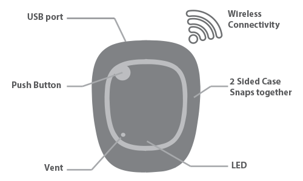

# MetaMotionRL (MMRL)

{ align=center }

MetaMotionRL is powered by a rechargeable lithium ion battery. It has a typical battery life of 1 to 14 days.

Since it is USB powered, you can add a battery pack to get even more life out of your MetaMotionRL.

The MMRL optionally comes with a plastic case. Please note that the proximity of the battery to the PCB when encased reduces the Bluetooth range.

## Details

| Name | Battery              | Size              | Memory              |
| :--- | :------------------- | :---------------- | :------------------ |
| MMRL | 100mAh recharge lipo | 17mm x 25mm x 5mm | 8MB (~0.5M entries) |

## Downloads

| Document     | Link |
| :----------- | :--- |
| Datasheet    | [MetaMotionRPS](assets/MetaMotionR-PS5.pdf) |
| Schematic    | [MetaMotionR0.5](assets/MetaMotionR_0.5.pdf) |
| CAD Model    | [STEP File](assets/MetaMotionR3-STEP.zip) |
| Case CAD     | [Rectangle Case STEP](assets/Rectangle-Case-STEP.zip) |
| Certificates | [MetaMotion Module](assets/MetaMotion-Certification.zip) |

## Sensor Datasheets

| Name | Accelerometer                                                          | Gyroscope                                                              | Magnetometer                                                                   | Temperature | Pressure | Light |
| :--- | :--------------------------------------------------------------------- | :--------------------------------------------------------------------- | :----------------------------------------------------------------------------- | :---------- | :------- | :---- |
| MMRL | [BMI160](https://www.bosch-sensortec.com/products/motion-sensors/imus/bmi160) | [BMI160](https://www.bosch-sensortec.com/products/motion-sensors/imus/bmi160) | [BMM150](https://www.bosch-sensortec.com/products/motion-sensors/magnetometers-bmm150/) | on-board    | none     | none  |

## Steps to get started

### 1. Unbox

Unbox your MetaMotionRL.

### 2. Power

Plug in your MetaMotionRL using a micro USB cable to charge the battery.

### 3. Wake Up

The MMRL will blink when charging.

### 4. Connect

Download the App of your choice to start working with your MMRL.

## Troubleshooting

Recharge the battery with a micro-USB to USB cable plugged in to power (AC adapter or computer) when you are not using it.

Troubleshoot any issues by following the steps [here](https://mbientlab.com/troubleshooting/).
