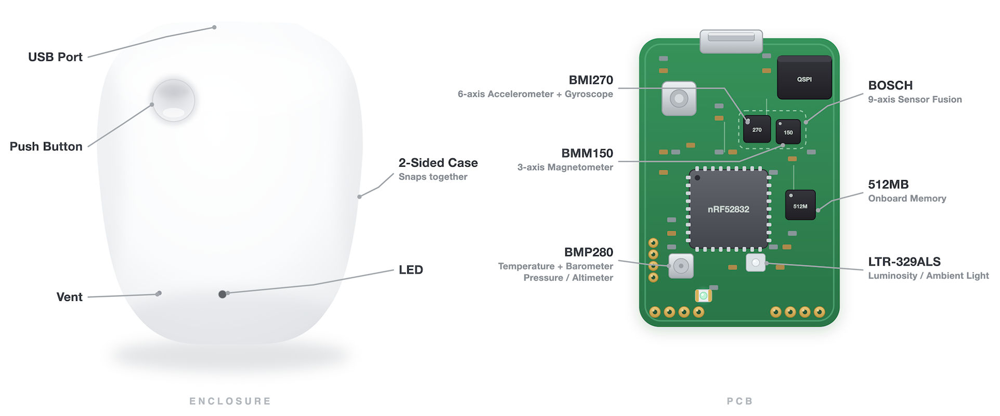
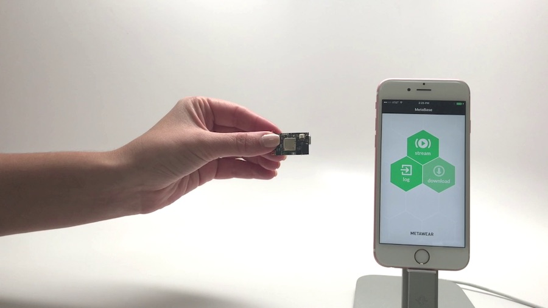
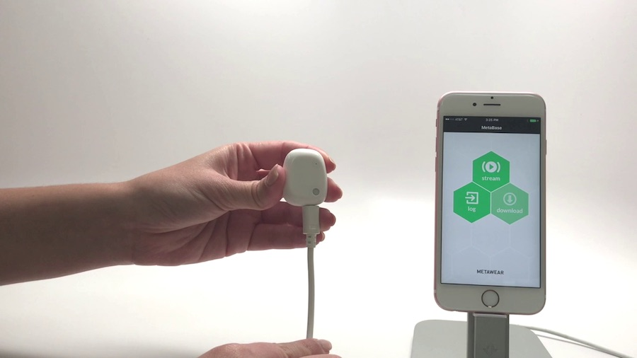
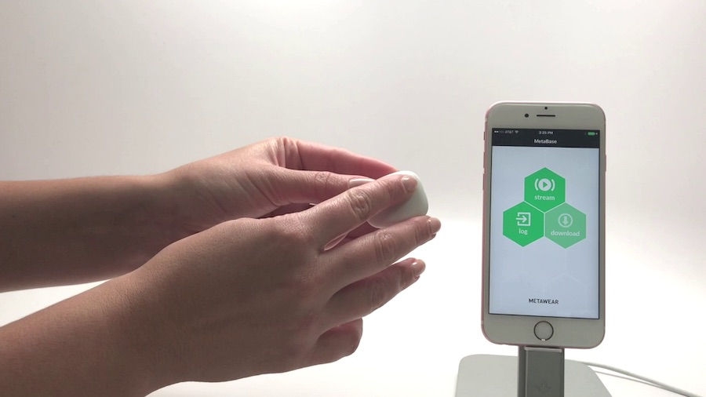
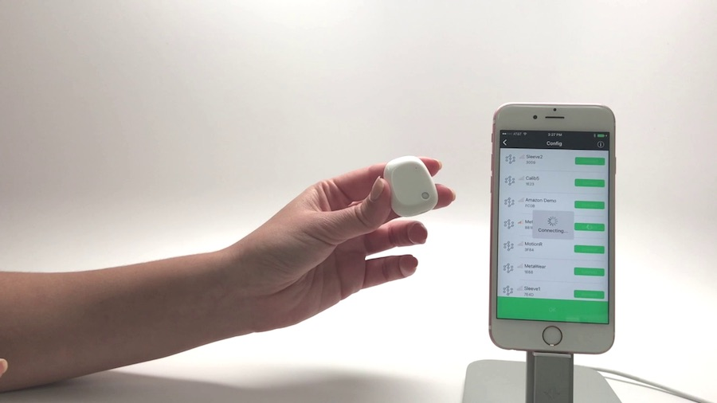

# MetaMotionS (MMS)

{ align=center }

MetaMotionS is powered by a rechargeable lithium-polymer (LiPo) battery. It has a typical battery life of 8 to 24 days. Please keep your MMS plugged-in and charged when not in use.

Since it is USB powered, you can add a battery pack to get even more life out of your MetaMotionS.

The MMS optionally comes with a plastic case. Please note that the proximity of the battery to the PCB when encased reduces the Bluetooth range.

## Details

| Name | Battery              | Size              | Memory               |
| :--- | :------------------- | :---------------- | :------------------- |
| MMS  | 100mAh recharge lipo | 17mm x 25mm x 5mm | 512MB (~67M entries)  |

## Battery Life

How long the MMS runs on a charge depends on which sensors are active, the sample rate, and whether you're **logging** (recording to onboard memory while disconnected) or **streaming** live over Bluetooth. Streaming is far more power-hungry — the radio alone draws roughly 7.5 mA.

For a logging session, two things run down and **whichever empties first ends the session**: the battery and the 512 MB onboard flash. The table below shows both for common configurations at 100 Hz.

| Configuration (100 Hz)                            | Battery life | Flash fills | Lasts about    |
| :------------------------------------------------ | :----------- | :---------- | :------------- |
| Accelerometer only — logging                      | ~19 days     | ~3.9 days   | **~3.9 days**  |
| Full IMU (accel + gyro + mag) — logging           | ~3.4 days    | ~1.3 days   | **~1.3 days**  |
| Sensor fusion → Euler angles — logging            | ~2 days      | ~2 days     | **~2 days**    |
| Sensor fusion → Euler angles — streaming over BLE | ~10 hours    | n/a         | **~10 hours**  |

The fusion-logging row is the typical "wear it and capture orientation" setup — full IMU feeding sensor fusion, Euler output recorded to flash at 100 Hz, no phone connected. That's **roughly two days** between charges on the MMS, with the battery and the 512 MB flash running out at about the same time. Recording the raw IMU channels in addition to the fused output fills flash ~2.5× faster (~18 hours) without changing battery life.

These are ballpark figures — real life shifts with temperature, battery age, Bluetooth settings, and exact rates. The per-sensor current draws and formulas behind them are in [Sensor Power Consumption](api-specification.md#sensor-power-consumption) and [Logging Memory Capacity](api-specification.md#logging-memory-capacity).

## Downloads

| Document     | Link |
| :----------- | :--- |
| Datasheet    | [MetaMotionS](assets/MetaMotionS-PS5.pdf) |
| Schematic    | [MetaMotionS0.1](assets/MetaMotionS_0.1.pdf) |
| CAD Model    | [STEP File](assets/MetaMotionR3-STEP.zip) |
| Case CAD     | [Rectangle Case STEP](assets/Rectangle-Case-STEP.zip) |
| Certificates | [MetaMotion Module](assets/MetaMotion-Certification.zip) |

## Sensor Datasheets

| Name | Accelerometer                                                          | Gyroscope                                                              | Magnetometer                                                                   | Temperature                                                                              | Pressure                                                                                 | Light                                                                                              |
| :--- | :--------------------------------------------------------------------- | :--------------------------------------------------------------------- | :----------------------------------------------------------------------------- | :--------------------------------------------------------------------------------------- | :--------------------------------------------------------------------------------------- | :------------------------------------------------------------------------------------------------- |
| MMS  | [BMI270](https://www.bosch-sensortec.com/products/motion-sensors/imus/bmi270) | [BMI270](https://www.bosch-sensortec.com/products/motion-sensors/imus/bmi270) | [BMM150](https://www.bosch-sensortec.com/products/motion-sensors/magnetometers-bmm150/) | [BMP280](https://www.bosch-sensortec.com/products/environmental-sensors/pressure-sensors/bmp280/) | [BMP280](https://www.bosch-sensortec.com/products/environmental-sensors/pressure-sensors/bmp280/) | [LTR-329ALS-01](http://www.mouser.com/ds/2/239/Lite-On_LTR-329ALS-01%20DS_ver1.1-348647.pdf) |

## Steps to get started

### 1. Unbox

Unbox your MetaMotionS.

### 2. Power

Plug in your MetaMotionS using a micro USB cable to charge the battery.

### 3. Wake Up

The MMS will blink when charging.

### 4. Connect

Download the App of your choice to start working with your MMS.

## Troubleshooting

Recharge the battery with a micro-USB to USB cable plugged in to power (AC adapter or computer) when you are not using it.

Troubleshoot any issues by following the steps [here](https://mbientlab.com/troubleshooting/).
